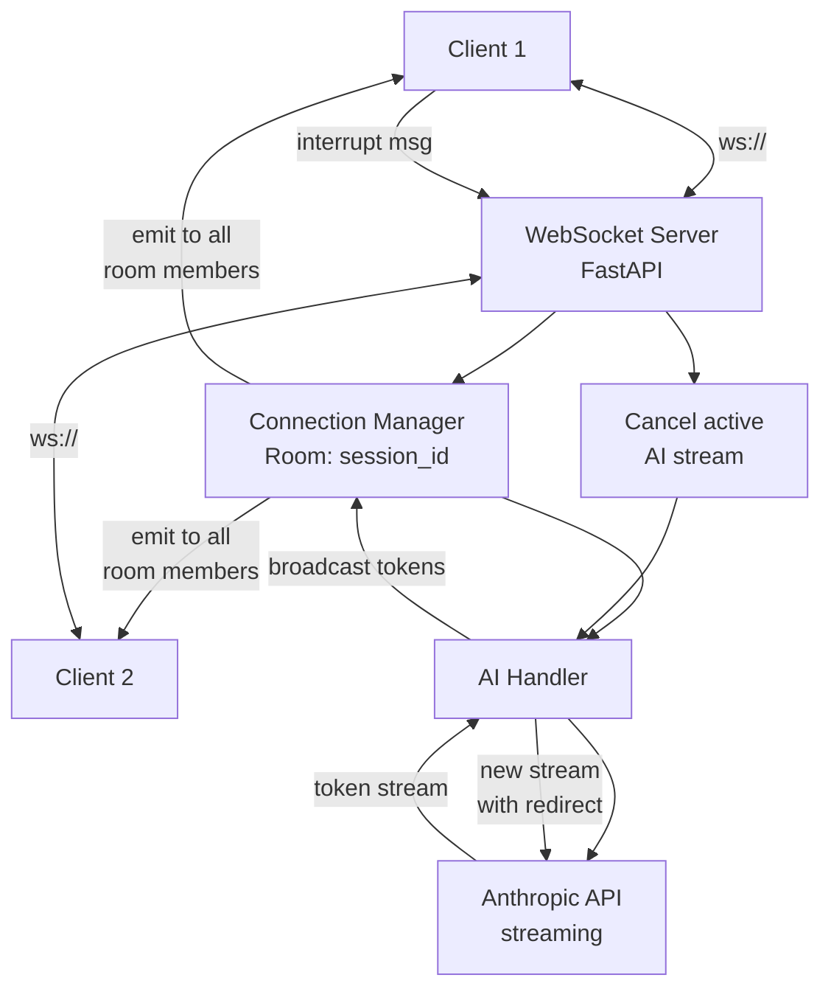

SSE (Server-Sent Events) is good enough for 80% of AI streaming use cases. The client sends a request, the server streams tokens back, done. But the remaining 20% — where you need the client to communicate *while* the server is streaming — requires WebSocket. And that 20% includes some of the most valuable AI features you can build.

Interrupt and redirect. Collaborative editing with multiple users watching the same AI generation. Voice input while receiving text output. These all require a bidirectional channel. Here's how to build it.



## SSE vs WebSocket: When Each Makes Sense

SSE is a one-way channel from server to client over HTTP. The client sends a POST request, the server responds with a stream of `data:` events. The client cannot send data back on the same connection — it needs a separate request.

This is fine when the only interactivity needed is "send query, receive stream." Most chatbot UIs work this way. But the moment you need the client to influence an *in-progress* stream, SSE forces you into awkward workarounds: a separate REST endpoint to signal cancellation, polling for state changes, or managing two parallel connections.

WebSocket gives you a full duplex channel. Both sides can send at any time. The client can interrupt the server while it's streaming. Multiple clients can share one WebSocket connection to the same session.

Use SSE when:
- Simple request/response streaming with no mid-stream client interaction
- You're behind HTTP/2 multiplexed connections that handle SSE efficiently
- You want the simplest possible implementation

Use WebSocket when:
- Users need to interrupt, redirect, or refine an in-progress AI response
- Multiple clients need to observe the same AI generation (collaborative)
- Your feature involves voice input or other bidirectional media
- You're building an agent that reports progress and asks for clarification mid-task

## Building the WebSocket AI Server

FastAPI's WebSocket support is the right foundation here. Clean async model, handles connection lifecycle well.

```python
import asyncio
import json
import uuid
from typing import Optional
from fastapi import FastAPI, WebSocket, WebSocketDisconnect
from fastapi.websockets import WebSocketState
import anthropic

app = FastAPI()
client = anthropic.AsyncAnthropic()


class ConnectionManager:
    """Manages active WebSocket connections per session."""

    def __init__(self):
        # session_id -> list of WebSocket connections
        self.rooms: dict[str, list[WebSocket]] = {}
        # session_id -> active generation task (for cancellation)
        self.active_tasks: dict[str, asyncio.Task] = {}

    async def connect(self, websocket: WebSocket, session_id: str):
        await websocket.accept()
        if session_id not in self.rooms:
            self.rooms[session_id] = []
        self.rooms[session_id].append(websocket)

    async def disconnect(self, websocket: WebSocket, session_id: str):
        if session_id in self.rooms:
            self.rooms[session_id].remove(websocket)
            if not self.rooms[session_id]:
                del self.rooms[session_id]
                # Cancel active generation if last client disconnected
                await self.cancel_generation(session_id)

    async def broadcast(self, session_id: str, message: dict):
        if session_id not in self.rooms:
            return
        dead = []
        for ws in self.rooms[session_id]:
            try:
                if ws.client_state == WebSocketState.CONNECTED:
                    await ws.send_json(message)
            except Exception:
                dead.append(ws)
        for ws in dead:
            self.rooms[session_id].remove(ws)

    async def cancel_generation(self, session_id: str):
        if session_id in self.active_tasks:
            self.active_tasks[session_id].cancel()
            try:
                await self.active_tasks[session_id]
            except asyncio.CancelledError:
                pass
            del self.active_tasks[session_id]


manager = ConnectionManager()


async def stream_ai_response(
    session_id: str,
    messages: list[dict],
    system: Optional[str] = None
):
    """Stream AI response to all clients in a session."""
    try:
        await manager.broadcast(session_id, {"type": "generation_start"})

        async with client.messages.stream(
            model="claude-opus-4-5",
            max_tokens=2048,
            system=system or "You are a helpful AI assistant.",
            messages=messages,
        ) as stream:
            async for text in stream.text_stream:
                await manager.broadcast(session_id, {
                    "type": "token",
                    "content": text
                })
                # Yield control to allow interrupt messages to be processed
                await asyncio.sleep(0)

        final = await stream.get_final_message()
        await manager.broadcast(session_id, {
            "type": "generation_complete",
            "usage": {
                "input_tokens": final.usage.input_tokens,
                "output_tokens": final.usage.output_tokens
            }
        })

    except asyncio.CancelledError:
        await manager.broadcast(session_id, {
            "type": "generation_interrupted",
            "reason": "User interrupted"
        })
        raise


@app.websocket("/ws/{session_id}")
async def websocket_endpoint(websocket: WebSocket, session_id: str):
    await manager.connect(websocket, session_id)
    conversation_history: list[dict] = []

    try:
        while True:
            data = await websocket.receive_json()
            action = data.get("action")

            if action == "send_message":
                # Cancel any in-progress generation first
                await manager.cancel_generation(session_id)

                user_message = data["content"]
                conversation_history.append({
                    "role": "user",
                    "content": user_message
                })

                # Start AI generation as a cancellable task
                task = asyncio.create_task(
                    stream_ai_response(
                        session_id,
                        conversation_history.copy(),
                        system=data.get("system")
                    )
                )
                manager.active_tasks[session_id] = task

                # Buffer assistant response while streaming
                # (simplified — production would accumulate in callback)

            elif action == "interrupt":
                redirect_prompt = data.get("redirect")
                await manager.cancel_generation(session_id)

                if redirect_prompt:
                    # Remove the last user message (will be replaced)
                    if conversation_history and conversation_history[-1]["role"] == "user":
                        conversation_history.pop()

                    conversation_history.append({
                        "role": "user",
                        "content": redirect_prompt
                    })

                    task = asyncio.create_task(
                        stream_ai_response(session_id, conversation_history.copy())
                    )
                    manager.active_tasks[session_id] = task

            elif action == "ping":
                await websocket.send_json({"type": "pong"})

    except WebSocketDisconnect:
        await manager.disconnect(websocket, session_id)
```

## Client-Side: React with Interrupt Support

```typescript
import { useEffect, useRef, useState, useCallback } from 'react';

interface AIMessage {
  role: 'user' | 'assistant';
  content: string;
  streaming?: boolean;
}

function useAIWebSocket(sessionId: string) {
  const wsRef = useRef<WebSocket | null>(null);
  const [messages, setMessages] = useState<AIMessage[]>([]);
  const [isGenerating, setIsGenerating] = useState(false);
  const reconnectDelay = useRef(1000);

  const connect = useCallback(() => {
    const ws = new WebSocket(`ws://localhost:8000/ws/${sessionId}`);

    ws.onopen = () => {
      reconnectDelay.current = 1000; // Reset backoff on successful connect
    };

    ws.onmessage = (event) => {
      const data = JSON.parse(event.data);

      switch (data.type) {
        case 'generation_start':
          setIsGenerating(true);
          setMessages(prev => [...prev, { role: 'assistant', content: '', streaming: true }]);
          break;

        case 'token':
          setMessages(prev => {
            const updated = [...prev];
            const last = updated[updated.length - 1];
            if (last?.role === 'assistant' && last.streaming) {
              updated[updated.length - 1] = {
                ...last,
                content: last.content + data.content
              };
            }
            return updated;
          });
          break;

        case 'generation_complete':
          setIsGenerating(false);
          setMessages(prev => {
            const updated = [...prev];
            const last = updated[updated.length - 1];
            if (last?.streaming) {
              updated[updated.length - 1] = { ...last, streaming: false };
            }
            return updated;
          });
          break;

        case 'generation_interrupted':
          setIsGenerating(false);
          // Remove the incomplete streaming message
          setMessages(prev => prev.filter((m, i) =>
            !(i === prev.length - 1 && m.streaming)
          ));
          break;
      }
    };

    ws.onclose = () => {
      // Exponential backoff reconnection
      setTimeout(() => {
        reconnectDelay.current = Math.min(reconnectDelay.current * 2, 30000);
        connect();
      }, reconnectDelay.current);
    };

    wsRef.current = ws;
  }, [sessionId]);

  useEffect(() => {
    connect();
    return () => wsRef.current?.close();
  }, [connect]);

  const sendMessage = (content: string) => {
    wsRef.current?.send(JSON.stringify({ action: 'send_message', content }));
    setMessages(prev => [...prev, { role: 'user', content }]);
  };

  const interrupt = (redirectPrompt?: string) => {
    wsRef.current?.send(JSON.stringify({
      action: 'interrupt',
      redirect: redirectPrompt
    }));
  };

  return { messages, isGenerating, sendMessage, interrupt };
}
```

## Scaling: The Sticky Session Problem

WebSocket connections are stateful. Unlike REST, you can't route a WebSocket message to any server in your pool — the message must reach the specific server holding that connection.

Two approaches:

**Sticky sessions (simplest)**: Configure your load balancer to route all traffic from a given client to the same backend server, keyed on session ID or client IP. Works well until a server dies — all connections on that server drop and clients reconnect to other servers, losing their in-progress generation state.

**Shared state in Redis**: Store conversation state and active connection metadata in Redis. Any server can handle any connection. When a server goes down, clients reconnect to any available server and the new server loads state from Redis. More complex to implement but eliminates single points of failure.

For most deployments, sticky sessions with graceful reconnection handling is the right starting point. The complexity of shared Redis state is only warranted when you need zero-downtime rolling deployments at high concurrency.

## Security: Don't Skip Auth at Upgrade Time

HTTP → WebSocket upgrades happen at the `/ws/` endpoint. You must validate authentication at this point. After the upgrade, there's no place to inject HTTP middleware authentication.

```python
from fastapi import WebSocket, Header, HTTPException
import jwt

@app.websocket("/ws/{session_id}")
async def websocket_endpoint(
    websocket: WebSocket,
    session_id: str,
    authorization: str = Header(default=None)  # Passed in upgrade headers
):
    # Validate before accepting the connection
    if not authorization or not authorization.startswith("Bearer "):
        await websocket.close(code=4001, reason="Unauthorized")
        return

    try:
        token = authorization.removeprefix("Bearer ")
        payload = jwt.decode(token, SECRET_KEY, algorithms=["HS256"])
        user_id = payload["sub"]
    except jwt.InvalidTokenError:
        await websocket.close(code=4001, reason="Invalid token")
        return

    # Verify user has access to this session_id
    if not await user_owns_session(user_id, session_id):
        await websocket.close(code=4003, reason="Forbidden")
        return

    await manager.connect(websocket, session_id)
    # ... rest of handler
```

The investment in WebSocket architecture pays off when you're building features that feel genuinely interactive — where the AI feels less like a query-response system and more like a collaborator you can redirect mid-thought. That's a qualitatively different product, and SSE simply can't get you there.
