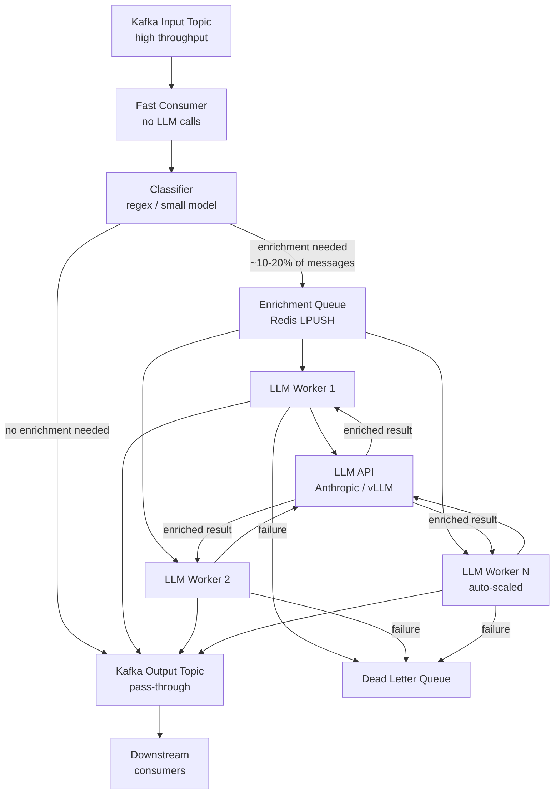

The mistake I see most often when engineers first add LLMs to their Kafka pipelines: they put the LLM call inside the consumer. It seems obvious — you're consuming events, you want to enrich them, you call the model, you produce enriched output. This works in staging with 10 messages per minute. It falls apart in production with 500 messages per minute.

At 3 seconds per LLM call, your consumer processes 20 messages per minute. If your topic produces 500 messages per minute, your consumer lag grows by 480 messages every minute. That's 28,800 messages per hour, indefinitely. You don't fix this by scaling Kafka — you fix it by decoupling LLM inference from consumption.



## Why Synchronous LLM Calls Inside Consumers Break Everything

Kafka consumers are designed to operate at high throughput — thousands of messages per second. LLM calls are designed to be slow — single-digit seconds per call, with high variance (p95 can be 5–10x the p50).

When you call an LLM synchronously inside a consumer:

1. **Consumer lag is unbounded**: Your processing rate is capped at `1 / avg_llm_latency`. If avg latency is 3s, you max out at 20 msg/min per consumer partition.
2. **Partition count doesn't help**: Adding Kafka partitions and consumer replicas scales throughput proportionally — but you're still bottlenecked by LLM API rate limits and latency, not Kafka throughput.
3. **LLM failures cause rebalancing**: If the LLM API is slow or returns errors, your consumer stalls. Kafka's consumer group coordinator sees heartbeat timeouts and triggers rebalances, causing cascading problems.
4. **Backpressure propagates incorrectly**: Your fast upstream producers see a slow consumer and may implement back-pressure that throttles unrelated pipelines.

The fix is separation of concerns. The Kafka consumer's job is to read fast and route. LLM enrichment is a separate workload with its own scaling, retry logic, and failure handling.

## The Decoupled Enrichment Architecture

The design has three layers:

**Layer 1 — Fast consumer**: Reads from the Kafka input topic at full speed. Applies cheap classification (regex, keyword matching, or a small local model) to decide whether each message needs LLM enrichment. Messages that don't need enrichment are written directly to the output topic. Messages that need enrichment are pushed to a work queue. This consumer processes thousands of messages per second.

**Layer 2 — Enrichment work queue**: Redis makes sense here — `LPUSH` for producers, `BRPOP` with timeout for workers. You get visibility into queue depth, priority queuing is possible if needed, and Redis is fast enough that it's never the bottleneck. Alternatively, a dedicated Kafka topic works if you want durability.

**Layer 3 — LLM worker pool**: A pool of workers consuming from the enrichment queue, calling the LLM API, and writing results to the output Kafka topic. This pool scales based on queue depth. Workers are stateless — add or remove them without coordination.

## Sizing the Worker Pool

The math is straightforward:

```
workers_needed = ceil(messages_per_second × avg_llm_latency_seconds)
```

For 100 messages/sec that need enrichment and 3s average LLM latency:
```
workers_needed = ceil(100 × 3) = 300 workers
```

That's a lot of workers — which is why selective enrichment (only sending a subset of messages to the LLM) matters so much. If you can reduce the fraction needing enrichment from 100% to 10%, you need 30 workers instead of 300.

In practice, you don't pre-allocate 300 workers. You implement auto-scaling: monitor queue depth, scale workers up when queue depth exceeds a threshold, scale down when it drops.

```python
import asyncio
import json
import logging
from typing import Optional
import redis.asyncio as aioredis
from confluent_kafka import Producer
import anthropic

logger = logging.getLogger(__name__)

class LLMEnrichmentWorker:
    def __init__(
        self,
        redis_url: str,
        kafka_bootstrap: str,
        queue_key: str = "enrichment:queue",
        dlq_key: str = "enrichment:dlq",
        max_retries: int = 3
    ):
        self.redis = aioredis.from_url(redis_url)
        self.producer = Producer({"bootstrap.servers": kafka_bootstrap})
        self.anthropic = anthropic.AsyncAnthropic()
        self.queue_key = queue_key
        self.dlq_key = dlq_key
        self.max_retries = max_retries
        self.running = False

    async def process_batch(self, messages: list[dict]) -> list[dict]:
        """Process multiple messages in parallel — reduce per-message API overhead."""
        tasks = [self.enrich_single(msg) for msg in messages]
        results = await asyncio.gather(*tasks, return_exceptions=True)

        enriched = []
        for msg, result in zip(messages, results):
            if isinstance(result, Exception):
                logger.error(f"Enrichment failed for message {msg.get('id')}: {result}")
                enriched.append({**msg, "enrichment_error": str(result)})
            else:
                enriched.append(result)
        return enriched

    async def enrich_single(self, message: dict) -> dict:
        """Call LLM API to enrich a single message."""
        content = message.get("content", "")

        response = await self.anthropic.messages.create(
            model="claude-haiku-4-5",  # Use fastest model for enrichment
            max_tokens=500,
            messages=[{
                "role": "user",
                "content": f"Extract entities and sentiment from: {content}\n"
                           f"Respond with JSON: {{entities: [], sentiment: 'positive|negative|neutral', summary: ''}}"
            }]
        )

        enrichment = json.loads(response.content[0].text)
        return {**message, "enrichment": enrichment}

    async def run(self, output_topic: str, batch_size: int = 10, idle_timeout: float = 1.0):
        self.running = True
        logger.info("LLM enrichment worker started")

        while self.running:
            try:
                # Pull up to batch_size messages from queue (non-blocking after first)
                batch = []
                raw = await self.redis.brpop(self.queue_key, timeout=idle_timeout)
                if raw is None:
                    continue

                batch.append(json.loads(raw[1]))

                # Pull additional messages without waiting (fill the batch)
                for _ in range(batch_size - 1):
                    extra = await self.redis.rpop(self.queue_key)
                    if extra is None:
                        break
                    batch.append(json.loads(extra))

                # Process batch in parallel
                enriched_batch = await self.process_batch(batch)

                # Produce to output topic
                for enriched in enriched_batch:
                    self.producer.produce(
                        output_topic,
                        key=enriched.get("id", "").encode(),
                        value=json.dumps(enriched).encode()
                    )
                self.producer.flush()

            except Exception as e:
                logger.error(f"Worker error: {e}")
                await asyncio.sleep(1)  # Brief pause before retrying

    def stop(self):
        self.running = False
```

## Selective Enrichment: The Key Cost Lever

Calling an LLM on 100% of your events is almost always wrong. Most events don't need it. A fast pre-filter that routes only the fraction requiring enrichment dramatically reduces LLM costs and worker pool size.

```python
import re
from confluent_kafka import Consumer, Producer

ENRICHMENT_PATTERNS = [
    re.compile(r'\berror\b|\bfailure\b|\bcritical\b', re.IGNORECASE),
    re.compile(r'\brefund\b|\bcancel\b|\bcomplaint\b', re.IGNORECASE),
    re.compile(r'\burgent\b|\bASAP\b|\bimmediate\b', re.IGNORECASE),
]

def needs_enrichment(message: dict) -> bool:
    content = message.get("content", "")

    # Fast path: regex matching (microseconds)
    if any(p.search(content) for p in ENRICHMENT_PATTERNS):
        return True

    # Medium path: rule-based heuristics
    if len(content) > 500 and message.get("priority") == "high":
        return True

    # Optionally: small model classification for edge cases
    # (100ms vs 3000ms for full LLM — worth it for high-volume topics)
    return False


class SelectiveConsumer:
    def __init__(self, kafka_config: dict, redis_url: str):
        self.consumer = Consumer(kafka_config)
        import redis
        self.redis = redis.from_url(redis_url)
        self.pass_through_producer = Producer({"bootstrap.servers": kafka_config["bootstrap.servers"]})

    def run(self, input_topic: str, output_topic: str, enrichment_queue: str):
        self.consumer.subscribe([input_topic])

        while True:
            msg = self.consumer.poll(timeout=0.1)
            if msg is None or msg.error():
                continue

            message = json.loads(msg.value())

            if needs_enrichment(message):
                # Route to LLM worker pool
                self.redis.lpush(enrichment_queue, json.dumps(message))
            else:
                # Pass through directly — no LLM needed
                self.pass_through_producer.produce(
                    output_topic,
                    key=msg.key(),
                    value=msg.value()
                )
```

## Consumer Lag Monitoring and Circuit Breaking

Consumer lag is your primary health signal. Measure it per consumer group per partition:

```python
from confluent_kafka.admin import AdminClient
from confluent_kafka import TopicPartition

def get_consumer_lag(bootstrap_servers: str, group_id: str, topic: str) -> dict:
    admin = AdminClient({"bootstrap.servers": bootstrap_servers})

    # Get committed offsets for the consumer group
    # Get high watermarks for each partition
    # Lag = high watermark - committed offset

    consumer_offsets = admin.list_consumer_group_offsets(
        [{"group_id": group_id}]
    )
    # ... implementation details vary by client version
    return {}  # {partition: lag}


# Alert thresholds
LAG_WARN_THRESHOLD = 10_000    # 2x normal max lag
LAG_CIRCUIT_BREAK = 50_000    # 10x — stop enrichment, let pass-through catch up

def check_lag_and_circuit_break(lag: int, enrichment_queue: str, redis):
    if lag > LAG_CIRCUIT_BREAK:
        # Drain enrichment queue — skip LLM enrichment, pass messages through
        logger.critical(f"Consumer lag {lag} exceeds threshold — circuit breaking LLM enrichment")
        redis.delete(enrichment_queue)
        # Signal workers to flush queue without calling LLM
```

The circuit breaker is the safety valve. When lag gets out of control — LLM API down, worker pool undersized, traffic spike — you need a way to keep messages flowing without enrichment rather than building unbounded lag. Enrichment can be applied retroactively from a replay topic once the incident resolves.

This architecture has handled streaming pipelines processing 50,000+ events per minute with LLM enrichment on 8% of them. The key invariant: the fast consumer is never slowed by LLM calls. Those two concerns are always separate.
