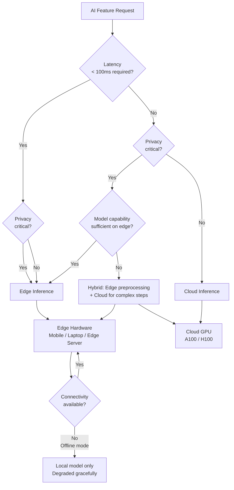

There's a lot of hype around edge AI that glosses over the fundamental constraint: edge hardware is limited, and you can only run small models on it. A 70B parameter model needs ~140GB of memory. A flagship smartphone has 12GB of RAM, half of which the OS and apps have already claimed. You're not running Opus-class intelligence at the edge. You're running Haiku-class — which is still genuinely useful, just not for everything.

Here's an honest look at where edge inference earns its place and how to deploy it without creating a maintenance nightmare.



## Why Edge AI: The Real Reasons

**Latency**: The round-trip from a mobile device to a US-East inference endpoint and back is 80–200ms before any model processing happens. For features where 100ms matters — in-IDE code completion, real-time spell/grammar correction, voice command recognition — eliminating that network hop is significant.

**Privacy**: Some data must not leave the device. Medical notes, personal documents, financial data, anything under GDPR or HIPAA constraints. Running inference locally means the raw data never traverses a network. This isn't theoretical — enterprise customers make buying decisions based on this capability.

**Offline capability**: On-device inference works without internet access. For enterprise field apps, consumer apps in areas with poor connectivity, or any scenario where reliability matters more than top-tier intelligence.

**Cost**: No per-token API cost for local inference. The compute cost is amortized into the device the user already owns. At scale, this matters — millions of low-stakes inference calls (grammar correction, local search, basic Q&A) add up on cloud APIs.

## Hardware Categories and What You Can Actually Run

**Mobile (iPhone 16 Pro, Pixel 9 Pro, Snapdragon 8 Elite devices)**:
- NPU: 35–45 TOPS (tera-operations per second)
- RAM: 8–12GB (4–6GB usable for inference)
- Practical model limit: 3–7B parameters, INT4 quantized
- Achievable performance: 15–30 tokens/second for 3B models
- Real-world models: Phi-3-mini-4K (3.8B), Gemma-2-2B, Qwen2.5-3B

**Apple Silicon laptops (M3 Pro/Max, M4 series)**:
- Unified memory architecture: up to 128GB shared between CPU/GPU/Neural Engine
- M3 Max: up to 400 GB/s memory bandwidth (faster than A100)
- Practical model limit: 13–30B parameters at full quality
- Performance: 60–100 tokens/second for 13B models
- Best-in-class edge hardware for AI workloads

**Qualcomm AI PCs (Snapdragon X Elite/Plus)**:
- NPU: 45 TOPS
- RAM: 16–32GB
- Practical model limit: 7–13B parameters
- Performance: 30–60 tokens/second for 7B models

**Edge servers (NVIDIA Jetson Orin, Hailo-8L, custom)**:
- For industrial or infrastructure deployment (not end-user devices)
- Jetson Orin: 275 TOPS, 64GB RAM
- Can run 13–70B models depending on quantization
- Used for: factory floor AI, medical device AI, autonomous vehicle inference

## Model Formats for Edge Deployment

**GGUF (llama.cpp)**: The most portable format. Supports CPU inference with optional GPU acceleration. Works on Apple Silicon (Metal), CUDA (NVIDIA), and CPU-only. The standard for cross-platform edge deployment.

```python
from llama_cpp import Llama

# Load a GGUF model — Q4_K_M is the typical quality/size tradeoff
llm = Llama(
    model_path="./models/Phi-3-mini-4k-instruct-q4.gguf",
    n_ctx=4096,          # Context window
    n_gpu_layers=-1,     # -1 = use all available GPU layers (Metal on Mac, CUDA on NVIDIA)
    n_threads=8,         # CPU threads for non-GPU layers
    verbose=False
)

response = llm.create_chat_completion(
    messages=[
        {"role": "system", "content": "You are a helpful assistant."},
        {"role": "user", "content": "Summarize this document in 3 bullet points: ..."}
    ],
    max_tokens=256,
    temperature=0.7,
    stream=True
)

for chunk in response:
    delta = chunk["choices"][0]["delta"]
    if "content" in delta:
        print(delta["content"], end="", flush=True)
```

**CoreML (Apple platforms)**: Compiled model format optimized for Apple's Neural Engine. Lowest latency on iPhone/iPad/Mac. Required for App Store distribution of AI features on iOS.

```python
# Convert to CoreML using coremltools
import coremltools as ct
from transformers import AutoModelForCausalLM, AutoTokenizer

model = AutoModelForCausalLM.from_pretrained("microsoft/phi-3-mini-4k-instruct")

# Trace and convert
mlmodel = ct.convert(
    traced_model,
    inputs=[ct.TensorType(name="input_ids", shape=(1, ct.RangeDim(1, 512)))],
    minimum_deployment_target=ct.target.iOS17,
    compute_units=ct.ComputeUnit.ALL  # Use Neural Engine + GPU + CPU
)
mlmodel.save("phi3-mini.mlpackage")
```

**ONNX Runtime**: Cross-platform, works on Windows/Linux/Android/iOS. Better for heterogeneous deployments where you need one codebase to run on multiple platforms.

## Use Cases Where Edge AI Works Well

**IDE code completion**: GitHub Copilot and alternatives are experimenting with edge models for low-latency completions. A 7B code model running locally can match or beat cloud latency for short completions (single line, argument completion). Quality is lower for complex multi-line completions.

**Document summarization on laptop**: A lawyer reviewing 50 contracts doesn't want those documents sent to external APIs. A 13B model on an M3 Max can summarize a 10-page document in 15–30 seconds with acceptable quality.

**Voice transcription**: Whisper-small (245MB) or Whisper-base (145MB) runs efficiently on any modern laptop or phone NPU. Transcription latency of 200–800ms for a typical utterance. Privacy-preserving voice notes, dictation, and commands.

**Real-time grammar and style correction**: Small models (1–3B) are sufficient for this task. Running locally eliminates network latency and makes the feature feel instant.

## Where It Doesn't Work

**Complex reasoning**: Tasks requiring multi-step logical reasoning, code debugging, architecture decisions — these need larger models. A 3B model on a phone will produce plausible-sounding but frequently wrong output for hard reasoning tasks.

**Large context**: Edge models typically support 4K–8K context. If your use case needs 100K context (long document analysis, large codebase understanding), you're not doing it on-device.

**State-of-the-art quality requirements**: The gap between a 7B edge model and a 70B+ cloud model is real. For anything user-facing where quality failure is costly (medical advice, legal analysis, financial decisions), don't use edge models as your primary path.

**Frequent model updates**: Distributing 4GB model files to millions of devices is a non-trivial logistics problem. If your use case requires weekly model updates, the update management overhead is substantial.

## Monitoring Edge Deployments With Privacy Constraints

You can't log user inputs and model outputs from edge devices — that's the whole point of running locally. But you still need operational telemetry:

```python
import time
import statistics
from dataclasses import dataclass, field

@dataclass
class EdgeInferenceTelemetry:
    """Privacy-preserving telemetry — no content, only metrics."""
    inference_latency_ms: list[float] = field(default_factory=list)
    tokens_generated: list[int] = field(default_factory=list)
    model_load_time_ms: float = 0.0
    cache_hits: int = 0
    cache_misses: int = 0
    error_count: int = 0

    def record_inference(self, latency_ms: float, tokens: int):
        self.inference_latency_ms.append(latency_ms)
        self.tokens_generated.append(tokens)

    def summary(self) -> dict:
        if not self.inference_latency_ms:
            return {}
        return {
            "p50_latency_ms": statistics.median(self.inference_latency_ms),
            "p95_latency_ms": statistics.quantiles(self.inference_latency_ms, n=20)[18],
            "avg_tokens_per_second": sum(self.tokens_generated) / (sum(self.inference_latency_ms) / 1000),
            "cache_hit_rate": self.cache_hits / max(1, self.cache_hits + self.cache_misses),
            "error_rate": self.error_count / max(1, len(self.inference_latency_ms) + self.error_count),
            "model_load_ms": self.model_load_time_ms
        }

    def flush_to_analytics(self, analytics_client):
        """Send aggregate metrics — never individual request content."""
        analytics_client.track("edge_inference_metrics", self.summary())
        # Reset after flush
        self.__init__()
```

The constraint: send performance metrics (latency, throughput, error rates, cache hit rates), never request content or model outputs. Aggregate before sending — individual inference records are fine, but don't send them individually (reconstruct usage patterns from individual events is a privacy concern).

Edge AI is not a replacement for cloud inference. It's a complement — the right tool for the subset of use cases where latency, privacy, or offline capability justify the capability tradeoff. Get clear on which use cases those are before investing in the deployment infrastructure.
