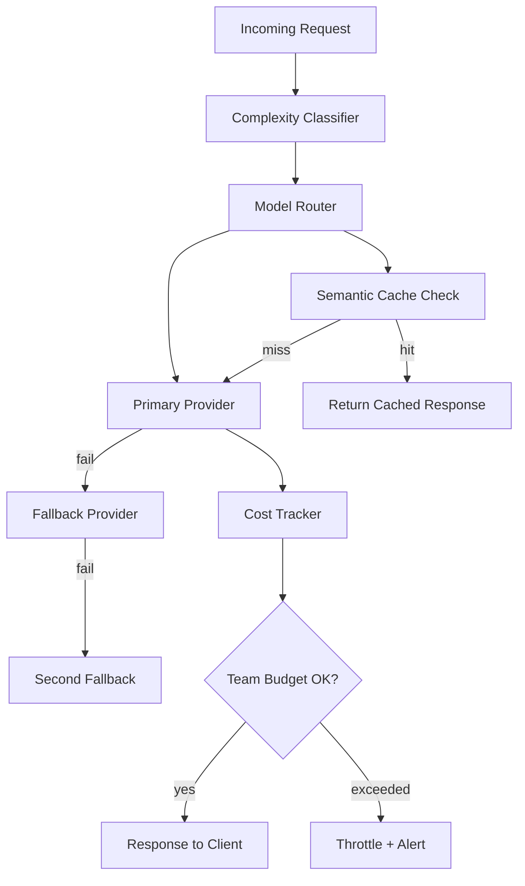

A basic LLM proxy solves one problem: hiding your API key from client code. An intelligent gateway solves five: which model should handle this request, what happens when the primary provider is down, who's spending the budget, is this response already cached, and is this request trying to hijack the system prompt. Most teams start with the first and discover they need the other four within a quarter of production traffic.



## What a dumb proxy leaves on the table

A simple proxy forwards every request to a single configured model. This works until you notice that 60% of your traffic is simple classification tasks running on your most expensive model, that a provider outage takes down your entire AI feature set, and that finance is asking which team is responsible for the $40K AI bill last month and you don't have an answer.

An intelligent gateway is the architectural layer that answers all three.

## Complexity-based routing

Not every request needs your flagship model. Classify request complexity with a fast, cheap model and route accordingly.

```python
from litellm import completion

COMPLEXITY_MODEL_MAP = {
    "simple": "claude-haiku-4-5-20251001",
    "medium": "claude-sonnet-4-6",
    "complex": "claude-opus-4-5",
}

def classify_complexity(prompt: str) -> str:
    response = completion(
        model="claude-haiku-4-5-20251001",
        max_tokens=10,
        messages=[{
            "role": "user",
            "content": f"Classify this request's complexity as simple, medium, or complex. Reply with one word only.\n\nRequest: {prompt}"
        }]
    )
    classification = response.choices[0].message.content.strip().lower()
    return classification if classification in COMPLEXITY_MODEL_MAP else "medium"

def route_request(prompt: str) -> str:
    complexity = classify_complexity(prompt)
    model = COMPLEXITY_MODEL_MAP[complexity]
    response = completion(model=model, messages=[{"role": "user", "content": prompt}])
    return response.choices[0].message.content
```

The classification call costs a fraction of a cent and adds ~100ms. If 60% of your traffic classifies as "simple" and moves from Opus-class ($15/M tokens) to Haiku-class ($0.25/M tokens), your cost on that slice drops by roughly 98%. Across a full traffic mix, this typically nets 40-60% total cost reduction without measurable quality impact — because the simple requests didn't need the expensive model in the first place.

## Multi-provider fallback

A single-provider architecture has a single point of failure. When Anthropic, OpenAI, or Azure OpenAI has a regional outage, your AI feature goes down with it unless you've built a fallback chain.

```python
FALLBACK_CHAIN = [
    {"model": "claude-sonnet-4-6", "provider": "anthropic"},
    {"model": "gpt-4o", "provider": "openai"},
    {"model": "azure/gpt-4o", "provider": "azure"},
]

def request_with_fallback(prompt: str) -> str:
    last_error = None
    for provider_config in FALLBACK_CHAIN:
        try:
            response = completion(
                model=provider_config["model"],
                messages=[{"role": "user", "content": prompt}],
                timeout=10,
            )
            return response.choices[0].message.content
        except Exception as e:
            last_error = e
            continue
    raise RuntimeError(f"All providers failed. Last error: {last_error}")
```

Fallback across providers changes model behavior — a response from GPT-4o will differ stylistically from Claude. For most use cases (chat, summarization, extraction) this is an acceptable degradation during an outage. For use cases with strict format or voice requirements, test the fallback path explicitly; don't assume it's a drop-in replacement.

## LiteLLM as the gateway foundation

Building this from scratch is unnecessary. LiteLLM is the OSS reference implementation: it normalizes 100+ model APIs behind one interface, handles routing config, auth, and logging out of the box, and exposes hooks for custom middleware.

```yaml
# litellm_config.yaml
model_list:
  - model_name: fast-tier
    litellm_params:
      model: claude-haiku-4-5-20251001
      api_key: os.environ/ANTHROPIC_API_KEY
  - model_name: balanced-tier
    litellm_params:
      model: claude-sonnet-4-6
      api_key: os.environ/ANTHROPIC_API_KEY
  - model_name: flagship-tier
    litellm_params:
      model: claude-opus-4-5
      api_key: os.environ/ANTHROPIC_API_KEY

router_settings:
  fallbacks:
    - balanced-tier: ["gpt-4o", "azure/gpt-4o"]
  timeout: 15
  num_retries: 2

litellm_settings:
  success_callback: ["custom_cost_tracker"]
  failure_callback: ["custom_alert_handler"]
```

## Per-team budget enforcement

Cost attribution without enforcement is just a report nobody acts on until the bill arrives. Enforce budgets at the gateway.

```python
import redis
from litellm.integrations.custom_logger import CustomLogger

r = redis.Redis()

class BudgetEnforcer(CustomLogger):
    def log_success_event(self, kwargs, response_obj, start_time, end_time):
        team_id = kwargs.get("metadata", {}).get("team_id", "unknown")
        cost = kwargs.get("response_cost", 0)
        
        month_key = f"budget:{team_id}:{start_time.strftime('%Y-%m')}"
        new_total = r.incrbyfloat(month_key, cost)
        r.expire(month_key, 60 * 60 * 24 * 35)
        
        budget = get_team_budget(team_id)  # from config or DB
        if new_total > budget * 0.9:
            send_budget_alert(team_id, new_total, budget)

    def pre_call_check(self, kwargs):
        team_id = kwargs.get("metadata", {}).get("team_id", "unknown")
        month_key = f"budget:{team_id}:{current_month()}"
        current_spend = float(r.get(month_key) or 0)
        budget = get_team_budget(team_id)
        
        if current_spend >= budget:
            raise Exception(f"Team {team_id} has exceeded monthly AI budget (${budget})")
```

Budget enforcement should throttle or alert before it blocks — a hard cutoff on a production feature at 9am on a Monday is worse than the overspend it was meant to prevent. Use a two-tier response: alert at 90% of budget, require manual override to continue past 100%.

## Semantic cache lookup

For request patterns with meaningful repetition — FAQ-style chatbots, common document types, repeated classification tasks — a semantic cache intercepts requests before they reach the model at all.

```python
from sentence_transformers import SentenceTransformer
import numpy as np

embedder = SentenceTransformer("all-MiniLM-L6-v2")

def semantic_cache_lookup(prompt: str, similarity_threshold: float = 0.95) -> str | None:
    query_embedding = embedder.encode(prompt)
    cached_entries = r.zrange("semantic_cache_index", 0, -1, withscores=False)
    
    for entry_id in cached_entries:
        cached_embedding = np.frombuffer(r.hget(f"cache:{entry_id}", "embedding"))
        similarity = np.dot(query_embedding, cached_embedding) / (
            np.linalg.norm(query_embedding) * np.linalg.norm(cached_embedding)
        )
        if similarity >= similarity_threshold:
            return r.hget(f"cache:{entry_id}", "response").decode()
    return None
```

At 0.95 cosine similarity threshold, false-positive cache hits (returning a cached response for a meaningfully different query) are rare but not zero — validate the threshold against your own traffic before trusting it in production, and never enable semantic caching for requests where a stale or slightly-off answer is unacceptable (financial figures, safety-critical instructions).

## Prompt injection detection at the gateway

The gateway is the natural chokepoint for basic injection defense: scan inbound requests for known injection patterns before they reach the model.

```python
INJECTION_PATTERNS = [
    r"ignore (all )?(previous|prior|above) instructions",
    r"disregard (the )?system prompt",
    r"you are now",
    r"new instructions:",
]

import re

def check_injection_risk(prompt: str) -> bool:
    return any(re.search(pattern, prompt, re.IGNORECASE) for pattern in INJECTION_PATTERNS)
```

This catches unsophisticated attempts. It will not catch adversarial prompts specifically crafted to evade pattern matching — treat it as one layer of defense in depth, not a complete solution. Pair it with output validation on the response side.

> The gateway adds 5-20ms of latency per request. For interactive features, that's negligible against a 500ms-2s LLM call. Don't skip the gateway to save latency — the routing, fallback, and cost control it provides are worth far more than 20ms.
{: .prompt-tip }

An LLM gateway is infrastructure, not a nice-to-have layered on later. Above roughly 10 engineers making direct model API calls, the absence of a gateway shows up as inconsistent routing decisions, no cost visibility, and a single-provider outage that takes down every AI feature at once. Build it before those problems force the issue.
