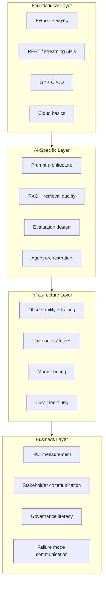

When GPT-4 launched in early 2023, the internet's consensus was that AI engineers needed to understand transformers, know how to fine-tune models, and have some background in ML math. Two and a half years later, most of the engineers shipping the best production AI at enterprise scale have none of those things in depth — and the ones who do aren't necessarily outperforming the ones who don't.

The 2026 AI engineering skill stack looks different from what the discourse predicted. Here's what actually happened.



## What Mattered More Than Expected

**Evaluation design.** This turned out to be the biggest differentiator. Engineers who could build rigorous evaluation pipelines — covering edge cases, real production distributions, adversarial examples — consistently shipped more reliably than those who couldn't. Evals aren't glamorous work. They require careful thought about what "correct" means for a given task, and they require ongoing maintenance as use cases drift. The engineers who invested here found that every downstream decision — model selection, prompt changes, retrieval tuning — became much easier to make confidently.

The absence of eval infrastructure is the most common cause of "we shipped something that worked in testing and degraded in production." Catching that degradation requires having baseline metrics to compare against.

**Systems thinking at integration points.** Almost every production AI failure I've seen in 2026 happened at an integration boundary, not in the model itself. The model generates a response — but the response gets passed through a downstream system that has its own constraints, and those constraints weren't considered when the prompt was designed. Or the retrieval layer returns stale data because the indexing pipeline has a lag that nobody accounted for. AI features fail at integration points. Engineers who think carefully about the full system boundary, not just the LLM call, are consistently more effective.

**Data wrangling for RAG.** Retrieval-Augmented Generation quality is retrieval quality is data quality. Full stop. Engineers who knew how to clean, chunk, enrich, and index documents effectively — and more importantly, who knew how to diagnose retrieval failures — were far more valuable than engineers who knew the latest RAG architecture papers but couldn't tell you why their cosine similarity scores were higher for irrelevant documents than relevant ones.

**Prompt architecture as a professional skill.** System prompt design went from "write some instructions at the top" to a structured engineering practice in 2026. The engineers who treat system prompts as software — with version control, documented intent, and eval coverage — consistently outperform those who treat them as rough instructions. A well-designed system prompt has explicit sections: persona, context, constraints, output format, edge case handling. It's maintained like code because it is code.

```yaml
# Example: structured system prompt sections
system_prompt:
  persona: "You are a technical documentation assistant..."
  context: "You have access to the following engineering docs..."
  constraints: |
    - Never fabricate API endpoints or parameters
    - If unsure, say so explicitly
    - Cite the source document for every factual claim
  output_format: "Markdown with code blocks for all examples"
  edge_cases: |
    - If the user asks about a deprecated feature, note the deprecation
    - If docs are ambiguous, present both interpretations
```

## What Mattered Less Than Expected

**Deep ML math.** Engineers without it shipped excellent production AI in 2026. Understanding how attention mechanisms work at the mathematical level doesn't help you design better system prompts or build more reliable evaluation pipelines. It helps you contribute to model research, which is a different job. The abstraction layer the APIs provide is genuinely thick enough that most production AI engineering doesn't require the layer below it.

**Training infrastructure.** Most enterprise AI teams in 2026 never touched GPU clusters. Managed fine-tuning (Anthropic's API, OpenAI's fine-tuning endpoints, various cloud offerings) removed most of that requirement for teams that do need custom models. Teams that do run their own training infrastructure are either running very high volume (where the cost math favors it) or have very specific requirements that managed services don't accommodate.

## The Emerging Skills for 2027

**Multi-agent orchestration.** The tooling has matured enough in 2026 that multi-agent systems are moving from research to production patterns. Engineers who understand how to design reliable agent pipelines — with explicit approval gates, error propagation handling, and observability — will be in high demand in 2027.

**AI observability.** Knowing what your AI system is doing in production requires different tooling than traditional software monitoring. Token consumption, latency distributions, quality metric trends, hallucination rates — these need dashboards and alerting. Tools like LangSmith, Weights & Biases, and custom Grafana setups are becoming standard, but engineers who know how to instrument AI systems effectively are still rare.

**Cost modeling and governance literacy.** AI inference spend is now material for most companies running production AI. Engineers who can model AI costs accurately — accounting for prompt caching, model routing, token efficiency — and communicate trade-offs to stakeholders are valuable. Governance literacy is also rising in importance as the EU AI Act and similar regulations create documentation and oversight requirements.

## The Full 2026 Skill Map

The career paths have clarified. Three distinct profiles are emerging:

**AI-embedded engineer**: A generalist software engineer who has added AI capabilities to their toolkit. They build AI features as part of a broader product engineering role. This is the most common profile and the one most in demand.

**AI platform engineer**: Infrastructure focus. Builds the LLM gateway, vector database infrastructure, model routing, cost monitoring, and eval tooling that other teams use. Requires strong systems engineering background more than AI-specific knowledge.

**AI product engineer**: UX and product focus combined with AI implementation skills. Understands how to design human-AI interaction patterns, knows when to involve AI and when not to, and can translate user needs into AI system requirements.

The honest take on career investment: the fundamentals (Python, APIs, observability, Git) still matter most. The AI-specific skills (evals, prompt architecture, RAG, agents) are what differentiate you in the AI engineering job market. The infrastructure and business skills are what get you from senior individual contributor to technical lead. Build them in that order, and don't let ML math anxiety stop you from shipping.
