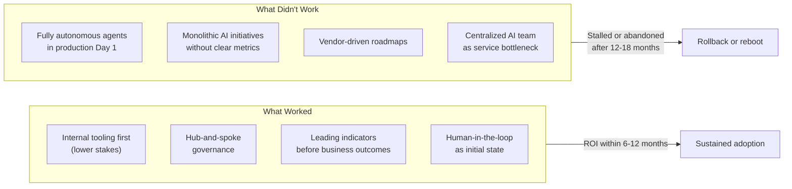

Enterprise AI in 2026 is no longer a research project or a pilot program. It's infrastructure, and it has the same failure modes as any other infrastructure: poor use case selection, wrong organizational structure, inadequate observability, and governance gaps that only become visible when something goes wrong. The difference from 2024 is that we now have enough production history to see the patterns clearly.

Here's what two years of watching enterprise AI rollouts actually taught us.



## What Worked

**Starting with internal tooling.** The most consistently successful enterprise AI rollouts in 2026 started by building tools for internal users — developers, support teams, analysts — rather than customer-facing features. The reasons compound: lower stakes if something goes wrong, faster feedback loops (engineers who use AI tools understand AI limitations and report failures accurately), and organizational learning that transfers to harder problems. Teams that started internal built calibrated intuition before they needed it for production customer experiences.

**Hub-and-spoke governance.** A central AI platform team (the hub) providing infrastructure, tooling, governance frameworks, and a shared LLM gateway, with product teams (spokes) building features within those guardrails. This structure keeps governance consistent without creating bottlenecks. The platform team owns the shared infrastructure — vector stores, model routing, eval tooling, cost monitoring — but doesn't block product teams from shipping.

**Measuring with leading indicators first.** Business outcome metrics (revenue, churn, NPS) move slowly and have too many confounding variables for early AI validation. Teams that succeeded in 2026 measured leading indicators first: AI response correction rate (how often users edit or override AI output), task completion time, confidence score distributions, and retrieval accuracy. These move quickly, correlate with business outcomes, and give teams early signal about whether their AI feature is actually working.

**Designing for human-in-the-loop as the starting state.** Every successful enterprise AI deployment I've seen in 2026 started with explicit human review steps — the AI suggests, a human confirms before action. Autonomy was added incrementally as the system proved reliable in production. Teams that tried to start fully autonomous, especially in any process with business consequence, invariably hit incidents that damaged organizational trust in the AI program for months.

## What Didn't Work

**Fully autonomous agents in production from day one.** The failure mode is almost always the same: the agent handles the common cases well enough that trust builds quickly, then encounters an unusual situation, makes a bad call, and the consequences are disproportionate because there was no human check. The damage isn't just the immediate incident — it's the organizational credibility loss that makes the next AI initiative harder to fund.

**Monolithic AI initiatives without clear success metrics.** "Transform our customer service with AI" is not a project plan. The AI programs that stalled or were rolled back in 2026 were almost always characterized by a vague mandate, a large budget, and no agreed definition of what success looked like after 90 days. Without that anchor, scope expanded, stakeholders had conflicting expectations, and the absence of measurable progress became a liability when budget cycles came around.

**Vendor-driven AI roadmaps.** Several organizations I worked with in 2026 let their AI program get shaped primarily by vendor relationships rather than identified user problems. They built features because a vendor partnership made them available cheaply, not because they'd validated that users needed them. The result: impressive demos, low adoption.

**Centralized AI team as service.** A single centralized AI team that product teams submit requests to is a bottleneck pattern that doesn't scale. It works for the first few projects and collapses when five product teams all have AI needs simultaneously. Every team waits, nothing ships on schedule, and the centralized team becomes a political liability.

## The Use Case Selection Framework That Worked

The single most valuable filter for AI use case selection in 2026 came down to four criteria:

```python
def is_good_ai_use_case(use_case):
    return (
        use_case.frequency == "high"           # AI leverage compounds with volume
        and use_case.quality_measurable        # You need evals; you need ground truth
        and use_case.human_fallback_available  # Human can catch what AI misses
        and use_case.user_tolerates_imperfection  # Some tasks require 100% accuracy; avoid those first
    )
```

High-frequency tasks justify the investment in evaluation infrastructure. Measurable quality means you can validate the AI is actually working. Human fallback means failures are recoverable. User tolerance means early imperfection doesn't destroy the experience.

Use cases that cleared all four criteria — internal document search, code review assistance, support ticket classification, meeting summarization — had high success rates. Use cases that failed one or more — regulatory document processing, financial calculations, real-time pricing decisions — had high failure rates.

## The 2027 Adoption Landscape

The organizations that will be in the strongest position in 2027 are the ones that:

1. Built evaluation infrastructure in 2026, so they can validate AI quality systematically
2. Established hub-and-spoke governance, so they can scale AI features without governance gaps
3. Ran human-in-the-loop as the initial state, accumulated enough production data to know where autonomy is safe, and are expanding autonomy incrementally in those areas
4. Have clear AI cost attribution by team and feature, so spending decisions are data-driven

The organizations that will be rebooting their AI programs in 2027 are the ones that optimized for AI announcements in 2026 instead of AI reliability.
