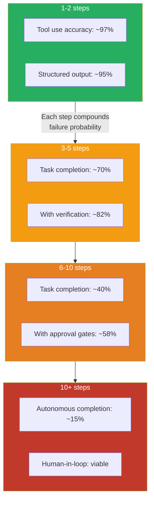

Agent reliability improved significantly in 2026. That improvement is real and it matters. But the headline number conceals an important split: single-step and short-horizon reliability improved dramatically, while long-horizon autonomous agent reliability remains the hardest unsolved problem in production AI engineering. If your agents are failing in production, the cause is almost certainly one of the patterns that haven't improved — not the ones that have.

Here's an honest accounting of where we are.



## Where Reliability Genuinely Improved

**Tool use.** In 2024, getting models to call tools correctly and consistently was genuinely hard. Schema adherence was poor, models would hallucinate tool arguments, and multi-tool sequences were unreliable. In 2026, single-step tool use is above 95% accuracy on well-defined tools with clear schemas. Models understand tool intent better, recover from schema errors with better error messages, and are much less likely to fabricate arguments that don't exist in the schema.

**Structured output.** JSON schema compliance went from roughly 70-80% reliable to 95%+ reliable in 2026. This matters because structured output is how you build reliable pipelines on top of AI systems. When the model produces valid, schema-compliant output consistently, you can build type-safe downstream processing without defensive try-except wrapping every response.

**Short-horizon task completion.** Define "task" as a sequence of 1-3 steps with a clear success criterion, and agent reliability in 2026 is genuinely good. Coding agents completing well-scoped single-file changes, RAG agents answering questions from retrieved context, classification agents processing documents — these work reliably enough to be production-appropriate without extensive human review.

**Recovery from tool errors.** Models in 2026 are meaningfully better at understanding tool error responses and adjusting their approach. A 404 from an API, a permission error from a file system, a validation error from a database — models can read these and retry with corrected arguments or try an alternative approach. This sounds minor but it eliminated a large class of hard failures that required human intervention in 2024.

## Where Reliability Is Still Poor

**Long-horizon autonomous agents.** The math is unforgiving. If each step in an agent workflow has a 95% success rate, a 10-step workflow has a 60% end-to-end success rate. A 20-step workflow has a 36% success rate. These numbers don't account for error propagation — when an early step produces subtly wrong output that propagates through later steps, producing plausible-looking wrong conclusions that are harder to catch than hard failures.

This isn't primarily a model quality problem. Models are smarter in 2026. But each step introduces irreducible uncertainty, and that uncertainty compounds. The architectural response is to keep task scopes short and introduce verification steps, not to wait for models to get smarter.

**Multi-agent coordination.** When Agent A produces output that Agent B depends on, errors in A's output don't just affect A's task — they propagate into B's reasoning. Error propagation in multi-agent systems compounds faster than in single-agent pipelines. In 2026, reliable multi-agent production systems almost universally use explicit verification agents that check work between stages, and explicit approval gates before consequential actions.

**Novel environments.** Agents operating in familiar environments with well-documented APIs and clear feedback signals do well. Agents operating in environments they haven't been designed for — unusual tool combinations, underdocumented systems, edge cases that fall outside their training distribution — fail unpredictably. The reliability numbers for "agent in a well-specified environment" look very different from "agent in a novel environment."

## The Architectural Patterns That Improved Reliability

The reliability gains of 2026 didn't come from models getting better. They came from engineers building better agent architectures. Three patterns made the most difference:

**Explicit approval gates before consequential actions.** Before any action that modifies state in a way that's expensive or impossible to reverse — sending an email, modifying a database record, deploying code — the agent pauses and surfaces a summary of what it's about to do for human review. This sounds like it eliminates the value of autonomy, but the reality is that most agent workflows have one or two consequential steps surrounded by many cheap, safe, reversible steps. Gating just the consequential steps preserves most of the efficiency benefit.

```python
class AgentWorkflow:
    REQUIRES_APPROVAL = {
        "send_email", "modify_database", "deploy_service", 
        "delete_file", "make_api_call_with_side_effects"
    }
    
    async def execute_tool(self, tool_name: str, args: dict) -> ToolResult:
        if tool_name in self.REQUIRES_APPROVAL:
            approved = await self.request_human_approval(
                tool=tool_name,
                args=args,
                context=self.conversation_history[-5:]  # Show recent context
            )
            if not approved:
                return ToolResult(error="Action declined by operator")
        
        return await self.tools[tool_name](**args)
```

**Verification agents.** A separate agent whose sole job is to check the output of the primary agent before that output is used. Not a full re-execution — a targeted review that checks for specific failure modes. "Did the agent actually answer the question asked or did it answer a related but different question?" "Is the code syntactically valid?" "Does the response contain claims the retrieved context doesn't support?"

**Explicit scope constraints.** Agents given narrow, clearly bounded tasks with specific success criteria outperform agents given broad, open-ended mandates. "Summarize the following 5 support tickets and classify each by urgency" is a much more reliable agent task than "review our support inbox and help prioritize."

## The Reliability Outlook

The unsolved long-horizon reliability problem will likely require architectural innovations — better error propagation prevention, smarter task decomposition, more sophisticated verification — rather than just model improvements. Model quality helps at the margin, but the math of compounding step probabilities is not a model quality problem at its core.

Build architectures that keep agent tasks short, verify outputs explicitly, and gate on consequential actions. Don't wait for models to get reliable enough to remove those guardrails. The teams with production agent deployments that actually work in 2026 didn't build them by trusting more — they built them by gating smarter.
