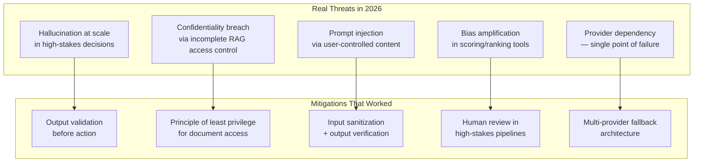

The AI safety discourse in 2023 was dominated by existential risk scenarios. The AI safety work that occupied production engineering teams in 2026 was almost entirely different: confidentiality breaches through incomplete access controls, prompt injection through user-submitted RAG content, hallucination at scale in high-stakes decisions, and bias amplification in tools that scored or ranked people. Not sentient AI rebellion — quiet, unglamorous failures that compound quietly and surface badly.

Here's what production AI safety actually looked like in 2026, and what worked.



## The Threats That Actually Materialized

**Hallucination at scale in high-stakes decisions.** This isn't surprising in isolation — models hallucinate, everyone knows this. What 2026 made clear is the compounding problem: when AI systems process high volumes of decisions automatically, even a low hallucination rate produces a significant absolute number of wrong outputs, and those wrong outputs can have material consequences if there's no human in the loop to catch them. A 99% accurate AI system processing 10,000 decisions per day produces 100 wrong outputs per day. If those outputs are loan assessments, medical record summaries, or legal document analyses, 100 wrong outputs per day is a serious problem.

The response that worked: mandatory human review sampling for high-stakes outputs, with sampling rates determined by the consequence of errors, not just by confidence scores. Confidence scores are useful but not sufficient — high-confidence hallucinations are harder to catch than low-confidence ones.

**Confidentiality breach via incomplete RAG access control.** This was the most common real AI security incident in 2026. The pattern: a RAG system retrieves documents based on semantic similarity to the user's query. The system correctly returns the most relevant documents — but one of those documents is one the querying user shouldn't have access to, because the access control checks in the retrieval layer were incomplete or incorrectly implemented. The AI assistant helpfully summarizes the confidential content.

The failure mode is particularly insidious because it passes all functional testing: the retrieval is semantically correct, the AI response is accurate, and the only problem is that the document shouldn't have been retrievable by this user. Standard functional tests don't test access boundaries.

```python
# Access control must happen BEFORE retrieval, not after
class SecureRAGRetriever:
    async def retrieve(
        self, 
        query: str, 
        user_context: UserContext,
        top_k: int = 5
    ) -> list[Document]:
        
        # Step 1: Get candidate documents via semantic search
        candidates = await self.vector_store.similarity_search(
            query=query,
            top_k=top_k * 3,  # Over-fetch to account for access filtering
            filter={"tenant_id": user_context.tenant_id}  # Minimum filter in vector store
        )
        
        # Step 2: Apply full access control BEFORE returning to the model
        # Do NOT rely on the model to skip unauthorized content
        authorized = [
            doc for doc in candidates 
            if self.access_control.can_read(user_context, doc)
        ]
        
        return authorized[:top_k]
```

**Prompt injection via user-controlled content in RAG systems.** Real attacks in 2026. The mechanism: a document in the RAG corpus contains carefully crafted text that, when retrieved and included in the model's context, attempts to override the system prompt or hijack the AI's behavior. An attacker who can influence document content — a customer submitting a support ticket, a contractor adding to a shared knowledge base — can potentially inject instructions that the AI then follows.

The attack is subtle because the injection doesn't appear in the user's query. It appears in retrieved context that seems legitimate. Standard input sanitization on the user query doesn't prevent it.

Mitigations that worked: treating all retrieved content as untrusted user input (not as authoritative context), explicit instruction boundary markers in the system prompt, and output validation that checks whether the AI's response is consistent with the stated task before acting on it.

**Bias amplification in scoring and ranking tools.** AI tools that score resumes, prioritize support tickets, or rank candidates amplify whatever biases exist in their training data and evaluation criteria — consistently and at scale, in ways that human inconsistency might have partially mitigated through random variation. Several organizations in 2026 discovered that their AI-assisted hiring tools had significant demographic disparities that weren't visible in aggregate performance metrics but appeared clearly in disaggregated analysis.

The mitigation that worked: mandatory disaggregated analysis in evaluation pipelines, treating demographic parity metrics as hard requirements rather than nice-to-haves, and human review of AI ranking decisions in any process with protected-class implications.

## Mitigations That Worked

**Defense in depth over single-layer filtering.** Single content filters — model-level safety fine-tuning, one input filter, one output filter — are not sufficient. Relying on model self-censorship is not sufficient. Real production safety requires multiple independent layers: input validation, system prompt design, output validation, and human review at appropriate confidence thresholds. Any single layer can fail; failures across all layers simultaneously are much rarer.

**Principle of least privilege for AI access.** The AI system should only access what it needs for the specific task being performed. A customer-facing assistant should not have access to internal employee documents. A document summarizer should not have write access to the document store. Scoping AI permissions to the minimum required for the task limits the blast radius of any single failure.

**Explicit scope communication to users.** Users should know what the AI can and cannot see, and what it will and won't do. "This assistant can access your account history from the past 12 months but cannot access billing information" sets correct expectations and reduces the value of prompt injection attacks aimed at extracting information the system genuinely doesn't have access to.

## The Regulatory Dimension

The EU AI Act's high-risk category requirements started landing in regulated industries in 2026. Documentation obligations, human oversight requirements, and accuracy standards for AI systems in hiring, credit, healthcare, and law enforcement drove safety practices that previously happened only at the most conscientious organizations. The regulatory pressure is imperfect — it covers specific categories while leaving others unaddressed — but its effect on documentation practices and oversight design in affected industries has been largely positive.

The practical takeaway: if you're in a regulated industry or using AI for any decision that affects access to services, build the audit trail and oversight mechanisms now, regardless of your current regulatory exposure. The documentation requirements that feel burdensome initially become the evidentiary record you need when something goes wrong — and something eventually goes wrong.
