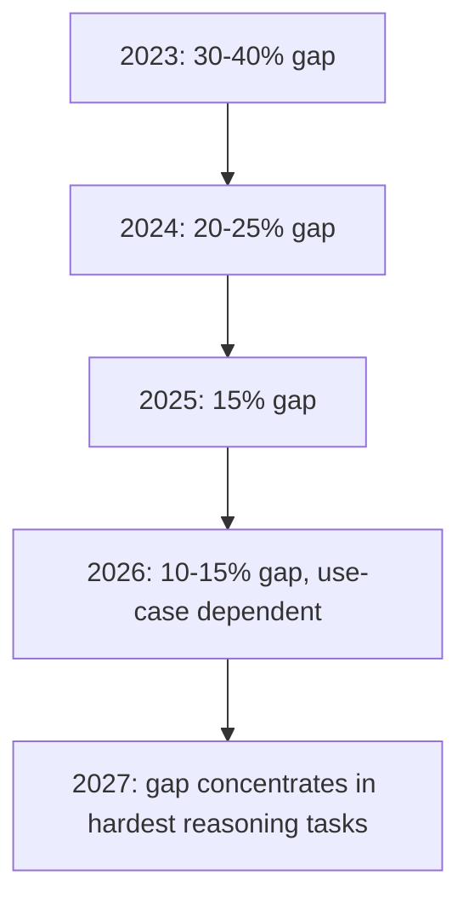

Two years ago, the gap between open-source and frontier proprietary models was wide enough that "just use the API" was correct advice for almost every use case. That's no longer universally true. In 2026, Llama 3.1 405B, Qwen2.5 72B, and Mistral Large 2 closed enough of the capability gap that self-hosting became a legitimate default for a meaningful slice of enterprise workloads — not because OSS caught up everywhere, but because it caught up on the tasks that make up most production traffic.



## The 2026 OSS model landscape

**Llama 3.1 405B (Meta)**: the largest widely-deployed open weight model. Within 10-15% of GPT-4-class benchmarks on most standard evaluations. Requires serious hardware (8x H100 minimum for full precision, 2x H100 with aggressive quantization) but represents the closest OSS gets to frontier capability.

**Qwen2.5 72B (Alibaba)**: strong multilingual performance and code generation, competitive with much larger models on programming benchmarks. Runs comfortably on 2x A100/H100 with AWQ quantization. The default choice for teams prioritizing code tasks and non-English language coverage.

**Mistral Large 2**: excellent instruction-following fidelity and reasoning consistency. European provenance matters for teams navigating data sovereignty requirements under GDPR and the EU AI Act.

**Gemma 2 27B (Google)**: efficient, well-documented, strong safety tuning out of the box. Smaller footprint makes it the practical choice for teams without large GPU budgets who still want quality above the 7-8B tier.

## Benchmarks that actually predict enterprise usefulness

Raw MMLU scores correlate weakly with production usefulness. The benchmarks that matter more:

- **Instruction-following fidelity**: does the model reliably do what the system prompt asks, including format constraints and negative instructions ("don't mention X")?
- **Structured output compliance**: schema adherence rate when using tool-call or JSON-mode style constrained generation
- **Domain-specific accuracy**: performance on your actual task distribution, not a general benchmark
- **Language coverage**: for multilingual deployments, per-language quality varies significantly between models

Teams that benchmarked only on MMLU or general leaderboards in 2024-2025 frequently found the "winning" model underperformed on their actual workload. Build a task-specific eval set before choosing — the general leaderboard tells you almost nothing about whether a model handles your support ticket classification or your contract summarization well.

## Where OSS still trails

The gap hasn't closed everywhere, and pretending otherwise produces bad architecture decisions:

- **Complex multi-step reasoning**: chained logical inference, especially under ambiguity, still favors frontier models measurably
- **Long-horizon agentic tasks**: OSS models show higher failure rates on 5+ step autonomous tasks
- **Creative writing quality**: subjective, but consistently rated lower in blind comparisons for nuanced tone and originality
- **Cutting-edge code generation**: for genuinely novel problems (not boilerplate or common patterns), frontier models retain an edge

## The vLLM ecosystem matured into production-grade infrastructure

The single biggest enabler of 2026 OSS adoption wasn't the models — it was the serving infrastructure catching up. vLLM's PagedAttention and continuous batching, combined with mature quantization tooling (AWQ, GPTQ, FP8) and multi-LoRA serving, means operators can now run OSS models with the same operational maturity that managed inference APIs offered in 2024. This closed the "OSS is capable but painful to operate" gap that kept many teams on APIs even when cost math favored self-hosting.

## The cost crossover

At sufficient volume, self-hosted OSS is cheaper than API access. The crossover point in 2026, accounting for full infrastructure and ops cost (not just GPU-hour price), sits around 5M tokens/day for most teams — below that, API pricing plus zero ops burden usually wins; above it, self-hosting starts winning on unit economics, assuming you already have or are willing to build the operational capability.

```python
# Simplified crossover estimate
def monthly_cost_comparison(tokens_per_day: int):
    api_cost_per_million = 3.00  # blended input/output, mid-tier model
    api_monthly = (tokens_per_day / 1_000_000) * api_cost_per_million * 30

    gpu_hourly_rate = 2.50  # single H100, cloud on-demand
    gpus_needed = max(1, tokens_per_day // 15_000_000)  # rough throughput estimate
    ops_engineer_monthly = 15_000 / 4  # fractional FTE allocation
    self_hosted_monthly = (gpu_hourly_rate * 24 * 30 * gpus_needed) + ops_engineer_monthly

    return {"api": api_monthly, "self_hosted": self_hosted_monthly}
```

## What pushed adoption beyond cost

Cost wasn't the only driver. Data sovereignty requirements — GDPR, sector-specific regulations in healthcare and finance, and emerging EU AI Act documentation obligations — pushed some teams toward self-hosting regardless of the cost math, because the data simply couldn't leave the network boundary. Customization needs (domain-specific fine-tuning, adapter serving for multiple use cases on one base model) also favored OSS, since API-based fine-tuning remains more constrained than full control over weights.

## Where OSS still lost

Teams without ML infrastructure expertise mostly stayed on APIs in 2026, and reasonably so — the operational burden of self-hosting (model updates, security patching, monitoring, capacity planning) is real work that doesn't disappear just because the model weights are free. And any use case genuinely requiring absolute frontier quality — the hardest 10-15% of tasks — still justified API access to flagship proprietary models, sometimes in a hybrid architecture alongside a self-hosted OSS model handling the bulk of simpler traffic.

> The right question in 2026 isn't "OSS or API" — it's "which of my workloads sit in the 85% that OSS now handles well, and which sit in the 15% that still needs frontier capability." Most enterprise AI architectures should answer with both.
{: .prompt-info }

The gap didn't disappear. It concentrated. For high-volume, well-scoped enterprise tasks — classification, extraction, summarization, code assistance on established patterns, domain-tuned support — 2026's open models are good enough, and the infrastructure to run them well finally exists.
