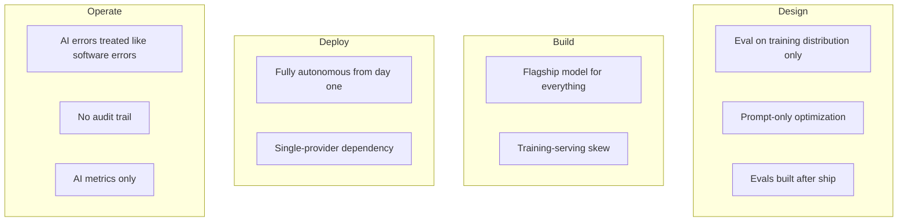

Every one of these antipatterns shows up in postmortems, not tutorials. They're not exotic mistakes — they're the reasonable-sounding shortcut that seemed fine in the demo and became a production incident three months later. If your team is doing any of these, 2027 planning is a good time to stop.

## 1. Evaluating on training distribution only

The eval dataset looks like the training data because it's convenient to build that way — same source, same format, same difficulty distribution. It passes with a high score and then fails in production the first week, because production traffic includes inputs the training distribution never anticipated. An eval set needs a deliberate out-of-distribution slice: edge cases, adversarial inputs, and real production samples collected after initial deployment. Without it, your eval score measures how well the model memorized your test-writing habits, not how well it generalizes.

## 2. Prompt engineering as the only optimization lever

When output quality is disappointing, the instinct is to rewrite the system prompt. Sometimes that's right. Often the actual problem is retrieval quality (wrong chunks reaching the model), data quality (the source documents are wrong or stale), or model selection (the task needs more reasoning capacity than the current tier provides). Teams that only ever pull the prompt lever burn weeks iterating on wording when the fix was in the retrieval pipeline the whole time.

## 3. Fully autonomous agents in production from day one

The agent demo works. Every step in the happy path executes correctly. The team ships it with full autonomy — no approval gates, no human review — because adding checkpoints feels like admitting the agent isn't good enough. Then it takes an unrecoverable action on bad input in week two. Every reliable production agent deployment in 2026 started with explicit human checkpoints on consequential actions and earned autonomy incrementally as confidence was established through actual production data, not through demo performance.

## 4. Treating AI errors like software errors

Traditional monitoring watches for exceptions and non-200 responses. AI quality failures don't look like that — the service returns 200, the output is fluent, and it's simply wrong. Alerting built for deterministic software silently misses the most common AI failure mode. You need a parallel monitoring layer: sampled output quality scoring, user correction rate tracking, and behavioral anomaly detection — none of which fires from an exception handler.

## 5. No audit trail for AI decisions

Audit logging gets added after an incident forces the question, or after a compliance audit asks for records that don't exist. By then you have months of production behavior nobody can reconstruct. Minimum viable audit logging — request ID, model version, input/output hashes, timestamps — costs little to build in from day one and is expensive to retrofit once you actually need it for an incident investigation or a regulatory request.

## 6. Choosing the flagship model for everything

The reasoning is understandable: use the best model, get the best output. In practice, a large share of production AI traffic — classification, routing, simple extraction, short-form generation — doesn't need flagship-tier reasoning. Routing that traffic to a smaller, cheaper, faster model cuts costs 40-60% with no measurable quality loss on those tasks, freeing budget for the genuinely hard tasks that do need the expensive model.

## 7. Building evals after the feature ships

Evals written retroactively measure against an unknown baseline — you don't actually know if the feature got better or worse over time because you never captured what "the current state" looked like before you started iterating. Evals belong in the spec, built alongside the feature, so the first measurement happens before the first production deployment, not six months into an unmeasured trajectory.

## 8. Ignoring training-serving skew

Feature computation logic implemented once for the training pipeline and again for the serving path — slightly differently, because two engineers wrote them at two different times — is a silent, slow-motion bug. The model was trained on features computed one way and serves on features computed a subtly different way, and nothing throws an error. This is a common cause of a model that scores well offline and underperforms in production for reasons nobody can immediately explain. A shared feature definition (a feature store, or at minimum a shared library) used by both paths eliminates the class of bug entirely.

## 9. Single-provider dependency

No fallback when the primary model provider has an outage means your AI feature goes down whenever they do, on their schedule, with no mitigation available to you. This is a solved problem — a multi-provider fallback chain in your gateway layer — that teams routinely skip because "it probably won't happen." It happens. Regional outages, rate limit exhaustion during a traffic spike, and deprecated model versions all trigger it.

## 10. Measuring AI success with AI metrics only

Eval scores improve. Faithfulness goes from 0.78 to 0.89. Nobody checks whether adoption, retention, or task completion moved at all — and sometimes they didn't, because the eval metric wasn't actually the thing blocking user value. Eval scores are a leading indicator, not the goal. The goal is a business or user outcome, and teams that only report eval metrics upward eventually get asked "so what" by someone who controls the budget.

> None of these are complicated to avoid. They're all easy to fall into because each one is the path of least resistance in the moment it gets chosen. The fix in every case is the same: build the missing thing (evals, audit logs, fallback, routing) before you need it, not after the incident that proves you needed it.
{: .prompt-warning }

If your 2027 planning includes "clean up AI technical debt," this list is a reasonable starting checklist. Most of it is cheaper to fix now than it will be after the next incident makes it urgent.
