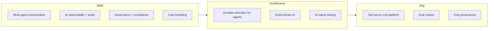

Skill roadmaps for AI engineering age fast, but the direction for 2027 is clearer than it was heading into 2026. The technology that mattered this year — RAG, structured output, evals, gateways — is now infrastructure, not differentiation. What's next is what happens on top of that infrastructure: orchestration at scale, governance as a discipline, and organizations that can self-serve AI capability instead of routing everything through one bottlenecked team.

## Skills to develop

**Multi-agent orchestration.** In 2026, multi-agent systems were mostly research-grade experiments with fragile reliability in production. The tooling matured enough by year-end that 2027 is the year this becomes real infrastructure rather than a research direction — closer to where microservices orchestration was around 2018. Engineers who understand supervisor/worker patterns, error propagation across agent boundaries, and state management for multi-step agentic workflows will be ahead of the curve.

**AI observability and evals.** This stopped being optional in 2026 for any team running AI in production, and it's the single highest-leverage skill for 2027. Every team needs an eval culture — not a one-time gate, but continuous measurement wired into CI and production monitoring both. If you can design a rigorous eval for a task nobody has evaluated before, that's a scarce and valuable skill.

**AI governance and compliance.** The EU AI Act's Annex III high-risk compliance deadline lands in December 2027, and equivalent regulatory frameworks are emerging in the US and APAC. Engineers who understand what "technical documentation" and "audit trail" actually mean for an LLM system — not in the abstract, but in terms of what code and logging infrastructure satisfies it — will be increasingly necessary, not just at regulated companies.

**Cost modeling and optimization.** AI spend became material on most company P&Ls in 2026. The engineers who can build a credible TCO model, design routing that cuts cost without hurting quality, and explain the tradeoffs to finance in language finance understands have a skill that's rare and directly tied to budget decisions.

## Architectural patterns to learn

**Durable execution for long-running agent workflows.** Agentic tasks that span minutes or hours, survive process restarts, and need retry-with-state semantics are a different engineering problem than a single synchronous LLM call. Temporal (and similar durable execution frameworks) combined with LLM calls is an emerging pattern worth learning now, before it's the default assumption for anything beyond a simple chat interface.

**Event-driven AI systems.** As AI moves from request-response chat interfaces into background processing — enrichment pipelines, monitoring agents, automated workflows — the architecture shifts toward event-driven design: Kafka topics, async workers, backpressure handling. This is a different skill set than building a chatbot, and it's where a growing share of enterprise AI value is showing up.

**AI-native testing methodology.** Contract testing for non-deterministic responses, mutation testing as an AI quality gate, chaos engineering for model failure modes — these patterns matured in 2026 and are worth internalizing as standard practice rather than novel techniques.

## What to build organizationally

**A self-service internal LLM platform.** Business teams and product engineers should be able to get a governed model endpoint, a vector store, and an eval harness without filing a ticket to a central AI team. The platform team's job in 2027 is enabling that self-service, not gatekeeping every individual feature request.

**An eval culture.** Every AI feature ships with an eval suite as a condition of shipping, the same way every service ships with tests. This is an organizational norm to establish deliberately — it doesn't happen by default, and once a team ships without evals once, it becomes much easier to skip them again.

**AI cost governance.** Chargeback or showback models that make AI spend visible and attributable to the teams generating it. Without this, cost conversations happen reactively after the bill arrives, instead of proactively as part of feature planning.

## What to stop building

**Bespoke integration layers.** Custom code that wraps model provider APIs, handles retries, and does basic routing is now a solved problem — LiteLLM and equivalent gateway products cover this well. Building it from scratch in 2027 is optimizing the wrong thing.

**RAG from scratch without evaluating existing frameworks first.** LangChain, LlamaIndex, and the broader RAG tooling ecosystem cover the standard patterns (hybrid retrieval, reranking, chunking strategies) well enough that custom-built RAG pipelines should be a deliberate choice for a specific unmet need, not a default starting point.

## Recommended learning sequence

Practical over theoretical: ship an AI feature and run its evals in production before spending time studying transformer internals or attention mechanism papers. The engineers who shipped the most reliable AI features in 2026 were not, as a rule, the ones with the deepest ML theory background — they were the ones who treated AI components with the same engineering rigor (testing, monitoring, incident response) as any other production system.

A reasonable 2027 project sequence: (1) build and instrument an eval pipeline for an existing AI feature that doesn't have one, (2) add a fallback and cost-routing layer to your LLM gateway if you don't have one, (3) prototype a multi-step agentic workflow with explicit approval gates for a real internal use case, (4) document what "technical documentation" would need to look like for your highest-risk AI system under emerging governance frameworks.

> The pattern across all four skill areas: 2027 rewards engineers who treat AI systems as production infrastructure requiring the same discipline as everything else you operate — not as a special category that gets a pass on testing, monitoring, and cost accountability.
{: .prompt-tip }

None of this requires waiting for new model releases or better tooling. The infrastructure to build all of it exists today. The gap between teams that will be ahead in 2027 and teams that won't is mostly a gap in deliberate practice, not access to better technology.
