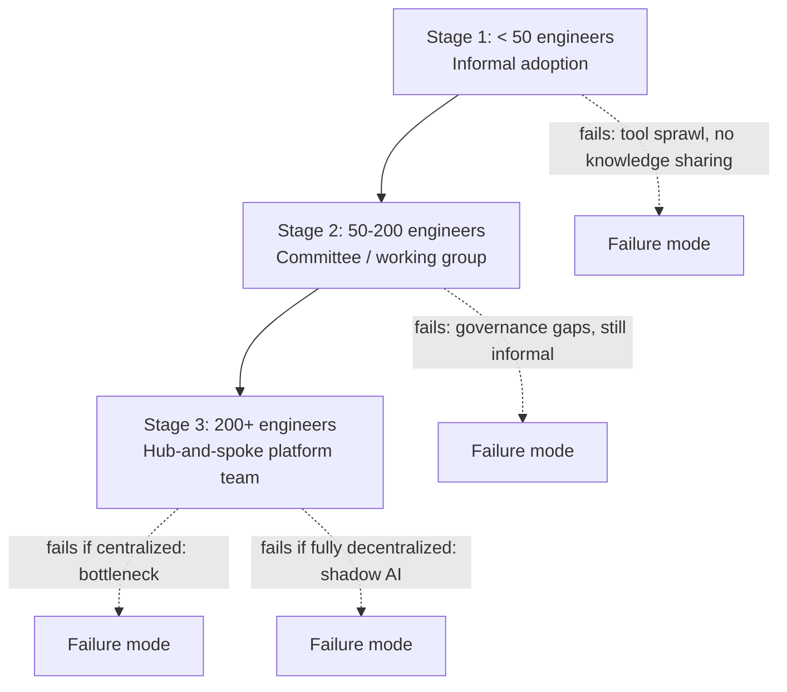

The way an organization structures its AI capability at 30 engineers is close to useless advice for the same organization at 300. What worked as informal enthusiasm in a small team becomes tool sprawl at scale; what worked as a tight review committee becomes a bottleneck once every product team wants to ship an AI feature simultaneously. 2026 gave enough enterprises enough scaling experience to see the pattern clearly.



## Stage 1: under 50 engineers — informal adoption

At this scale, AI adoption happens organically. Individual engineers use Copilot, Claude Code, and whatever AI tools they find useful, without central coordination. This works initially — it's fast, it requires no organizational overhead, and engineers who are motivated get real productivity gains immediately.

The failure mode shows up within 6-12 months: tool sprawl (five teams pick five different vector databases for essentially the same RAG use case), no knowledge sharing (the prompt engineering lessons one team learned the hard way get relearned independently by the next team), and no consistent security posture (some engineers send sensitive data to AI APIs without anyone having made a deliberate policy decision about it).

## Stage 2: 50-200 engineers — the committee phase

Organizations at this size typically form an AI working group or committee — a cross-functional group that meets to share best practices and occasionally sets loose guidelines. This is progress over Stage 1: knowledge sharing improves, some common tooling emerges informally.

It's still not enough. Governance remains largely advisory rather than enforced. There's no infrastructure ownership — no team is actually responsible for the LLM gateway, the shared vector store, or the eval framework, so these either don't exist or exist as one team's side project that other teams depend on without any SLA. This stage is a necessary transition, not a stable end state.

## Stage 3: 200+ engineers — hub-and-spoke

The pattern that held up at scale in 2026: a dedicated AI platform team (typically 4-8 engineers) owns infrastructure, tooling, and governance as their actual job — not a side project layered onto other responsibilities. Business unit AI leads coordinate between the platform team and their product organizations. Embedded AI engineers sit inside product teams and build features using the platform's guardrails.

```yaml
# Illustrative org structure
ai_platform_team:
  size: 6
  owns:
    - llm_gateway
    - vector_infrastructure
    - eval_framework
    - governance_policy
    - cost_dashboards
  does_not_own:
    - individual product AI features

business_unit_ai_leads:
  count: 1_per_bu
  responsibilities:
    - coordinate_with_platform_team
    - prioritize_bu_ai_roadmap
    - escalate_platform_gaps

embedded_ai_engineers:
  location: within_product_teams
  responsibilities:
    - build_features_on_platform
    - consume_shared_infrastructure
    - contribute_patterns_back_to_platform
```

## Why centralized AI teams fail

The obvious alternative — one central AI team that builds all AI features for the whole company — fails predictably once demand exceeds the team's capacity, which happens fast. Every product team's AI feature request goes into one queue. The central team becomes the bottleneck for the entire organization's AI velocity, and product teams either wait indefinitely or route around the team entirely, which leads to the next failure mode.

## Why fully decentralized AI fails

The other obvious alternative — every team builds and operates its own AI stack independently — produces shadow AI: unmonitored spend, inconsistent data handling policies, duplicated infrastructure (six teams each running their own vector database), and zero visibility into what's actually running in production until something goes wrong and someone asks who owns it.

## What the platform team's job actually is

The critical distinction that made hub-and-spoke work: the platform team's job is not building AI features. It's building the infrastructure that lets product teams build AI features reliably and safely without reinventing the gateway, the eval framework, or the governance policy each time. This is the same relationship a platform engineering team has to product teams for any other shared infrastructure — the analogy holds well.

Concretely, the platform team owns: the LLM API gateway (routing, cost tracking, fallback), the shared vector infrastructure, a reusable eval framework and CI integration, governance policy and its technical enforcement, and cost dashboards with per-team attribution. Product teams consume these and build on top, contributing improvements back rather than building parallel versions.

## Measuring whether the platform team is working

Feature count shipped by the platform team is the wrong metric — that measures the antipattern, not success. The metrics that actually indicate a healthy hub-and-spoke model:

- **Self-service rate**: what fraction of new AI features get built without the platform team writing any feature-specific code
- **Time to first AI feature for a new team**: how long from "team wants to build an AI feature" to "feature is in production," using the platform's guardrails
- **AI incident rate**: security, compliance, or quality incidents per feature shipped — should trend down as governance matures, not up as adoption grows
- **Cost per team**: visible, attributable AI spend, tracked against each team's own budget

## The organizational antipattern to watch for

A subtle failure mode that looks like governance but isn't: an "AI center of excellence" that reviews and approves features before they ship, but provides no actual infrastructure or enablement. This produces all of the bottleneck problems of a centralized team with none of the platform benefits — teams wait for approval from a committee that isn't actually helping them build anything faster or safer. If your AI governance function reviews more than it enables, it's this antipattern wearing different branding.

> The test for whether your AI organization has scaled correctly: can a product team ship a governed, monitored AI feature without a meeting with the platform team? If yes, you've built a platform. If every feature requires platform team involvement, you've built a bottleneck with a platform team's job title.
{: .prompt-info }

None of these stages is wrong for its scale — Stage 1's informality is appropriate at 30 engineers. The mistake is staying in a stage past the point where its failure modes start costing more than the transition to the next stage would.
