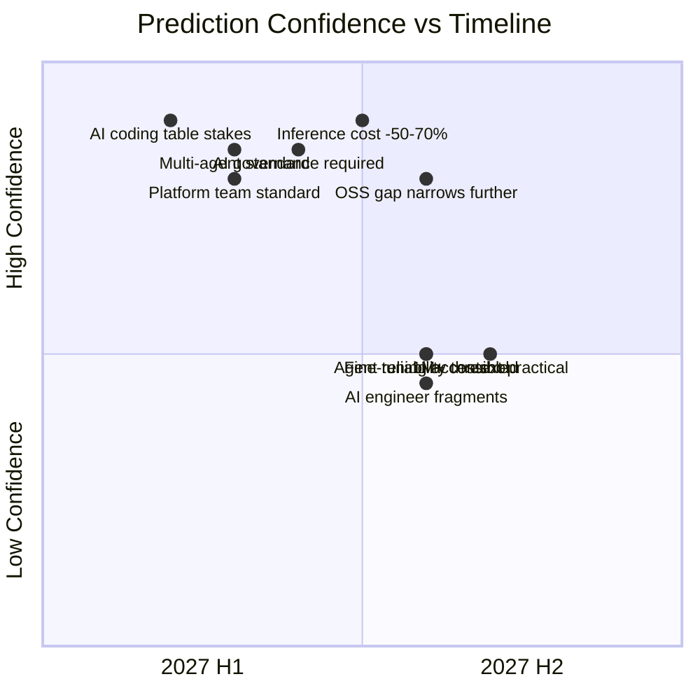

Predictions are only useful if they come with the reasoning attached, so a reader can judge the logic independently of whether the specific date turns out right. These ten are grounded in trajectories that were already visible by the end of 2026 — extrapolations, not guesses — each with an explicit confidence level.

## 1. Multi-agent systems become production standard (high confidence)

The tooling and architectural patterns matured substantially through 2026 — durable execution frameworks paired with LLM calls, clearer supervisor/worker patterns, better error propagation handling. By mid-2027, multi-agent systems should be roughly as standard in production architecture as microservices were around 2018: not universal, but no longer exotic, with well-understood tradeoffs and established reference architectures.

## 2. AI inference costs drop another 50-70% (high confidence)

The 2023-2026 cost curve was remarkably consistent — driven by hardware generation turnover, distillation techniques, and quantization improvements compounding year over year. There's no visible reason for that trajectory to break in 2027. Combined with wider adoption of prompt caching and cost-aware routing, effective inference cost per unit of useful work should continue falling sharply.

## 3. Context windows exceed 1M tokens and become practical (medium confidence)

The context window ceiling will likely keep rising — that part is close to certain. Whether 1M+ token contexts become genuinely *practical*, rather than technically available but quality-degraded, is less certain. The "lost in the middle" problem that limits long-context reliability has been improving but hasn't been solved, and there's real uncertainty about whether it fully resolves in 2027 or just continues to improve incrementally.

## 4. AI governance becomes a required engineering discipline (high confidence)

The EU AI Act's Annex III high-risk compliance deadline lands in December 2027 — a hard date, not a trend extrapolation. Combined with emerging equivalent frameworks in other jurisdictions, governance literacy stops being a specialist concern and becomes baseline expectation for engineers building anything that touches consequential decisions.

## 5. The AI platform team becomes standard above 100 engineers (high confidence)

This organizational pattern — hub-and-spoke, central platform team plus embedded product engineers — was already well-established by companies that scaled AI adoption through 2026, and the business case (avoiding both the centralized bottleneck and the decentralized shadow-AI chaos) is clear and well-documented. This is more an observation of a pattern completing its spread than a genuine bet.

## 6. Open-source models close the gap further for most use cases (high confidence)

The trajectory from 2023 through 2026 has been consistent narrowing, and the underlying drivers (training technique improvements, hardware access broadening, growing engineering investment in OSS model development) show no sign of slowing. The frontier advantage should continue concentrating specifically in the hardest reasoning and long-horizon agentic tasks, while the broad middle of enterprise use cases becomes increasingly OSS-viable.

## 7. Agent reliability hits the "good enough" threshold for more use cases (medium confidence)

Reliability has been improving steadily through better tool-use training, structured output compliance, and architectural patterns like explicit verification steps. Whether it improves fast enough in 2027 to unlock genuinely long-horizon (10+ step) autonomous use cases is less certain — the hardest reliability problems (multi-agent error propagation, compounding failure probability across steps) may need architectural innovations that don't yet exist, not just incremental model improvement.

## 8. AI coding tools become table stakes, not differentiators (high confidence)

Adoption is already near-universal among professional engineers by the end of 2026. The open question for 2027 isn't whether teams use AI coding tools — it's how well they use them, which is a skill and workflow-design question, not an adoption question. "We use Claude Code" stops being a notable statement; "here's how we've integrated it into our review and testing process" becomes the differentiator.

## 9. Fine-tuning becomes more accessible with managed platforms (medium confidence)

Vendor-managed fine-tuning offerings improved meaningfully in 2026, lowering the operational barrier. Whether this translates into materially broader adoption in 2027 is less certain — the harder barriers (building quality training data, running rigorous evaluation) are process and skill problems that a better platform doesn't automatically solve. Tooling accessibility and actual adoption don't always move together.

## 10. The "AI engineer" title fragments into specializations (medium confidence)

As the field matures, distinct roles are starting to separate: evaluation engineer, AI platform engineer, AI product engineer each carry a different day-to-day and a different skill emphasis. This mirrors how "web developer" fragmented into frontend, backend, and full-stack over the 2010s. Whether this fragmentation crystallizes into standard job titles by end of 2027, versus remaining an informal distinction within broader "AI engineer" roles, is genuinely uncertain.

> Predictions 1, 4, 5, 6, and 8 rest on trajectories already visible and largely locked in by momentum. Predictions 3, 7, 9, and 10 depend on developments that could plausibly go either way — worth revisiting with fresh evidence partway through 2027 rather than treated as settled.
{: .prompt-info }

The throughline across all ten: 2027 is less about new model capability breakthroughs and more about the engineering discipline, organizational structure, and governance maturity catching up to capability that mostly already exists. That's a less exciting story than "AGI arrives" headlines, and it's also the one the evidence actually supports.
