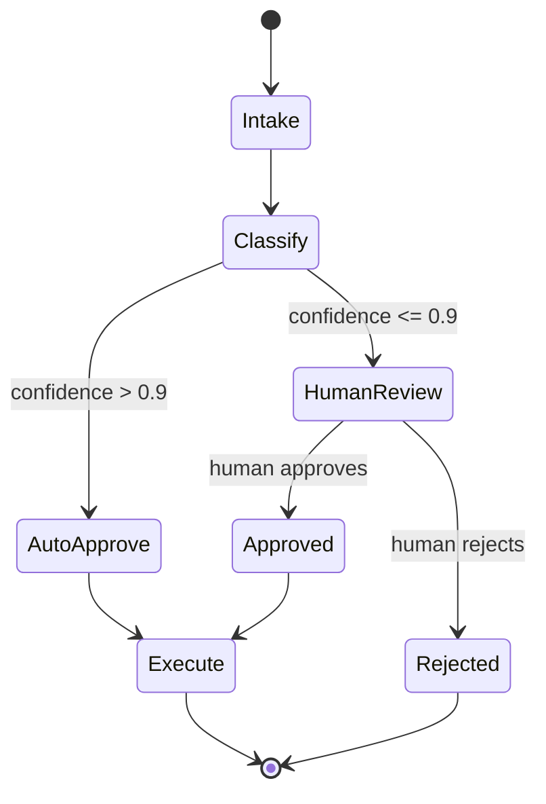

I've built multi-agent systems in three frameworks over the last year, and the one that survives contact with a compliance team is LangGraph. Not because it's the most elegant API — CrewAI wins that comparison easily — but because when a bank's risk team asks "show me exactly what your agent considered before it approved that transaction," you can point at a graph and a state object instead of shrugging at a chat transcript. This post is about why that structural choice matters and how the graph, state, and checkpoint model actually works under the hood.



## Why explicit state beats implicit conversation history

Most conversational agent frameworks treat "state" as an ever-growing chat history that the model re-reads on every turn. That works fine for a chatbot. It falls apart the moment you need to answer questions like: what tools were called, in what order, with what inputs, and who approved what. A chat transcript is a human-readable log, not a queryable data structure. You can't easily assert "the discount field was never modified after the pricing agent ran" against a wall of text.

LangGraph inverts this. The unit of truth isn't the conversation — it's a typed state object that gets explicitly read and written by each node in a graph. The conversation history, if you keep one at all, is just one field on that state. Every other piece of information — what the classifier decided, what the retrieval step found, what a human approved — lives in its own named, typed slot. That's the difference between "the agent probably considered X" and "field `risk_score` was set to 0.82 by node `classify_risk` at this step."

## The core primitives

A LangGraph application is built from three things: a state schema, nodes, and edges.

```python
from typing import TypedDict, Literal
from langgraph.graph import StateGraph, END

class ClaimState(TypedDict):
    claim_id: str
    claim_text: str
    category: str
    risk_score: float
    decision: str
    approver: str | None

def classify(state: ClaimState) -> ClaimState:
    # call the LLM to categorize + score the claim
    result = classify_claim(state["claim_text"])
    return {**state, "category": result.category, "risk_score": result.score}

def route_on_risk(state: ClaimState) -> Literal["auto_approve", "human_review"]:
    return "auto_approve" if state["risk_score"] < 0.3 else "human_review"

def auto_approve(state: ClaimState) -> ClaimState:
    return {**state, "decision": "approved", "approver": "system"}

def human_review(state: ClaimState) -> ClaimState:
    # this node pauses execution — covered in tomorrow's post
    decision = wait_for_human_decision(state["claim_id"])
    return {**state, "decision": decision.outcome, "approver": decision.reviewer}

builder = StateGraph(ClaimState)
builder.add_node("classify", classify)
builder.add_node("auto_approve", auto_approve)
builder.add_node("human_review", human_review)

builder.set_entry_point("classify")
builder.add_conditional_edges("classify", route_on_risk, {
    "auto_approve": "auto_approve",
    "human_review": "human_review",
})
builder.add_edge("auto_approve", END)
builder.add_edge("human_review", END)

graph = builder.compile()
```

Nodes are plain functions that take state and return a partial update. Edges connect nodes. Conditional edges are just a routing function that inspects state and returns the name of the next node. There's no magic — you can trace the entire possible execution space by reading the `builder.add_*` calls, which is exactly the property an auditor wants.

## Running it

```python
result = graph.invoke({
    "claim_id": "CLM-4471",
    "claim_text": "Rear-end collision, $3,200 in damages, no injuries.",
    "category": "",
    "risk_score": 0.0,
    "decision": "",
    "approver": None,
})
print(result["decision"], result["approver"])
```

`invoke` runs the graph to completion synchronously. For anything long-running or requiring a pause, you use `stream` and checkpointing instead — which is the actual production pattern.

## Checkpointing for crash recovery

The feature that makes LangGraph a production tool rather than a demo tool is the checkpointer. Attach one, and the graph persists its state after every node execution, not just at the end.

```python
from langgraph.checkpoint.postgres import PostgresSaver

checkpointer = PostgresSaver.from_conn_string(DATABASE_URL)
graph = builder.compile(checkpointer=checkpointer)

config = {"configurable": {"thread_id": "CLM-4471"}}
graph.invoke(initial_state, config=config)
```

That `thread_id` is the key to everything. If the process crashes between `classify` and `human_review`, you don't lose the classification work — you resume the same thread and LangGraph picks up from the last completed node, not from scratch. For an agent workflow that might involve several LLM calls at $0.02 a pop and a few seconds of latency each, replaying from zero on every worker restart is real money and real time, not just an inconvenience.

This is also what makes human-in-the-loop possible at all: a node can pause execution indefinitely, the process can be killed and restarted, and the workflow resumes exactly where it left off once a human acts — hours or days later. I'll go deep on that pattern tomorrow.

## Why this beats "let the agent decide everything"

The alternative — a single agent loop that decides at each turn what to do next based on the full conversation history — is genuinely faster to build and often produces more flexible behavior. I use that pattern for internal tooling and exploratory work all the time. But it has a property that's disqualifying for regulated workflows: the set of things the agent *could* do next is defined by the model's judgment at runtime, not by code you can review in a PR.

With LangGraph, the graph topology is the specification. A security reviewer can look at `builder.add_conditional_edges` and know, with certainty, that a claim can only reach `auto_approve` via the `classify` node's risk routing — there's no path where the model free-associates its way into approving something it shouldn't. That's not a small ergonomic win. It's the difference between "we tested the agent and it behaved well in our test cases" and "here is a formal description of every state this system can be in."

The honest tradeoff: you write more code. Defining a typed state schema and explicit routing functions is slower than describing a role and a goal in a paragraph of natural language. For a weekend prototype, that overhead isn't worth it. For a workflow that touches money, healthcare data, or anything a regulator will eventually ask about, it's the cheapest insurance you'll buy this year.
