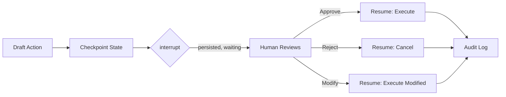

Yesterday I covered why LangGraph's explicit state model wins for auditable workflows. The feature that actually makes that useful in practice is `interrupt` — the mechanism that lets a graph stop mid-execution, wait for a human, and resume later with updated state. I've shipped this pattern for a refund-approval agent, a contract-redlining agent, and a data-deletion agent, and in all three cases the interrupt mechanism was the difference between "agent that occasionally does something we regret" and "agent that proposes, and a human disposes."



## interrupt, not interrupt_before/interrupt_after

Older LangGraph docs talk about `interrupt_before` and `interrupt_after`, which pause the graph at fixed points you declare at compile time. The pattern I actually use now is the `interrupt()` function called from inside a node, because it lets the pause point carry data — you can hand the human reviewer exactly what they need to see, not just "node X is about to run."

```python
from langgraph.types import interrupt, Command
from langgraph.graph import StateGraph, END
from typing import TypedDict

class RefundState(TypedDict):
    customer_id: str
    order_id: str
    amount: float
    reason: str
    decision: str | None
    approved_amount: float | None

def draft_refund(state: RefundState) -> RefundState:
    proposal = llm_draft_refund(state["order_id"], state["reason"])
    return {**state, "amount": proposal.amount}

def approval_gate(state: RefundState) -> RefundState:
    decision = interrupt({
        "type": "refund_approval",
        "customer_id": state["customer_id"],
        "order_id": state["order_id"],
        "amount": state["amount"],
        "reason": state["reason"],
    })
    return {
        **state,
        "decision": decision["action"],
        "approved_amount": decision.get("amount", state["amount"]),
    }

def execute_refund(state: RefundState) -> RefundState:
    if state["decision"] == "approve":
        process_refund(state["order_id"], state["approved_amount"])
    return state

builder = StateGraph(RefundState)
builder.add_node("draft_refund", draft_refund)
builder.add_node("approval_gate", approval_gate)
builder.add_node("execute_refund", execute_refund)
builder.set_entry_point("draft_refund")
builder.add_edge("draft_refund", "approval_gate")
builder.add_edge("approval_gate", "execute_refund")
builder.add_edge("execute_refund", END)
```

When `interrupt()` is called, LangGraph raises a special exception internally, saves the current state to the checkpointer, and returns control to whatever called `invoke` or `stream` — with a payload describing what's pending. Nothing about the process needs to stay alive. That's the whole point: the worker handling this request can shut down, redeploy, or crash, and the pending approval survives because it's sitting in Postgres, not in memory.

## Persisting across days, not just seconds

The naive version of "pause for approval" is an `await` on some in-process future. That works until your deploy pipeline restarts the service, or the approver is on a plane for six hours, or — realistically — the manager doesn't look at their queue until the next morning. You need the pause to survive process death.

```python
from langgraph.checkpoint.postgres import PostgresSaver

checkpointer = PostgresSaver.from_conn_string(DATABASE_URL)
graph = builder.compile(checkpointer=checkpointer)

config = {"configurable": {"thread_id": f"refund-{order_id}"}}

# Kick off the workflow — it runs until it hits interrupt()
result = graph.invoke(initial_state, config=config)

if "__interrupt__" in result:
    pending = result["__interrupt__"][0].value
    save_to_approval_queue(pending, thread_id=config["configurable"]["thread_id"])
```

That's it — the graph is now durably paused. Nothing is running, nothing is holding a connection open, and the state is sitting in Postgres exactly as it was at the point of interruption.

## Resuming after approval

Resuming doesn't mean calling `invoke` again with a fresh state — it means calling it with a `Command(resume=...)` against the same thread ID, and LangGraph reconstructs everything from the checkpoint automatically.

```python
from langgraph.types import Command

def approve_refund(thread_id: str, action: str, amount: float, reviewer: str):
    config = {"configurable": {"thread_id": thread_id}}
    result = graph.invoke(
        Command(resume={"action": action, "amount": amount, "reviewer": reviewer}),
        config=config,
    )
    audit_log.write(thread_id=thread_id, reviewer=reviewer, action=action)
    return result
```

The `approval_gate` node picks right back up at the line after `interrupt()` was called, with `decision` bound to whatever you passed in `resume`. Everything computed before the interrupt — the drafted refund amount, the customer ID, the reason — is still there in state, untouched, because it was checkpointed.

## Building the approval surface

The interrupt payload is just a dict, so the approval UI is decoupled from the graph entirely — it's whatever queries `pending` approvals and renders them. In practice this is a simple internal dashboard: a table of pending threads, each row showing the interrupt payload, with approve / reject / modify buttons that call the resume function above. The modify path is the one people forget — a manager who wants to approve a refund for $40 instead of the drafted $55 shouldn't have to reject and restart the whole workflow; they pass a different `amount` in the resume payload and the graph proceeds with the modified value.

## Audit logging at each checkpoint

Because every checkpoint is a full state snapshot keyed by thread ID, you get a surprisingly good audit trail for free — `checkpointer.get_tuple(config)` returns the state as of any point in the thread's history without any extra instrumentation. I still write an explicit audit log on every interrupt and resume, though, because "reconstruct the audit trail by querying LangGraph's internal checkpoint tables" is not a sentence you want to say to a compliance auditor. Keep a plain, boring, append-only table: thread ID, event type, payload, actor, timestamp. Let LangGraph's checkpoints be your debugging tool and your own audit table be the system of record.

## The honest limitation

Interrupts pause a single thread cleanly, but they don't give you queueing, prioritization, or SLA tracking on pending approvals — that's on you to build, and it's more work than it sounds like once you have hundreds of refunds sitting in review and a team that needs to triage by urgency. LangGraph gets you a durable pause point with full state; it does not get you a workflow inbox. Budget for building that layer yourself, on top.
