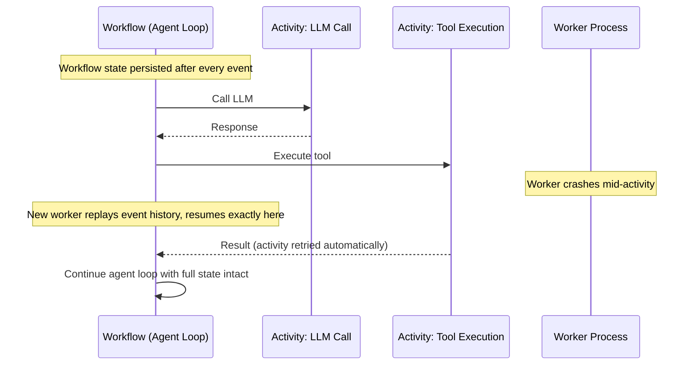

LangGraph's checkpointer solves crash recovery for graphs that pause deliberately at an interrupt. It doesn't solve the harder problem: what happens when a worker dies in the middle of an LLM call it didn't ask to pause during, or a tool call hangs, or a deploy rolls the fleet while forty agent sessions are mid-flight? That's the problem Temporal was built for a decade before agents existed, and it's why I've moved our longest-running agent workflows — the ones that can legitimately take days, waiting on external systems — onto Temporal's Agent Harness instead of stretching LangGraph past what it's designed for.



## Why durable execution is a different problem than checkpointing

LangGraph's checkpointer persists state at node boundaries you've explicitly defined. That's fine when the pause is intentional. But an agent loop making a tool call to a flaky third-party API, or waiting on a webhook that might not arrive for two days, isn't a "pause at a node" problem — it's a "this entire execution needs to survive arbitrary infrastructure failure at any point" problem. Temporal's answer, refined over years of running financial transaction workflows, is event sourcing: every workflow execution is really just a deterministic replay of a durable event log. If a worker dies, a new worker picks up the log and replays it to reconstruct exact in-memory state, then continues from precisely where execution stopped — no matter whether that was mid-LLM-call, mid-tool-call, or mid-anything.

## Workflows and activities, applied to agents

Temporal splits code into two kinds: workflows, which must be deterministic and describe orchestration logic, and activities, which do the actual side-effecting work — API calls, database writes, and in our case, LLM calls and tool executions. The agent loop itself is the workflow; every LLM call and every tool call is an activity.

```python
from temporalio import workflow, activity
from datetime import timedelta

@activity.defn
async def call_llm(messages: list[dict]) -> dict:
    response = await anthropic_client.messages.create(
        model="claude-sonnet-5",
        messages=messages,
        tools=AVAILABLE_TOOLS,
    )
    return response.model_dump()

@activity.defn
async def execute_tool(tool_name: str, tool_input: dict) -> dict:
    return await TOOL_REGISTRY[tool_name](**tool_input)

@workflow.defn
class AgentLoopWorkflow:
    def __init__(self):
        self.messages: list[dict] = []
        self.done = False

    @workflow.run
    async def run(self, task: str) -> str:
        self.messages = [{"role": "user", "content": task}]

        while not self.done:
            response = await workflow.execute_activity(
                call_llm,
                self.messages,
                start_to_close_timeout=timedelta(seconds=60),
                retry_policy=workflow.RetryPolicy(maximum_attempts=3),
            )
            self.messages.append({"role": "assistant", "content": response["content"]})

            tool_calls = [b for b in response["content"] if b["type"] == "tool_use"]
            if not tool_calls:
                self.done = True
                break

            for call in tool_calls:
                result = await workflow.execute_activity(
                    execute_tool,
                    args=[call["name"], call["input"]],
                    start_to_close_timeout=timedelta(minutes=5),
                    retry_policy=workflow.RetryPolicy(
                        maximum_attempts=5,
                        backoff_coefficient=2.0,
                    ),
                )
                self.messages.append({
                    "role": "user",
                    "content": [{"type": "tool_result", "tool_use_id": call["id"], "content": result}],
                })

        return self.messages[-1]["content"]
```

Everything Temporal-specific here is `execute_activity` calls with a retry policy. If `call_llm` times out because the provider is having a bad five minutes, Temporal retries it with backoff, automatically, without the workflow code needing a single try/except. If the worker process running this workflow gets killed by a bad deploy halfway through the loop, a new worker picks up the workflow's event history and replays it — the loop resumes at the exact iteration it was on, with `self.messages` reconstructed exactly as it was.

## What the Agent Harness adds on top

Raw Temporal gives you durability but nothing agent-specific — you'd otherwise hand-roll message history management, tool schema wiring, and approval gating yourself, on top of workflow/activity plumbing that wasn't designed with agents in mind. The Agent Harness is a thinner layer purpose-built for this: typed tool interfaces so a tool's input/output schema is enforced at the activity boundary instead of by convention, built-in approval-gate primitives that pause a workflow the same way LangGraph's `interrupt` does but backed by Temporal's durability guarantees instead of a single Postgres checkpointer, and integration adapters for the OpenAI Agents SDK and Vercel AI SDK so you don't rewrite an existing agent loop from scratch to get durability — you wrap it.

```python
from temporalio.contrib.agent_harness import DurableAgent, ApprovalGate

@workflow.defn
class DurableRefundAgent(DurableAgent):
    @workflow.run
    async def run(self, refund_request: dict) -> dict:
        draft = await self.call_tool("draft_refund", refund_request)

        approved = await self.approval_gate(
            ApprovalGate(
                summary=f"Refund ${draft['amount']} for order {draft['order_id']}",
                payload=draft,
                timeout=timedelta(days=3),
            )
        )
        if not approved.granted:
            return {"status": "rejected", "reason": approved.reason}

        return await self.call_tool("process_refund", approved.payload)
```

The `approval_gate` call here behaves like LangGraph's `interrupt`, but the timeout is a first-class part of the primitive — after three days with no human response, the workflow fires a timeout signal you handle explicitly, rather than sitting in an approval queue nobody remembers exists.

## When Temporal is worth the overhead, and when it isn't

Temporal is not a lightweight choice. You're running a Temporal cluster (or paying for Temporal Cloud), thinking in workflows and activities instead of plain functions, and accepting the determinism constraints that come with event-sourced replay — no direct `time.time()` or unguarded randomness inside workflow code, for instance. For an agent that finishes in under a minute and doesn't need to survive a deploy mid-execution, that's pure overhead; LangGraph's checkpointer is simpler to run and easier to reason about.

Reach for Temporal when the workflow's natural duration is hours to days — waiting on a human, waiting on a batch job, waiting on an external system that doesn't have a webhook — and losing that in-flight state to a routine deploy is not acceptable. In our case, that turned out to be exactly the contract-review and vendor-onboarding agents: the kind of workflow where "wait three days for legal to respond" is a completely normal state to be in, and where restarting from step one after every deploy would have made the tool unusable rather than merely annoying.
