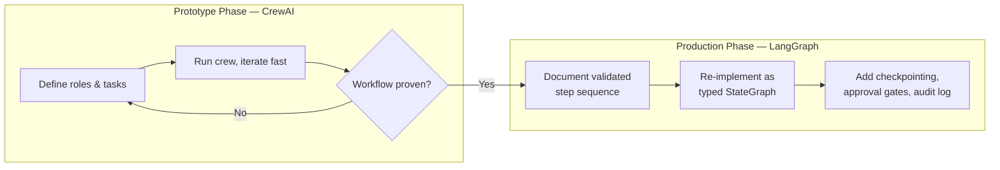

After two posts on LangGraph's explicit state model, it's worth being honest about what that explicitness costs you: speed. When I want to know in an afternoon whether a multi-agent workflow is even a good idea before I invest a week defining typed state schemas and conditional edges, I reach for CrewAI. It's not a production framework in the way I use it, and I don't think it's trying to be one — it's the fastest way I know to find out whether an idea works before deciding it deserves the LangGraph treatment.



## The role/task/crew abstraction

CrewAI's core idea is that you describe agents the way you'd describe a hire: a role, a goal, and a backstory that steers tone and judgment. Tasks are assigned to agents, and a crew coordinates them — sequentially by default, or with a manager agent delegating in a hierarchical mode.

```python
from crewai import Agent, Task, Crew, Process

researcher = Agent(
    role="Research Analyst",
    goal="Find and summarize the three most relevant recent sources on the given topic",
    backstory="A meticulous analyst who never states a claim without a source.",
    tools=[web_search_tool],
)

writer = Agent(
    role="Technical Writer",
    goal="Synthesize research into a clear, well-structured brief",
    backstory="A writer who values clarity over cleverness and always cites sources.",
)

research_task = Task(
    description="Research recent developments in {topic}. Cite sources for every claim.",
    expected_output="A bulleted list of findings, each with a source URL.",
    agent=researcher,
)

writing_task = Task(
    description="Write a 400-word brief synthesizing the research findings.",
    expected_output="A structured brief with headers, citing the research findings.",
    agent=writer,
    context=[research_task],
)

crew = Crew(
    agents=[researcher, writer],
    tasks=[research_task, writing_task],
    process=Process.sequential,
)

result = crew.kickoff(inputs={"topic": "durable execution for AI agents"})
print(result.raw)
```

That's a full two-agent research-synthesis pipeline in about thirty lines, with no state schema to define and no graph topology to wire up — `context=[research_task]` is all it takes to tell CrewAI that the writer's task depends on the researcher's output. Compare that to the LangGraph version from earlier this week, where I had to define a `TypedDict`, write explicit node functions, and wire edges by hand. CrewAI's version is faster to write and, honestly, faster to get right on the first attempt, because there's less surface area for me to make a mistake in.

## Why the implicitness that makes it fast also makes it risky in production

The thing CrewAI hides from you — the exact sequence of what gets passed to which agent, in what form — is exactly the thing a production system needs to expose. `context=[research_task]` is convenient because CrewAI decides how to serialize the research task's output into the writer's prompt. That's also the problem: I don't have a typed field I can validate, log, or gate a human approval on. If the research task quietly returns malformed output, I find out when the final brief reads strangely, not when a specific validation check fails on a specific field.

There's no first-class equivalent to LangGraph's `interrupt()` either — pausing a crew mid-execution for human approval means bolting on your own polling or webhook logic outside the framework's model, which erases most of the convenience that made CrewAI fast in the first place. And because tasks pass free-form text between agents by default, tracing exactly which agent introduced an error in a four-agent chain means reading prose, not inspecting a state diff. I'll cover that debugging problem properly in a couple of days — but the short version is: it's much harder in CrewAI than in a framework where every inter-agent handoff is a typed field.

## The handoff pattern

The workflow I actually follow: build the first version of a multi-agent idea in CrewAI because I want fast iteration on the *shape* of the collaboration — how many agents, what each one's job is, whether splitting the work this way even produces better output than a single well-prompted agent. Once that shape is validated — and only once — I treat the CrewAI prototype as a spec, not as code I extend, and re-implement the proven step sequence as an explicit LangGraph graph.

```python
# Step 1 (CrewAI prototype, validated): researcher -> writer, sequential
# Step 2 (LangGraph production re-implementation)

from typing import TypedDict
from langgraph.graph import StateGraph, END

class BriefState(TypedDict):
    topic: str
    findings: list[dict]  # now typed, not free-form prose
    brief: str

def research(state: BriefState) -> BriefState:
    findings = run_research_agent(state["topic"])
    return {**state, "findings": findings}

def write(state: BriefState) -> BriefState:
    brief = run_writer_agent(state["findings"])
    return {**state, "brief": brief}

builder = StateGraph(BriefState)
builder.add_node("research", research)
builder.add_node("write", write)
builder.set_entry_point("research")
builder.add_edge("research", "write")
builder.add_edge("write", END)
graph = builder.compile(checkpointer=checkpointer)
```

The prompts and agent behavior carry over almost unchanged — that's the whole value of prototyping first. What changes is the plumbing: `findings` becomes a typed list of structured records instead of whatever text CrewAI's context-passing produced, which means I can now validate it, log it, and gate a human review on it if the findings look thin. That validation work is new code I didn't need in the prototype, which is exactly why prototyping in CrewAI first and re-implementing in LangGraph second is faster overall than trying to build production-grade LangGraph from the very first iteration of an idea you're not yet sure is any good.

## What's lost, and what's worth it

The honest cost of the migration is that you're writing the workflow twice — once loosely to prove the concept, once rigorously for production. For a genuinely novel multi-agent idea, I've found that's still net faster than trying to get the LangGraph version right on the first pass, because the mistakes I make in the shape of the collaboration are cheaper to fix in thirty lines of CrewAI than in a fully wired state graph with checkpointing and approval gates already attached. Save the rigor for the workflow that's actually earned it.
