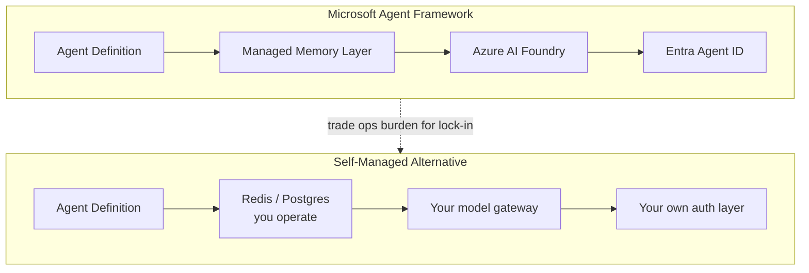

Every framework I've covered this week — LangGraph, Temporal, CrewAI — makes you own your own memory and identity infrastructure: a Postgres instance for checkpoints, your own auth layer for who's allowed to trigger what. Microsoft Agent Framework takes a different bet. If you're already committed to Azure, it gives you managed conversational memory and enterprise identity for agents essentially for free, wired directly into Azure AI Foundry. I've used it on exactly one project, for a client that was Azure-only by mandate, and the honest verdict is: genuinely less infrastructure to own, at the cost of a framework that's still finding its footing and a bet you can't easily walk back.



## What MAF actually provides beyond orchestration

Strip away the marketing and MAF is, at its core, another agent-loop-plus-tools framework — comparable in shape to what you'd build with the OpenAI Agents SDK. What makes it worth a separate post is three things bundled in that you'd otherwise assemble yourself: a managed memory layer that persists conversation and working state without you standing up your own datastore, native wiring into Azure AI Foundry for model access and observability, and Entra Agent ID — a first-class identity for the *agent itself*, not just the user driving it, which matters a lot once you're asking "which service principal did this agent act as when it modified that record."

```python
from agent_framework import Agent, ManagedMemory
from agent_framework.azure import AzureAIFoundryClient

client = AzureAIFoundryClient(
    endpoint=AZURE_FOUNDRY_ENDPOINT,
    credential=DefaultAzureCredential(),
)

memory = ManagedMemory(
    scope="conversation",
    retention_days=90,
)

agent = Agent(
    name="ContractReviewAgent",
    model="gpt-4o",
    client=client,
    memory=memory,
    identity="entra-agent-id://contract-review-agent",
    tools=[fetch_contract, flag_clause, summarize_risk],
)

response = await agent.run(
    "Review the attached vendor contract for unusual liability clauses.",
    session_id="contract-4471",
)
```

The `memory=memory` line is doing what would otherwise be a Redis or Postgres schema, a TTL policy, and retrieval logic on your side. The `identity=` line is doing what would otherwise be a service-account credential you provision and rotate yourself. That's a real amount of code and operational surface area you're not writing.

## Comparing managed memory to rolling your own

The DIY version of `ManagedMemory` looks roughly like this — a session table keyed by `session_id`, a retention job, and retrieval logic you maintain:

```python
class SelfManagedMemory:
    def __init__(self, redis_client, retention_days=90):
        self.redis = redis_client
        self.ttl = retention_days * 86400

    async def append(self, session_id: str, turn: dict):
        key = f"session:{session_id}"
        await self.redis.rpush(key, json.dumps(turn))
        await self.redis.expire(key, self.ttl)

    async def load(self, session_id: str) -> list[dict]:
        raw = await self.redis.lrange(f"session:{session_id}", 0, -1)
        return [json.loads(r) for r in raw]

    # plus: eviction policy, backup, access control, PII handling...
```

That's not hard code, but it's code you own, test, patch, and are on call for. MAF's version is a managed service — retention, backup, and access control are Microsoft's problem, not yours. If your team is small and already runs everything else on Azure, that's a legitimate win. If your team already operates Redis at scale for ten other services, you're not saving much — you're mostly trading a pattern you already know for one you have to learn.

## The lock-in you're actually signing up for

This is the part vendor pitches gloss over: MAF's managed memory, Foundry integration, and Entra Agent ID are not portable. There's no clean export path to "run this same agent on GCP next year" — the memory layer, the identity model, and the model routing are all Azure-specific by design. That's a fine trade if your organization's cloud strategy is a real, durable decision made above your pay grade, not a default you fell into. It's a bad trade if you're a startup keeping options open, or an enterprise with a genuine multi-cloud requirement from a different business unit's contract terms.

## Preview-status risk, stated plainly

Several pieces of MAF — notably parts of the memory retention API and some of the Foundry observability hooks — were still labeled preview when I used it, which meant SLAs I could point to for production incidents didn't fully exist yet, and I hit at least one breaking change in a minor version bump that silently altered how `retention_days` was interpreted. For an internal tool, that's an annoyance. For anything customer-facing with an uptime commitment, it's a real risk you should surface to whoever owns that commitment before you build on it — not something to discover during an incident review.

## When MAF makes sense, and when it doesn't

Reach for MAF when your organization is genuinely Azure-committed — not "mostly on Azure" but committed at the level where switching clouds isn't a live option regardless of framework choice — and you'd rather not staff the operational work of running your own memory and identity infrastructure. It's a legitimate accelerant for that specific team.

Skip it if you need multi-cloud portability, if your team already has mature self-managed memory infrastructure that MAF wouldn't meaningfully replace, or if your workload can't tolerate the kind of breaking change I hit in a preview API. In those cases, the frameworks from earlier this week — LangGraph with your own Postgres checkpointer, or Temporal for the durability-heavy cases — give you a slightly higher infrastructure bill and a lot more control over what happens when Microsoft's roadmap and your production requirements stop lining up.
