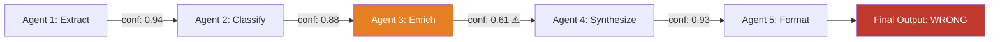

The math on multi-agent pipelines is unforgiving and rarely stated out loud when a team decides to decompose a task into five specialized agents. If each agent is individually 90% reliable — which is a genuinely good number for a well-prompted step — a five-agent sequential chain doesn't inherit that 90%. It compounds: 0.9^5 is about 59%. You built five good agents and shipped a pipeline that's wrong nearly half the time, and the failure is almost never visible at any single step. Each agent's output looks locally reasonable. It's only wrong in the context of what came before it.



## Why the failure hides until the end

I've debugged exactly this shape of bug more times than I'd like: a customer-facing output is subtly wrong, every individual agent's logs look fine on inspection, and the actual root cause is buried three hops upstream in an agent whose output was plausible-sounding but factually off. The classification agent categorized a support ticket as "billing" instead of "billing dispute" — a reasonable-looking mistake — and every downstream agent then correctly did its job on the wrong premise. Nothing downstream failed. The chain failed.

This is the core diagnostic problem with multi-agent systems: correctness at each step doesn't compose into correctness of the pipeline, because "each step looks correct in isolation" is not the same claim as "each step is correct given what actually happened upstream." You need instrumentation designed around that gap, not just per-step logging.

## Technique 1: structured output at every boundary, never free-form prose

The single highest-leverage change I've made to multi-agent pipelines is banning free text between agents. If Agent A hands Agent B a paragraph of prose, you cannot programmatically ask "did A's classification actually match what the data says" — you can only read it and eyeball it. If A hands B a typed object, you can validate it.

```python
from pydantic import BaseModel, Field

class TicketClassification(BaseModel):
    category: str
    subcategory: str
    confidence: float = Field(ge=0.0, le=1.0)
    evidence_quotes: list[str]  # forces the model to cite what it based this on

def classify_ticket(ticket_text: str) -> TicketClassification:
    result = llm_call_structured(ticket_text, schema=TicketClassification)
    if result.confidence < 0.75:
        log_low_confidence("classify_ticket", result, ticket_text)
    return result
```

`evidence_quotes` is doing real work here beyond schema validation — it forces the model to point at the substrings of the input that justify its classification, which makes a wrong classification much faster to spot on review than a bare category label would be. This costs a few extra tokens per call. It's cheap compared to the debugging time it saves.

## Technique 2: per-agent eval checkpoints that gate downstream execution

A validation gate between agents doesn't need to be another LLM call — often a cheap rule-based check catches most of what matters, and you save the expensive judge call for cases the rules can't resolve.

```python
def validate_classification(ticket: dict, classification: TicketClassification) -> bool:
    if classification.confidence < 0.6:
        return False
    if classification.category == "billing" and "refund" in ticket["text"].lower():
        if classification.subcategory not in ("billing_dispute", "refund_request"):
            return False  # cheap heuristic catches an obvious mismatch
    return True

def run_pipeline(ticket: dict):
    classification = classify_ticket(ticket["text"])
    if not validate_classification(ticket, classification):
        return route_to_human_review(ticket, classification, reason="failed validation gate")
    enriched = enrich_ticket(ticket, classification)
    return synthesize_response(enriched)
```

The point of the gate isn't to catch every error — a rule-based check will miss plenty. It's to fail loudly and early, routing to a human or a retry, instead of letting a shaky classification propagate silently through three more expensive agent calls that all compound the original mistake.

## Technique 3: tracing tools that visualize the full chain

Once a pipeline has more than two or three agent hops, reading through logs by hand to find where things went wrong stops scaling. This is where a proper tracing tool — LangSmith if you're on LangGraph, Honeycomb's Agent Timeline if you want provider-agnostic tracing — earns its keep. The value isn't the pretty visualization; it's that every hop is a span with structured input/output attached, so you can filter a failed pipeline run down to "show me every agent call where confidence was below 0.7" across thousands of production runs, not just the one you're currently staring at.

```python
from langsmith import traceable

@traceable(name="classify_ticket")
def classify_ticket(ticket_text: str) -> TicketClassification:
    result = llm_call_structured(ticket_text, schema=TicketClassification)
    return result

@traceable(name="enrich_ticket")
def enrich_ticket(ticket: dict, classification: TicketClassification) -> dict:
    return llm_call_enrich(ticket, classification)
```

With every node decorated like this, a wrong final output gives you a full trace tree you can walk backwards through — input and output at every hop, with confidence scores attached if you logged them as part of the structured output. That turns "where did this go wrong" from an afternoon of reading logs into a five-minute filtered query.

## A worked example: tracing a wrong answer back four hops

A pipeline (extract → classify → enrich → synthesize) produced a customer-facing summary that misstated a refund amount. Working backward through the trace: `synthesize` faithfully summarized what `enrich` gave it — not the bug. `enrich` correctly pulled the order total from the data `classify` handed it — not the bug. `classify` correctly categorized the ticket — not the bug. `extract`, the very first hop, had pulled the *pre-discount* order total instead of the post-discount total from a receipt with two dollar amounts on it, because the extraction prompt didn't disambiguate which figure to use. Every downstream agent did its job correctly on a wrong premise, and the fix was a two-line prompt change in the first hop of the chain — not the summary agent that any error message would have naively pointed at first.

That inversion — the visible failure and the root cause being at opposite ends of the chain — is the normal case, not the exception. Design for it: structured output you can validate at every boundary, gates that fail loud instead of passing along low-confidence results, and tracing that lets you walk the whole chain instead of guessing which hop to inspect first.
