Yesterday's post was about the reliability cost of chaining agents. Today's is about the bill. Every agent hop in a pipeline is a full LLM call — its own network round trip, its own token cost, its own tail-latency risk — and teams routinely decompose a task into five or six specialized agents without ever writing down what that decomposition costs versus what a single well-prompted agent would have cost for the same job. I've seen a "multi-agent" pitch deck get approved before anyone ran the arithmetic. The arithmetic usually kills the multi-agent version of the idea, or at least reshapes it.

```mermaid
gantt
    title Latency: Single vs Sequential vs Parallel (same task, 5 subtasks)
    dateFormat X
    axisFormat %Ls
    section Single Agent
    One large call (4s) : 0, 4
    section Sequential Multi-Agent
    Agent 1 (2s) : 0, 2
    Agent 2 (2s) : 2, 4
    Agent 3 (2s) : 4, 6
    Agent 4 (2s) : 6, 8
    Agent 5 (2s) : 8, 10
    section Parallel Multi-Agent
    Agent 1-3 parallel (2s) : 0, 2
    Agent 4 merge (2s) : 2, 4
    Agent 5 format (2s) : 4, 6
```



## The hidden cost: every hop pays full price, twice

The obvious cost of a multi-agent pipeline is N times the LLM calls of a single-agent design. The less obvious cost is that context tends to grow as it's passed forward — each agent typically needs some or all of what previous agents produced, so token cost per hop doesn't stay flat, it grows through the pipeline. A five-agent sequential chain isn't 5x the cost of one call; depending on how much context each stage needs to carry forward, it can be considerably more.

```python
def estimate_pipeline_cost(stages: list[dict], price_per_1k_input=0.003, price_per_1k_output=0.015):
    total_cost = 0.0
    total_latency = 0.0
    accumulated_context_tokens = 0

    for stage in stages:
        input_tokens = stage["base_input_tokens"] + accumulated_context_tokens
        output_tokens = stage["output_tokens"]
        cost = (input_tokens / 1000 * price_per_1k_input) + (output_tokens / 1000 * price_per_1k_output)
        total_cost += cost
        total_latency += stage["latency_seconds"]
        accumulated_context_tokens += output_tokens  # forwarded to next stage
        print(f"{stage['name']}: {input_tokens} in, {output_tokens} out, ${cost:.4f}, cumulative ctx {accumulated_context_tokens}")

    return total_cost, total_latency

stages = [
    {"name": "extract",   "base_input_tokens": 1500, "output_tokens": 400, "latency_seconds": 2.1},
    {"name": "classify",  "base_input_tokens": 300,  "output_tokens": 150, "latency_seconds": 1.4},
    {"name": "enrich",    "base_input_tokens": 500,  "output_tokens": 600, "latency_seconds": 2.8},
    {"name": "synthesize","base_input_tokens": 300,  "output_tokens": 500, "latency_seconds": 2.5},
    {"name": "format",    "base_input_tokens": 200,  "output_tokens": 300, "latency_seconds": 1.6},
]

cost, latency = estimate_pipeline_cost(stages)
print(f"Total: ${cost:.4f}, {latency:.1f}s sequential")
```

Running that: total cost lands around $0.045 per request and roughly 10.4 seconds of sequential latency, purely from the pipeline shape — before accounting for retries, validation gates, or any human-in-the-loop pause from earlier this week. Compare that to a single well-prompted agent doing the same end-to-end job: one call, maybe 2,500 input tokens and 800 output tokens, about $0.02 and 4 seconds. The multi-agent version costs roughly 2.3x and takes roughly 2.6x as long, for a task that — if the five subtasks don't genuinely need different specialization — a single capable model likely handles just as well.

## When decomposition is actually worth the multiplier

Decomposition earns its cost in two situations, and I've found teams reliably conflate them with a third situation where it doesn't. First: the subtasks are genuinely parallelizable — independent enough that running them concurrently, not sequentially, actually collapses wall-clock latency instead of just adding hops. Second: the subtasks need meaningfully different specialization — different tools, different context windows, different models entirely (a cheap fast model for extraction, a stronger model only for the synthesis step that actually needs it) — where a single agent juggling all of it would need a prompt so overloaded with instructions that its performance on each individual sub-task degrades. What doesn't earn the cost: decomposition purely for the sake of "cleaner architecture" or because a diagram with five boxes looks more impressive in a design review than one box that does the same job.

## Parallelizing independent branches

If three of your five stages don't actually depend on each other's output, running them concurrently is the single best lever for cutting latency without touching cost:

```python
import asyncio

async def run_parallel_stage(agents: list, shared_input: dict) -> list:
    tasks = [agent(shared_input) for agent in agents]
    return await asyncio.gather(*tasks)

async def pipeline(document: dict):
    # Stages 1-3 are independent extractors reading different parts of the doc
    extraction_results = await run_parallel_stage(
        [extract_entities, extract_dates, extract_amounts],
        document,
    )
    # Stage 4 genuinely depends on all three — can't parallelize this one
    merged = await synthesize(extraction_results)
    formatted = await format_output(merged)
    return formatted
```

That collapses the three independent extraction calls from 6 seconds sequential to roughly 2 seconds (the slowest of the three), without changing token cost at all — parallelism buys you latency, not cost, and it's worth being precise with stakeholders about which one you're actually improving when you propose it.

## The design heuristic

Start with one agent. Give it a genuinely good prompt, real tool access, and enough context to do the whole job. Only split it into multiple agents when you can point to a specific, concrete failure mode the single-agent version produces — not a hypothetical one, an observed one — that a decomposed pipeline demonstrably fixes: context getting so large the model loses track of earlier instructions, a subtask that needs a materially different tool set than the rest, or a step that genuinely benefits from running in parallel with others because it's on the critical path to latency that actually matters to users.

If you can't point to that failure mode, you're paying the 2x-3x cost and latency multiplier from the math above for an architecture diagram, not for a system that works better. The teams I've seen get burned by multi-agent cost overruns didn't get burned because multi-agent was the wrong idea in general — they got burned because nobody ran stages through something like the cost estimator above before committing, and found out the multiplier the hard way, in a monthly API bill.
