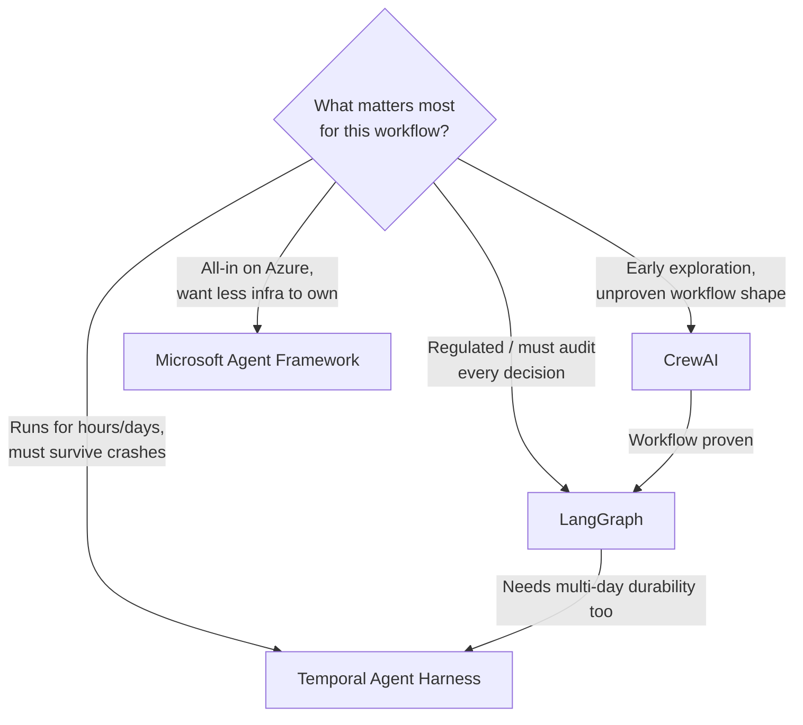

Seven posts this week, four frameworks, one recurring theme: every one of these tools is optimizing for a different constraint, and "which framework is best" is a meaningless question outside the context of what you're actually building and who has to answer for it when it breaks. LangGraph optimizes for auditability. CrewAI optimizes for iteration speed. Temporal optimizes for durability across the kind of timescales that make "just restart the process" unacceptable. Microsoft Agent Framework optimizes for teams who'd rather not own infrastructure and have already made the Azure bet. Here's the decision framework I actually use, distilled from a week of getting specific about the mechanics of each.

## The axes that actually matter

Four questions, in the order I ask them, cut through most of the framework debate before it starts.

**Auditability requirement.** Can a regulator, an internal risk team, or a customer's legal department demand to know exactly what your agent considered and why, after the fact? If yes, you need explicit typed state and a graph topology you can hand to a reviewer — that's LangGraph's whole reason for existing, covered in days one and two of this series.

**Prototyping speed vs. workflow maturity.** Do you know yet whether this multi-agent decomposition is even a good idea, or are you building the tenth version of a workflow you've already validated? Early exploration favors CrewAI's low-ceremony role/task/crew model; a proven workflow favors re-implementing it explicitly once you know the shape is right, as covered on day four.

**Durability requirement.** Does this workflow's natural duration cross hours or days, with real cost to losing in-flight state to a routine deploy or worker crash? If a refund approval sitting for three days while a manager is out is normal, not exceptional, you're in Temporal's territory from day three — LangGraph's checkpointer handles deliberate pauses well but wasn't built for surviving arbitrary infrastructure failure mid-LLM-call.

**Cloud commitment.** Is your organization genuinely, durably committed to Azure — not "mostly on Azure" but locked in at a level where portability isn't realistically on the table regardless of framework — or does portability matter? MAF's managed memory and Entra Agent ID integration, from day five, are a real accelerant for the former and a liability for the latter.

## Comparison table

| | LangGraph | CrewAI | Temporal Agent Harness | Microsoft Agent Framework |
|---|---|---|---|---|
| **State model** | Explicit typed state object | Implicit, prose passed between tasks | Event-sourced workflow state | Managed conversational memory |
| **Checkpointing** | Built-in (Postgres/Redis/etc.) | None native | Built-in, survives worker crash | Managed by Azure |
| **Human-in-the-loop** | First-class (`interrupt`) | Bolt-on, outside the framework | First-class (`approval_gate`) | Partial, via Foundry tooling |
| **Learning curve** | Moderate — typed schemas, graph wiring | Low — describe roles and tasks | Steep — workflow/activity determinism rules | Moderate — Azure-specific concepts |
| **Operational maturity** | Production-proven, widely adopted | Prototyping tool, not production-hardened | Production-proven (pre-dates agents) | Still maturing, some preview APIs |
| **Portability** | Cloud-agnostic | Cloud-agnostic | Cloud-agnostic (self-hosted or Temporal Cloud) | Azure-only by design |
| **Cost/latency overhead vs. single agent** | Moderate (graph adds hops only where you add them) | Low in prototyping, unmeasured in practice | Moderate (activity retries add latency on failure) | Low (managed services absorb some ops cost) |

## The hybrid pattern most teams actually land on

Almost nobody I've worked with picks exactly one of these and stops. The pattern that keeps showing up: prototype in CrewAI, or honestly, in nothing more formal than a single agent with a big prompt, to find out fast whether decomposing the task even helps — apply day seven's cost/latency math here before committing to more than one agent at all. Once a workflow shape is proven, re-implement it as an explicit LangGraph graph for the production version, because that's what gives you the typed state, the checkpointing, and the audit trail a real deployment needs. If that same production workflow also needs to survive multi-day pauses and arbitrary infrastructure failure — not just the deliberate pauses LangGraph's `interrupt` handles well — wrap the LangGraph-validated logic in a Temporal workflow, using Temporal for the outer durability guarantee and keeping LangGraph's explicit state model for the auditability inside it. MAF sits outside this progression entirely — it's a decision made once, upstream, by whether your organization is Azure-committed, not a stage every workflow passes through.

## What I'd tell a team starting from zero

Don't start by picking a framework. Start by answering the four questions above for the specific workflow in front of you, honestly, before anyone in the room has gotten attached to a particular tool. A team that picks LangGraph for a two-day hackathon prototype is going to spend most of that time writing state schemas instead of finding out if the idea works. A team that ships a regulated financial workflow on top of a CrewAI prototype because it worked in the demo is going to have a very uncomfortable conversation with their risk team eight months in, right around the time an auditor asks a question CrewAI's implicit prose-passing model has no good answer for.

The frameworks aren't competing for the same job. Match the tool to the constraint that actually governs the workflow — auditability, iteration speed, durability, or cloud commitment — and the choice mostly makes itself. The failure mode this week's series is really about isn't "picked the wrong framework." It's "picked a framework before figuring out which constraint mattered most," and that's a planning failure, not a tooling one.
