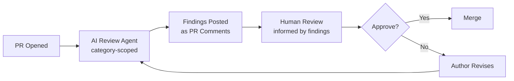

Here's the number that started this series: AI-generated code now accounts for a large share of new commits on the teams I work with, and it produces more issues per PR than human-written code does — while roughly a quarter of the resulting defects go uncaught through review. That second half is the part people don't talk about enough. It's not that AI code is worse in some obvious way; it's that it reads as confidently correct. Clean formatting, sensible variable names, a docstring that sounds right. A human reviewer skims it, the shape looks familiar, and the bug that a slower read would have caught slides through. This post is about the practice that's actually closing that gap: review agents that run before a human ever opens the diff.



## Why this isn't "have AI review the AI"

The instinctive objection is fair: if the same class of model wrote the code, why would it be any better at catching its own mistakes? In practice it works for a boring reason — writing code and reviewing a diff are different tasks with different failure modes. Generation optimizes for "produce something that plausibly solves the stated problem." Review, done well, is a narrower, mechanical pass over a fixed diff against a fixed set of criteria. An LLM given a tight rubric and a diff is far more reliable at "does this new function have a try/except around the network call" than it is at silently deciding, mid-generation, to add one. The failure mode of generation is overconfidence about correctness. The failure mode of review, if you scope it right, is closer to "checklist compliance," which models are actually good at.

## What these agents catch well

After running one of these in CI for a while, the categories that consistently pay for themselves:

- **Missing error handling.** AI-generated code has a strong bias toward the happy path — it writes the function that works when the API call succeeds and quietly skips the retry, timeout, or exception handling a human would add out of scar tissue.
- **Inconsistent patterns vs. the existing codebase.** A generated function that reinvents a helper your codebase already has three versions of, or uses `requests` when the rest of the service standardized on an internal HTTP client.
- **Security anti-patterns.** String-concatenated SQL, secrets read from a default value instead of a required env var, an auth check that's present on the happy path but missing on an early-return branch.
- **Missing test coverage on new logic.** Not "is there a test file" — whether the specific branch of new conditional logic has any test touching it at all.

Notice what these have in common: they're all things you can check mechanically against the diff, without needing to understand the business problem.

## What they don't replace

This is the part worth being blunt about, because oversold review agents get uninstalled fast. These tools do not have architectural judgment. They can't tell you the new caching layer is solving the wrong problem, or that this feature will conflict with a decision made in a different service six months ago that isn't visible in the diff. They don't know whether the business logic is *correct* — only whether it's internally consistent and follows visible patterns. A review agent will happily approve a beautifully error-handled, well-tested implementation of the wrong requirement. That judgment call stays with the human reviewer, and pretending otherwise is how teams end up shipping confidently-wrong features with a green checkmark on them.

## Implementation: scoped, not "review everything"

The single biggest lever for whether this survives past week two is scope. A review agent instructed to "review this PR for issues" produces a wall of low-value comments — style nits, hypothetical edge cases, restated docstrings — and reviewers learn to ignore it within about two weeks. Scope it to a fixed set of categories with a structured output schema instead.

```python
# review_agent.py — runs in CI on every PR
import json
import subprocess
from anthropic import Anthropic

client = Anthropic()

REVIEW_CATEGORIES = [
    "missing_error_handling",
    "security_antipattern",
    "inconsistent_with_codebase_patterns",
    "untested_new_logic",
]

FINDING_SCHEMA = {
    "type": "object",
    "properties": {
        "findings": {
            "type": "array",
            "items": {
                "type": "object",
                "properties": {
                    "category": {"type": "string", "enum": REVIEW_CATEGORIES},
                    "file": {"type": "string"},
                    "line": {"type": "integer"},
                    "severity": {"type": "string", "enum": ["low", "medium", "high"]},
                    "explanation": {"type": "string"},
                },
                "required": ["category", "file", "line", "severity", "explanation"],
            },
        }
    },
    "required": ["findings"],
}


def get_pr_diff(base: str, head: str) -> str:
    return subprocess.run(
        ["git", "diff", f"{base}...{head}"], capture_output=True, text=True
    ).stdout


def run_review(diff: str) -> list[dict]:
    prompt = f"""Review this diff STRICTLY for these categories only: {REVIEW_CATEGORIES}.
Do not comment on style, naming, or anything outside these categories.
Only report findings you are highly confident about — skip anything speculative.

Diff:
{diff}
"""
    response = client.messages.create(
        model="claude-sonnet-5",
        max_tokens=4096,
        tools=[{
            "name": "report_findings",
            "description": "Report scoped code review findings",
            "input_schema": FINDING_SCHEMA,
        }],
        tool_choice={"type": "tool", "name": "report_findings"},
        messages=[{"role": "user", "content": prompt}],
    )
    tool_use = next(b for b in response.content if b.type == "tool_use")
    return tool_use.input["findings"]


def post_findings(findings: list[dict], pr_number: int):
    if not findings:
        return
    for f in findings:
        body = f"**[{f['category']} · {f['severity']}]** {f['explanation']}"
        subprocess.run([
            "gh", "pr", "comment", str(pr_number),
            "--body", f"{f['file']}:{f['line']}\n{body}",
        ])


if __name__ == "__main__":
    diff = get_pr_diff("origin/main", "HEAD")
    findings = run_review(diff)
    post_findings(findings, pr_number=int(json.loads(subprocess.run(
        ["gh", "pr", "view", "--json", "number"], capture_output=True, text=True
    ).stdout)["number"]))
```

The CI wiring is a standard GitHub Actions step that runs this after the PR opens and before it requests a reviewer:

```yaml
# .github/workflows/ai-review.yml
name: AI Code Review
on:
  pull_request:
    types: [opened, synchronize]

jobs:
  review:
    runs-on: ubuntu-latest
    steps:
      - uses: actions/checkout@v4
        with:
          fetch-depth: 0
      - uses: actions/setup-python@v5
        with:
          python-version: "3.12"
      - run: pip install anthropic
      - run: python review_agent.py
        env:
          ANTHROPIC_API_KEY: ${{ secrets.ANTHROPIC_API_KEY }}
          GH_TOKEN: ${{ secrets.GITHUB_TOKEN }}
```
{: file=".github/workflows/ai-review.yml" }

## Tuning signal-to-noise is the actual job

Standing up the agent is the easy part. The ongoing work is watching which categories generate findings reviewers act on versus dismiss, and pruning the ones that don't. I track a simple ratio: findings posted vs. findings that led to a code change before merge. When a category's action rate drops below roughly 30%, it comes out of scope or gets a stricter confidence threshold. `untested_new_logic` has stayed high-value on every codebase I've run this on. `inconsistent_with_codebase_patterns` needs the most babysitting — it's prone to false positives on legitimately new patterns — and I've had to feed it a short list of "these are intentional deviations, don't flag them" exceptions more than once.

The categories that survive that pruning are, not coincidentally, the same ones the defect-rate data says AI-generated code is weak on. That's the whole point of scoping the agent narrowly instead of asking it to be a second full human reviewer: it's not trying to replace judgment, it's trying to make sure the mechanical checks that get skipped in a fast skim actually happen every time.
