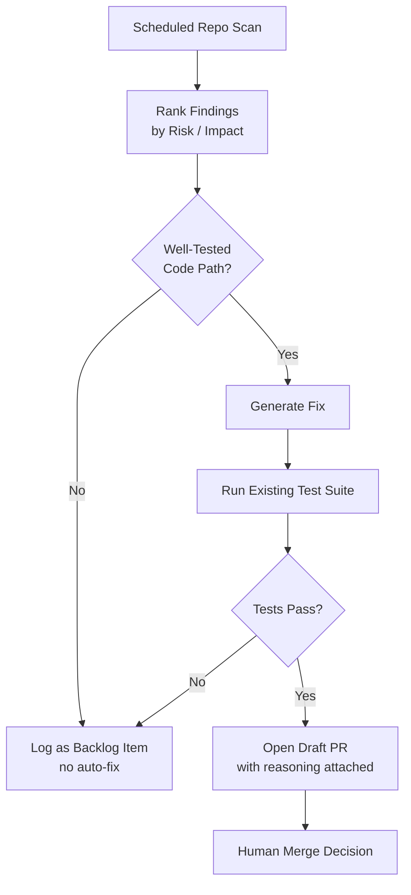

I've watched three different teams pilot a debt-remediation agent this year, and only one of them still has it running six months later. The demo is always the same: point an agent at a repo, it finds 400 instances of some deprecated pattern, generates a report, everyone's impressed. Then week three arrives, the backlog has 400 new tickets nobody asked for, half the "fixes" the agent proposed don't actually compile in context, and the tool quietly gets uninstalled. The gap between a scanning agent and a *trusted* remediation agent is where these pilots die, and it's bigger than the demos let on.



## Why the pilots stall

Two failure modes show up over and over, and they're opposites of each other.

The first is agents that only flag debt. This feels safe — no code gets touched automatically — but it's actively counterproductive if the output is a flood of tickets with no proposed remediation attached. You've turned an invisible problem into a visible, unowned one. Nobody triages 400 new backlog items; they get bulk-closed or ignored, and the team's trust in the tool (and often in "AI debt tooling" as a category) burns down in one sprint.

The second is agents that go straight to auto-generated fixes without strong test coverage backing the code they're touching. The fix compiles, looks reasonable, and nobody can tell whether it changed behavior — because the code it touched didn't have tests establishing what the *correct* behavior was in the first place. Reviewers either rubber-stamp fixes they can't actually verify (bad) or reject everything on principle (safe, but now the tool produces zero value). Either way, adoption stops.

## The pattern that survives past the pilot

The team still running theirs did three things differently.

**They ranked before they touched anything.** Every finding gets a risk/impact score — how often is this code path executed, how many other modules depend on it, how recently was it changed — before any fix generation happens. Low-risk, low-impact debt in a dead code path gets logged and left alone. Nobody needs an agent to tell them about debt in code that hasn't run in production in a year.

**They only generate fixes for code with real test coverage.** This is the load-bearing constraint. If the function the agent wants to touch doesn't have tests that would catch a behavior change, the agent doesn't propose a fix — it logs the finding with a note: "needs test coverage before this can be safely remediated." That's a less exciting output, but it's honest about what's actually safe to automate right now.

**They scoped the agent to one debt category at a time.** Not "find all technical debt" — that's a categorization problem so broad it becomes noise. The one that stuck: "find all usages of the deprecated `LegacyAuthClient` and replace with `AuthClientV2`." Narrow enough that the fix pattern is nearly mechanical, broad enough to matter (200+ call sites across the codebase).

## A scanning agent with a risk-scoring gate

```python
# debt_scanner.py — scheduled weekly, scoped to one debt category
import ast
import subprocess
from dataclasses import dataclass
from anthropic import Anthropic

client = Anthropic()

DEBT_PATTERN = "LegacyAuthClient"  # one category per run — don't broaden this


@dataclass
class Finding:
    file: str
    line: int
    call_frequency: int   # times this code path is hit per day, from logs/APM
    dependent_modules: int
    has_test_coverage: bool
    risk_score: float = 0.0

    def score(self) -> float:
        # higher call frequency + more dependents = higher blast radius if wrong
        # test coverage lowers risk because a bad fix gets caught before merge
        blast_radius = (self.call_frequency ** 0.5) * (1 + self.dependent_modules * 0.1)
        coverage_discount = 0.3 if self.has_test_coverage else 1.0
        self.risk_score = round(blast_radius * coverage_discount, 2)
        return self.risk_score


def scan_for_pattern(repo_path: str, pattern: str) -> list[Finding]:
    grep = subprocess.run(
        ["grep", "-rn", pattern, repo_path, "--include=*.py"],
        capture_output=True, text=True,
    )
    findings = []
    for line in grep.stdout.splitlines():
        file_path, line_no, _ = line.split(":", 2)
        findings.append(Finding(
            file=file_path,
            line=int(line_no),
            call_frequency=get_call_frequency(file_path),   # from APM/log data
            dependent_modules=count_dependents(file_path),   # from import graph
            has_test_coverage=has_covering_test(file_path, int(line_no)),
        ))
    return findings


def generate_fix(finding: Finding) -> str | None:
    if not finding.has_test_coverage:
        return None  # refuse to generate a fix for untested code — log instead

    with open(finding.file) as f:
        source = f.read()

    response = client.messages.create(
        model="claude-sonnet-5",
        max_tokens=2048,
        messages=[{
            "role": "user",
            "content": (
                f"Replace usage of {DEBT_PATTERN} with AuthClientV2 in this file. "
                f"Preserve all existing behavior exactly — this code has test coverage, "
                f"do not change semantics beyond the API migration.\n\n{source}"
            ),
        }],
    )
    return response.content[0].text


def open_draft_pr(finding: Finding, fixed_code: str):
    branch = f"debt-fix/{finding.file.replace('/', '-')}-L{finding.line}"
    subprocess.run(["git", "checkout", "-b", branch])
    with open(finding.file, "w") as f:
        f.write(fixed_code)
    subprocess.run(["git", "commit", "-am", f"Migrate off {DEBT_PATTERN} in {finding.file}"])
    subprocess.run(["git", "push", "-u", "origin", branch])
    subprocess.run([
        "gh", "pr", "create", "--draft",
        "--title", f"[debt-agent] Migrate {finding.file}:{finding.line} off {DEBT_PATTERN}",
        "--body", (
            f"Risk score: {finding.risk_score} (call frequency: {finding.call_frequency}/day, "
            f"dependents: {finding.dependent_modules})\n\n"
            f"This path has existing test coverage — full test suite passed against this change."
        ),
    ])


if __name__ == "__main__":
    findings = scan_for_pattern(".", DEBT_PATTERN)
    findings.sort(key=lambda f: f.score(), reverse=True)

    for finding in findings:
        fix = generate_fix(finding)
        if fix is None:
            log_backlog_item(finding)  # visible, but no PR — needs tests first
            continue

        # run existing suite before opening anything
        result = subprocess.run(["pytest", finding.file.replace(".py", "_test.py")])
        if result.returncode == 0:
            open_draft_pr(finding, fix)
        else:
            log_backlog_item(finding)
```

Every fix is a draft PR, never auto-merged, with the risk score and reasoning in the description so a reviewer isn't starting from zero context.

## Measure acceptance rate, not PRs opened

The vanity metric here is "number of debt fixes generated." Ignore it. The metric that tells you whether the agent is earning trust is **PR acceptance rate** — of the draft PRs it opens, what fraction get merged (possibly with human edits) versus closed without action. A tool generating 50 PRs a week with a 20% acceptance rate is producing net review burden, not value, no matter how good the raw finding count looks in a slide. The team with six months of runway on theirs sits around 70% acceptance, specifically because the test-coverage gate keeps it from ever proposing a fix nobody can verify.

## The honest limitation

Debt in poorly-tested code is not a safe automation target right now, full stop. If your worst debt lives in the code with the worst test coverage — which, empirically, it usually does — this pattern won't touch it. That's not a tooling gap you fix with a better prompt; it's a sequencing problem. The unglamorous fix is: write characterization tests for the risky untested code first, as its own separate effort, and then let the debt agent loose on it. Trying to skip that step is exactly how you end up back at "auto-generated fixes nobody trusts enough to merge."
