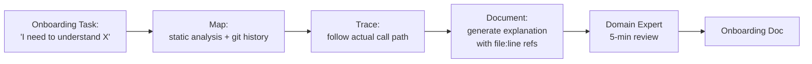

Give an onboarding agent a six-month-old service with clean module boundaries and it'll produce a genuinely useful architecture summary in minutes. Give the same agent a ten-year-old monolith where half the "weird" code exists because of an incident postmortem nobody wrote down, and it'll produce a confident, plausible-sounding summary that's subtly wrong in the places that matter most. The gap isn't a prompting problem. It's that greenfield code's structure *is* its documentation — clean names, current patterns, no historical scar tissue — while legacy code's real logic often lives in commit history, tribal knowledge, and Slack threads the model never sees. This post is the methodology I use to narrow that gap: map, trace, document.



## The greenfield-vs-legacy gap, concretely

I ran the same exercise on two codebases last quarter: "explain how authentication works in this service." On a six-month-old service, the agent's summary was accurate down to naming the exact middleware and the token refresh edge case, because all of that was legible in the current code. On a legacy billing system, the agent confidently described a permission model that had actually been superseded eighteen months earlier by a patch that only touched three files and left the old code paths in place, unused, as dead branches that still *looked* live to static analysis. A domain expert caught it in under a minute. A new engineer relying on the doc unsupervised would have built on the wrong model of the system for weeks.

That's the failure mode to design against: not "the agent gets it obviously wrong," but "the agent gets it plausibly, confidently wrong in a codebase old enough to have accumulated dead paths that read as live ones."

## Map: build the map from more than current-state code

The map step is where you compensate for the historical-context gap. Static analysis gives you the dependency graph and module boundaries. That's necessary but not sufficient on legacy code — you also want git history and commit messages as a second input, specifically to catch cases where recent activity contradicts what the static structure implies.

```python
# codebase_map.py
import subprocess
import json
from pathlib import Path

def build_dependency_map(repo_path: str) -> dict:
    """Static import graph — cheap, deterministic, current-state only."""
    result = subprocess.run(
        ["pydeps", repo_path, "--show-deps", "--no-output"],
        capture_output=True, text=True,
    )
    return json.loads(result.stdout)


def recent_activity_for_module(repo_path: str, module_path: str, months: int = 12) -> list[dict]:
    """Git history is the signal static analysis can't see: what actually
    changed recently, and why, per the commit message."""
    result = subprocess.run(
        ["git", "-C", repo_path, "log", f"--since={months}.months.ago",
         "--pretty=format:%H|%ad|%s", "--date=short", "--", module_path],
        capture_output=True, text=True,
    )
    commits = []
    for line in result.stdout.splitlines():
        sha, date, subject = line.split("|", 2)
        commits.append({"sha": sha, "date": date, "subject": subject})
    return commits


def flag_stale_vs_active_paths(dep_map: dict, repo_path: str) -> list[str]:
    """Modules the static graph says are central but git history says
    haven't been touched in years — likely dead or superseded paths
    worth flagging before the agent trusts them."""
    warnings = []
    for module, info in dep_map.items():
        activity = recent_activity_for_module(repo_path, module, months=24)
        if info.get("in_degree", 0) > 5 and len(activity) == 0:
            warnings.append(
                f"{module}: {info['in_degree']} incoming deps but no commits "
                f"in 24 months — verify this path is actually live before relying on it"
            )
    return warnings
```

That last function is the part that matters most on legacy code: it's a cheap heuristic for "this looks structurally important but nobody has touched it in years," which is exactly the shape of the dead-permission-model problem above. It doesn't solve the problem, but it tells the agent — and the human reviewing its output — where to be suspicious.

## Trace: follow the actual call path for the actual question

Don't ask the agent to summarize the whole system. Ask it to trace one concrete path for one concrete task, because that's what a new engineer actually needs and it's a task the model can ground in real file references instead of a vibes-based summary.

```python
# trace_agent.py
from anthropic import Anthropic

client = Anthropic()

def trace_call_path(task_description: str, dep_map: dict, entry_points: list[str],
                     read_file) -> str:
    """read_file: callable(path) -> str, used as a tool so the agent
    reads real source instead of guessing from the dependency map alone."""

    prompt = f"""A new engineer needs to understand: "{task_description}"

Entry points to start from: {entry_points}
Dependency map (for navigation, not for facts about behavior): {dep_map}

Trace the ACTUAL execution path through the real source files. For every
claim you make about what the code does, cite the specific file and line
number you read it from. If you cannot verify a claim by reading the file,
say so explicitly rather than inferring it from naming or structure.
"""
    response = client.messages.create(
        model="claude-sonnet-5",
        max_tokens=4096,
        tools=[{
            "name": "read_file",
            "description": "Read the contents of a source file to verify behavior",
            "input_schema": {
                "type": "object",
                "properties": {"path": {"type": "string"}},
                "required": ["path"],
            },
        }],
        messages=[{"role": "user", "content": prompt}],
    )

    while response.stop_reason == "tool_use":
        tool_use = next(b for b in response.content if b.type == "tool_use")
        file_content = read_file(tool_use.input["path"])
        response = client.messages.create(
            model="claude-sonnet-5",
            max_tokens=4096,
            tools=[{"name": "read_file", "description": "Read a source file",
                     "input_schema": {"type": "object",
                                       "properties": {"path": {"type": "string"}},
                                       "required": ["path"]}}],
            messages=[
                {"role": "user", "content": prompt},
                {"role": "assistant", "content": response.content},
                {"role": "user", "content": [{
                    "type": "tool_result",
                    "tool_use_id": tool_use.id,
                    "content": file_content,
                }]},
            ],
        )

    return response.content[0].text
```

The instruction to cite file:line and explicitly flag unverified claims is not decoration — it's the difference between an explanation a reviewer can check in five minutes and one they'd have to independently re-derive to trust.

## Document, then require the five-minute review

The output of the trace step is a working document, not a final one. That distinction is the whole point of the methodology: it's specifically scoped and evidence-cited enough that a domain expert can review it fast, instead of needing to write the doc themselves from scratch or read the whole subsystem to sanity-check a vague summary.

```markdown
## How authentication works (traced for onboarding, generated 2027-01-11)

**Task:** Understand the auth flow for the billing service.

**Path traced:**
1. `api/middleware/auth.py:34` — request hits `AuthMiddleware.process`
2. `api/middleware/auth.py:41` — calls `TokenValidator.validate()`, defined in
   `core/auth/tokens.py:112`
3. `core/auth/tokens.py:118` — ⚠️ UNVERIFIED: this branches on `legacy_mode`
   flag; I could not determine from static reads whether this flag is ever
   true in production — needs confirmation from someone with runtime access
4. `core/auth/permissions.py:22` — permission check against `RoleTable`

**Flags for reviewer:**
- `core/auth/permissions.py` has 6 incoming dependencies but no commits in
  24 months — verify `RoleTable` is still the live permission model and not
  superseded by something else.
```

That `⚠️ UNVERIFIED` line and the staleness flag are what make this safe to hand to a new engineer *after* a five-minute expert pass, not before. Skipping that review is the one shortcut that turns this from a genuinely useful onboarding accelerant back into the same confidently-wrong-summary problem the whole methodology exists to avoid. On the legacy billing example above, that review step is exactly where the dead permission model would have gotten caught before a new hire built three days of work on top of it.
