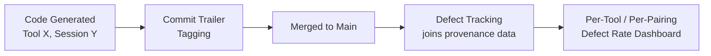

Most engineers on a modern team now use two or three AI coding tools in the same week, sometimes the same file — autocomplete from one, a chat-driven refactor from another, an agentic multi-file change from a third. When a bug traces back to AI-generated code (and per the defect-rate numbers that opened this series, a meaningful share do), "which tool wrote this and what was the actual prompt" used to be an unanswerable question by the time anyone went looking. It doesn't have to be. This post covers the provenance tracking practices that turn that into a five-minute lookup instead of an archaeology project.



## Why this earns its keep

Two reasons, and they're different enough that a team motivated by only one of them tends to under-invest.

**Debugging speed.** AI tools fail differently. One model's coding assistant tends to hallucinate plausible-looking API signatures for libraries it's less familiar with; another is more prone to dropping error handling under time pressure in agentic mode; a third has a training cutoff that means it confidently writes against a deprecated version of an internal SDK. When a bug traces back to generated code, knowing *which* tool and, ideally, what the actual prompt or session was, tells you which failure mode you're looking at before you've read a line of the diff. Without it, you're debugging blind every time.

**Compliance.** This is no longer hypothetical for teams in regulated industries — some now require disclosure of AI assistance in code touching critical paths (payments, health data, safety-relevant logic), and "we don't actually know which parts of this service were AI-generated" is not an answer that survives an audit.

## Three implementation approaches, in order of investment

**1. Commit metadata tagging.** The lowest-friction option: a structured git trailer on any commit containing AI-generated code, noting the tool and enough session context to look up more later.

```
Fix null pointer in payment reconciliation

The reconciliation job crashed on partial refunds because the amount
field was assumed non-null. Added a guard and a regression test.

AI-Assisted-By: claude-code
AI-Session-Id: sess_8f2a91c4
AI-Generated-Lines: 12-34
Reviewed-By: akash
```
{: .nolineno }

Trailers are just structured text in the commit message — no tooling investment beyond a commit template and a habit. `git log --grep="AI-Assisted-By"` gets you a first-pass query for free.

**2. IDE plugin telemetry.** Higher fidelity: a plugin that tags code blocks with provenance metadata at generation time, before the human even accepts the suggestion, and writes it somewhere queryable alongside the commit.

```python
# ide_provenance_hook.py — called by an IDE plugin on accepted suggestions
import json
import subprocess
from dataclasses import dataclass, asdict
from datetime import datetime, timezone

@dataclass
class ProvenanceRecord:
    tool: str
    session_id: str
    file: str
    line_start: int
    line_end: int
    prompt_summary: str  # short, not the full prompt — avoid storing secrets
    accepted_at: str
    engineer: str


def record_provenance(record: ProvenanceRecord, store_path: str = ".ai_provenance.jsonl"):
    with open(store_path, "a") as f:
        f.write(json.dumps(asdict(record)) + "\n")


def on_suggestion_accepted(tool: str, session_id: str, file: str,
                            line_start: int, line_end: int, prompt: str, engineer: str):
    record = ProvenanceRecord(
        tool=tool,
        session_id=session_id,
        file=file,
        line_start=line_start,
        line_end=line_end,
        prompt_summary=prompt[:200],
        accepted_at=datetime.now(timezone.utc).isoformat(),
        engineer=engineer,
    )
    record_provenance(record)


def attach_provenance_to_commit():
    """Run as a pre-commit hook: pull any provenance records touching
    staged files into the commit trailer automatically."""
    staged = subprocess.run(
        ["git", "diff", "--cached", "--name-only"], capture_output=True, text=True
    ).stdout.splitlines()

    with open(".ai_provenance.jsonl") as f:
        records = [json.loads(line) for line in f]

    relevant = [r for r in records if r["file"] in staged]
    if not relevant:
        return

    tools_used = sorted({r["tool"] for r in relevant})
    trailer = f"\n\nAI-Assisted-By: {', '.join(tools_used)}"
    subprocess.run(["git", "commit", "--amend", "-m",
                     get_commit_msg() + trailer], check=False)
```

This is a real investment — a plugin, a storage backend, a pre-commit hook — but it's the version that scales to "measure defect rate by tool" without relying on engineers remembering to tag things by hand.

**3. Manual comment-tag convention.** For teams without appetite for either of the above, a lightweight fallback: a comment convention on any block of substantially AI-generated code.

```python
# ai-generated: claude-code, 2027-01-12, reviewed
def reconcile_partial_refund(transaction: Transaction) -> ReconciliationResult:
    ...
```

It's manual, it will drift, but it's better than nothing and costs nothing to adopt.

## Using provenance data for something other than compliance

The dashboard that actually changes behavior is the join between provenance tags and your existing defect tracking — which tool, or which engineer-tool pairing, correlates with the defects that make it to production.

```python
# defect_provenance_report.py
import json
from collections import defaultdict

def load_provenance(path: str) -> list[dict]:
    with open(path) as f:
        return [json.loads(line) for line in f]


def load_defects(path: str) -> list[dict]:
    """Defect records with a 'file' field, from your bug tracker export."""
    with open(path) as f:
        return json.load(f)


def defect_rate_by_tool(provenance: list[dict], defects: list[dict]) -> dict:
    lines_by_tool = defaultdict(int)
    for r in provenance:
        lines_by_tool[r["tool"]] += (r["line_end"] - r["line_start"] + 1)

    defects_by_tool = defaultdict(int)
    provenance_by_file = defaultdict(list)
    for r in provenance:
        provenance_by_file[r["file"]].append(r)

    for defect in defects:
        for r in provenance_by_file.get(defect["file"], []):
            if r["line_start"] <= defect.get("line", -1) <= r["line_end"]:
                defects_by_tool[r["tool"]] += 1

    return {
        tool: {
            "lines_generated": lines_by_tool[tool],
            "defects": defects_by_tool[tool],
            "defects_per_1k_lines": round(
                defects_by_tool[tool] / max(lines_by_tool[tool], 1) * 1000, 2
            ),
        }
        for tool in lines_by_tool
    }
```

This is where provenance tracking pays for itself beyond debugging: it's how you find out, with your own data instead of a vendor's benchmark, that one tool's agentic mode has a defect rate twice another's on your codebase — or that the gap isn't the tool at all, it's a specific engineer-tool pairing where someone hasn't adjusted their review habits for how a particular tool tends to fail.

## The privacy line

Per-tool aggregate dashboards are unambiguously useful. Per-engineer dashboards need to be handled carefully — the moment "AI usage tracking" starts reading as individual performance surveillance instead of a debugging and tooling-selection input, engineers stop trusting the tagging and adoption of the whole practice collapses. In practice: keep the per-engineer breakdowns visible to the engineer themselves and to whoever's evaluating tool choices, not as a leaderboard, and say so explicitly when you roll this out. The goal is "which tool is actually helping," not "who's slacking" — and it needs to visibly be that from day one, or the data you collect stops being honest.
