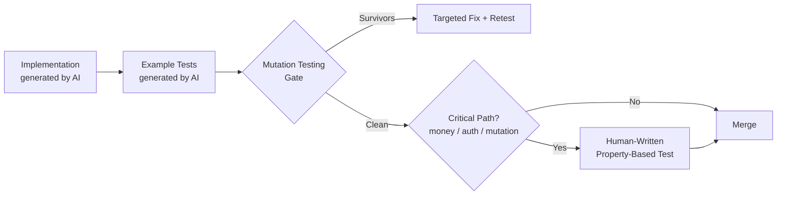

A PR shows up with an implementation and a test file, coverage sits at 94%, CI is green. Nothing about that looks like a problem — until you notice that both the implementation and the tests came out of the same generation pass. If the model's reasoning about the problem has a gap, that gap shows up in the implementation *and* in the tests meant to catch it, because they share the same blind spot. Coverage percentage tells you the tests executed the code. It says nothing about whether the tests were written by reasoning independent of the reasoning that wrote the bug. That's the specific weakness this post is about, and it needs a different testing strategy than "make sure coverage stays above 80%."



## The shared-blind-spot problem

Coverage was always a weak proxy for test quality — that's not new. What's new is *why* it's specifically weak for AI-generated code. When a human writes an implementation and then writes tests for it, there's a natural moment of second-guessing: "wait, what happens if this list is empty," caught because the human's mental model shifts from "build it" to "break it" between the two tasks. When the same model generates both in one pass — which is the default workflow with most coding agents now — that shift often doesn't happen. The tests tend to exercise the paths the model was already confident about, and skip the edge case it didn't think to question, because it's the same reasoning pass producing both.

I've seen this most often with boundary conditions on numeric logic, ordering assumptions in concurrent code, and null/empty handling on optional fields — all cases where the "obvious" example the model reaches for happens to avoid the actual edge case.

## Gate one: mutation testing, applied specifically to AI-authored diffs

I covered the mechanics of mutation testing as a CI quality gate in [an earlier post](/posts/mutation-testing-ai-quality-gate/) — introducing deliberate defects into the code and checking whether the test suite actually catches them, rather than just executing the lines. I won't repeat the how-to here. What's worth calling out specifically for this series: mutation testing is the single most direct countermeasure to the shared-blind-spot problem, because it doesn't ask "did the tests run this code" — it asks "would the tests notice if this code were subtly wrong," which is exactly the question coverage can't answer and which the AI-generated test suite is least likely to answer well on its own.

The policy adjustment for AI-generated code specifically: don't apply the same mutation score threshold uniformly. Diffs flagged as AI-authored (via the provenance tagging from the previous post, if you have it) get a stricter mutation score floor than human-authored diffs — I run AI-generated diffs at a 90% mutation kill threshold versus 75% for human-written code, precisely because the failure mode this gate exists to catch is more common in the former.

## Gate two: a human-written test is required for money, auth, and data mutation

Regardless of how clean the AI-generated tests look, any function that handles money, authentication, or a data mutation (write, delete, state transition) needs at least one test a human actually wrote, reading the requirement independently rather than reading the AI's implementation and confirming it does what it appears to do. This isn't about distrust of the code — it's about breaking the shared-reasoning-pass problem by introducing a genuinely independent perspective, which by definition can't come from the same generation pass that wrote the implementation.

In CI, this is enforceable mechanically: diff the test file's git blame or provenance tag against the implementation file's, for files matching a critical-path allowlist.

```python
# critical_path_test_gate.py
import subprocess
import re

CRITICAL_PATH_PATTERNS = [
    r"payments?/", r"billing/", r"auth/", r"permissions/",
    r".*_mutation\.py$", r".*_writer\.py$",
]

def is_critical_path(file_path: str) -> bool:
    return any(re.search(p, file_path) for p in CRITICAL_PATH_PATTERNS)


def get_human_authored_tests(test_file: str, provenance_records: list[dict]) -> list[dict]:
    """Cross-reference against the provenance log from the previous post —
    a test 'passes' this check only if no AI-tool record covers its lines."""
    ai_covered_lines = set()
    for r in provenance_records:
        if r["file"] == test_file:
            ai_covered_lines.update(range(r["line_start"], r["line_end"] + 1))

    with open(test_file) as f:
        lines = f.readlines()

    human_lines = [i + 1 for i in range(len(lines)) if (i + 1) not in ai_covered_lines]
    return human_lines


def check_pr(changed_files: list[str], provenance_records: list[dict]) -> list[str]:
    failures = []
    for file in changed_files:
        if not is_critical_path(file):
            continue
        test_file = file.replace(".py", "_test.py")
        try:
            human_lines = get_human_authored_tests(test_file, provenance_records)
        except FileNotFoundError:
            failures.append(f"{file}: no test file found for critical-path change")
            continue
        if len(human_lines) < 5:  # rough floor — at least one real assertion block
            failures.append(
                f"{file}: touches a critical path but {test_file} has no "
                f"meaningfully human-authored test coverage"
            )
    return failures
```

This gate is deliberately blunt — it doesn't evaluate test *quality*, just authorship independence — because the goal isn't to grade the human's test, it's to guarantee an independent pass happened at all.

## Gate three: property-based testing for the edge cases example tests miss

AI-generated tests are, almost universally, example-based: given this input, expect that output, repeated for a handful of cases the model thought of. What they're weak at is generating the *invariant* — the property that should hold for all inputs, which is exactly what surfaces edge cases nobody explicitly thought to write an example for. This is a genuine complementary strength, not a replacement: keep the AI-generated example tests (they're a fine first pass and often catch obvious regressions cheaply), and add human-written property tests for critical paths on top.

```python
# test_refund_calculation.py
from hypothesis import given, strategies as st
from refunds import calculate_refund_amount

# --- AI-generated example tests (kept, still useful) ---
def test_full_refund_no_fee():
    assert calculate_refund_amount(order_total=100.0, fee_pct=0.0) == 100.0

def test_partial_refund_with_fee():
    assert calculate_refund_amount(order_total=100.0, fee_pct=0.03) == 97.0


# --- Human-added property-based test, for the invariant AI tests missed ---
@given(
    order_total=st.floats(min_value=0.0, max_value=1_000_000.0, allow_nan=False),
    fee_pct=st.floats(min_value=0.0, max_value=1.0, allow_nan=False),
)
def test_refund_never_exceeds_order_total(order_total, fee_pct):
    """The property the example tests never tried: no matter the inputs,
    a refund can never be MORE than what was originally paid. The AI's
    example tests never generated a case where fee_pct is negative or
    where floating point rounding pushes the result slightly over —
    Hypothesis finds both within seconds."""
    refund = calculate_refund_amount(order_total, fee_pct)
    assert 0.0 <= refund <= order_total
```

Run this and Hypothesis will, within seconds, find that a negative `fee_pct` (which the type hints don't forbid and the AI-generated examples never tried) produces a refund larger than the original order — the exact class of bug that a coverage-passing, example-test-only suite would never surface.

## CI policy: escalate, don't block, on AI-only coverage

The practical rollout isn't "block every PR without a human test" — that's a bottleneck nobody sustains. It's a review escalation rule: any PR where AI-generated code's only test coverage is itself AI-generated gets flagged for a second, more careful reviewer pass rather than the standard one, specifically on the critical-path allowlist above. Everywhere else, AI-generated example tests plus a mutation testing gate is a reasonable bar. The extra scrutiny is reserved for where the shared-blind-spot problem actually costs you something if it slips through — which, per the numbers this series opened with, is disproportionately where AI-generated defects go uncaught in the first place.
