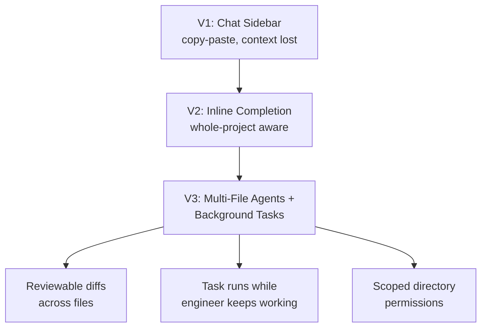

The chat sidebar is where most people's mental model of "AI in the IDE" got stuck, and it's already two generations behind what's actually available. First it was copy a question into a panel, copy the answer back into your file, lose the surrounding context every time you tabbed away. Then inline completion got good enough to matter — ghost text that understood more than the current line. What's changed most recently is the part that actually shifts daily workflow: agents that propose and apply multi-file diffs directly in the editor, and background tasks that keep running while you do something else entirely. This post is about what actually changes in how you work, and the discipline it takes not to let that convenience turn into the exact defect gap this series opened with.



## What actually changed between generations

**V1, chat sidebar:** the model has no persistent view of your open files unless you paste them in. Every answer is a fresh negotiation of context. The workflow cost wasn't the AI being wrong — it was the tax of manually ferrying context in and code out, which meant it only got used for self-contained questions, not real editing.

**V2, inline completion:** the model gained visibility into the whole open project — not just the current file, but imports, related modules, type definitions elsewhere in the repo. This is what made autocomplete actually useful for anything beyond boilerplate; it could suggest a call to a helper function defined in a different file because it could see that file existed and what it did.

**V3, where things are now:** agents that operate across multiple files as a single reviewable change, and background agents that take a scoped task, run independently — sometimes for minutes, sometimes attempting a build-test-fix loop on their own — while you keep working on something else. This is the generation that changes daily workflow shape, not just editing speed.

## Practical pattern: background agent + parallel work

The workflow that's actually paid off for me: hand a background agent a narrowly scoped, well-specified task — "update all callers of this deprecated function signature across the service" — and keep working on something unrelated while it runs. The key word is *narrowly scoped*. A vague, large-surface-area task run in the background produces a large, hard-to-review diff by the time you come back to it, which defeats the purpose.

```yaml
# .agent/tasks/deprecate-old-signature.yml — a scoped background task spec
task: "Migrate all callers of fetch_user(id) to fetch_user(id, include_deleted=False)"
scope:
  include:
    - "src/services/**/*.py"
    - "src/handlers/**/*.py"
  exclude:
    - "src/services/legacy_billing/**"   # off-limits, handled manually
constraints:
  - "Do not change any function signatures other than the specified callers"
  - "Do not modify test files — flag them for human update instead"
  - "Run the existing test suite after each file change; halt and report on any failure"
mode: background
output: diff-for-review   # never auto-apply
```
{: file=".agent/tasks/deprecate-old-signature.yml" }

While that runs, I'm in a different file entirely. The agent halting and reporting on a test failure — rather than pushing through or silently reverting — is the part that makes this trustworthy enough to actually walk away from. An agent that keeps trying variations until something passes, without telling you it struggled, is the one that produces the plausible-but-wrong code this whole series is about avoiding.

## Reviewing multi-file diffs: change-by-change, not file-by-file

The instinct when a multi-file diff lands is to review it the way your editor presents it — file by file, top to bottom. That's the wrong unit of review for an agent-generated change. A rename that touches twelve files is twelve mechanically identical diffs; reading each one closely is both exhausting and low-value, and exhaustion is exactly when the one file where the agent did something *different* — an extra parameter, a changed default — slides past you.

Group by intent instead. Most IDE agent tools let you view a multi-file change as a single unified diff or grouped by the semantic change rather than by file path — use that view first, skim for "does every instance follow the same pattern," and only then drop into individual files for the ones that don't match the pattern. That's where the actual review time should go, not on confirming eleven identical renames a fourth time.

```python
# diff_intent_grouper.py — group a multi-file agent diff by change pattern,
# so review time goes to the outliers, not the repeated mechanical edits
import subprocess
from collections import defaultdict
import difflib

def get_changed_files(base: str, head: str) -> list[str]:
    result = subprocess.run(
        ["git", "diff", "--name-only", f"{base}...{head}"],
        capture_output=True, text=True,
    )
    return result.stdout.splitlines()


def get_file_diff(base: str, head: str, file: str) -> str:
    result = subprocess.run(
        ["git", "diff", f"{base}...{head}", "--", file],
        capture_output=True, text=True,
    )
    return result.stdout


def group_by_pattern_similarity(diffs: dict[str, str], threshold: float = 0.85) -> dict:
    """Cluster diffs that are near-identical (mechanical renames, signature
    migrations) so review focuses on the outliers, not the repeats."""
    groups = defaultdict(list)
    assigned = set()
    files = list(diffs.keys())

    for i, file_a in enumerate(files):
        if file_a in assigned:
            continue
        group_key = file_a
        groups[group_key].append(file_a)
        assigned.add(file_a)
        for file_b in files[i + 1:]:
            if file_b in assigned:
                continue
            similarity = difflib.SequenceMatcher(
                None, diffs[file_a], diffs[file_b]
            ).ratio()
            if similarity >= threshold:
                groups[group_key].append(file_b)
                assigned.add(file_b)

    return groups


if __name__ == "__main__":
    files = get_changed_files("main", "HEAD")
    diffs = {f: get_file_diff("main", "HEAD", f) for f in files}
    groups = group_by_pattern_similarity(diffs)

    for representative, members in groups.items():
        flag = " <- OUTLIER, review closely" if len(members) == 1 else \
               f" ({len(members)} files match this pattern)"
        print(f"{representative}{flag}")
```

The output tells you which files are part of a repeated, mechanical pattern (skim once, trust the rest) and which stand alone (read carefully). That's a five-minute triage step that turns a forty-file diff into "three patterns and two outliers," which is a review task that actually fits in someone's attention span.

## The risk: review erosion from "it usually gets it right"

Here's the failure mode worth naming directly, because it's the one that undoes every safeguard above. Multi-file agents that work well most of the time train engineers to stop reading diffs carefully. Three weeks of "the refactor was clean, the tests passed, ship it" and the fourth week's diff — the one with a subtly wrong edge case in file nine of twelve — gets the same cursory skim as the first three. That's not a hypothetical; it's the mechanism behind the defect-escape numbers this whole series started with, just moved one layer up from single-function generation to multi-file agentic changes. The tooling in this post doesn't fix that on its own — it lowers the review cost, which only helps if the time saved gets spent on genuine scrutiny of the outliers rather than banked as "one less thing to check."

## Scope limits as team policy, not individual preference

The last piece: which directories a background or multi-file agent is allowed to touch shouldn't be left to whatever each engineer happens to configure locally. `legacy_billing/` excluded in the task spec above wasn't an arbitrary choice — it's the directory with the worst test coverage on that team, the same category of code the technical-debt post in this series flagged as not a safe automation target yet. Encode that as a repo-level policy (a checked-in scope config, enforced in CI if the tooling supports it) rather than trusting every engineer to remember it every time they kick off a background task. The tools are genuinely capable enough now that the limiting factor isn't what they *can* touch — it's making sure "should touch" gets decided once, deliberately, instead of implicitly by whoever's using the agent that week.
