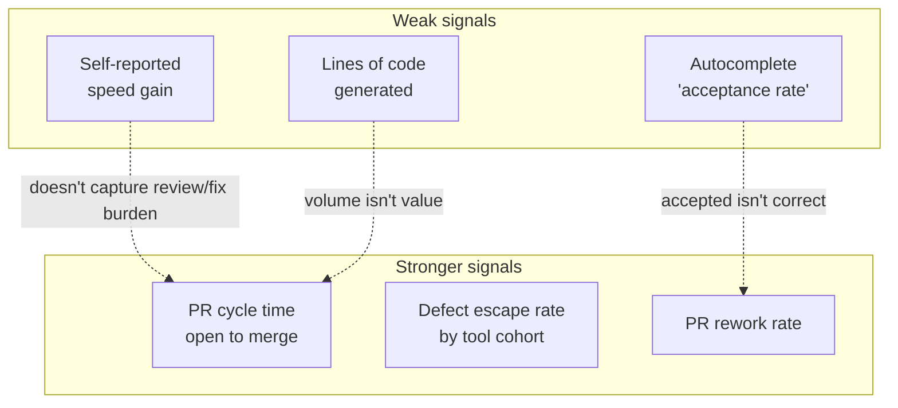

Every AI coding tool renewal conversation starts the same way: "engineers say it's faster." It's usually true and it's usually not sufficient. Self-reported speed is a real signal — I don't dismiss it — but it's a biased one on both ends. Engineers consistently overestimate how much time a tool saved them, because the time saved (fast autocomplete, less typing) is vivid and immediate while the time cost (reviewing a plausible-looking diff more carefully, fixing a subtly wrong generated function two days later) is diffuse and rarely gets attributed back to the tool that caused it. Given the defect-rate numbers this series opened with, that second cost is not small. This post is about the metrics that hold up better when real budget decisions are on the line.



## Why the weak signals stay weak no matter how you slice them

**Lines of code generated.** This one should be retired outright. More code isn't more value — it's frequently the opposite, since the terser, more maintainable solution is usually fewer lines, not more. A tool that generates verbose, over-engineered implementations will look great on this metric and be actively making the codebase worse.

**Raw autocomplete acceptance rate.** Accepting a suggestion means it looked right in the moment, not that it was right. I've watched engineers accept a suggestion, run the tests, and revert it twenty minutes later — that shows up as a 100% acceptance rate and zero delivered value. Acceptance rate measures "did this feel plausible enough to tab-complete," which is precisely the property that makes AI-generated defects hard to catch in review in the first place.

**Self-reported speed, alone.** Not worthless — trend it, but don't budget against it. It captures generation speed and misses the two things that actually determine whether a tool paid for itself: how much extra review scrutiny the generated code required, and how much rework happened after merge because something slipped through.

## The metrics that hold up

**PR cycle time, open to merge.** This is the metric that captures the *full* loop — not "how fast did the engineer type," but how long the unit of work actually took from submission to done, including review rounds, CI failures, and rework. If a tool speeds up writing but the resulting PRs take longer to get through review because reviewers have learned to scrutinize that engineer's AI-heavy PRs more carefully, cycle time will show it. Self-reported speed never will.

**Defect escape rate to production, by AI-tool-usage cohort.** Not "did this tool introduce more bugs in review" — did it introduce more bugs that *review missed*. This is the metric most directly answering the question the whole series is built around, and it requires joining production incident data back to the PR (and, if you have it, the provenance tagging from earlier in this series) that introduced the defect.

**PR rework rate.** How often does a PR need substantial revision after initial submission — not a typo fix, but a reviewer sending it back for a real logic or design change. A tool that produces code requiring more rework rounds is costing you time even if the first draft appeared quickly.

## A lightweight measurement dashboard

None of this requires new instrumentation if you already have Git history, CI logs, and a bug tracker. The join is the work.

```python
# roi_metrics.py — pulls existing Git/CI/incident data, no new instrumentation
import subprocess
import json
from dataclasses import dataclass
from datetime import datetime
from collections import defaultdict

@dataclass
class PRMetrics:
    number: int
    author: str
    opened_at: datetime
    merged_at: datetime | None
    review_rounds: int
    ai_tool: str | None   # from provenance tagging, if available — else None

    @property
    def cycle_time_hours(self) -> float | None:
        if not self.merged_at:
            return None
        return (self.merged_at - self.opened_at).total_seconds() / 3600


def fetch_pr_metrics(repo: str, since_days: int = 90) -> list[PRMetrics]:
    result = subprocess.run(
        ["gh", "pr", "list", "--repo", repo, "--state", "all",
         "--search", f"created:>={since_days}d",
         "--json", "number,author,createdAt,mergedAt,reviews"],
        capture_output=True, text=True,
    )
    prs = json.loads(result.stdout)
    metrics = []
    for pr in prs:
        review_rounds = len({r["submittedAt"][:10] for r in pr.get("reviews", [])})
        metrics.append(PRMetrics(
            number=pr["number"],
            author=pr["author"]["login"],
            opened_at=datetime.fromisoformat(pr["createdAt"].replace("Z", "+00:00")),
            merged_at=datetime.fromisoformat(pr["mergedAt"].replace("Z", "+00:00"))
                      if pr.get("mergedAt") else None,
            review_rounds=review_rounds,
            ai_tool=lookup_provenance_tool(pr["number"]),  # from provenance log, or None
        ))
    return metrics


def join_defect_escapes(metrics: list[PRMetrics], incidents: list[dict]) -> dict:
    """incidents: [{'pr_number': int, 'severity': str, ...}, ...] from your
    incident tracker, pre-joined to the PR that introduced the change."""
    pr_lookup = {m.number: m for m in metrics}
    escapes_by_tool = defaultdict(int)
    total_by_tool = defaultdict(int)

    for m in metrics:
        total_by_tool[m.ai_tool or "human-only"] += 1

    for incident in incidents:
        pr = pr_lookup.get(incident["pr_number"])
        if pr:
            escapes_by_tool[pr.ai_tool or "human-only"] += 1

    return {
        tool: {
            "prs": total_by_tool[tool],
            "escaped_defects": escapes_by_tool[tool],
            "escape_rate_pct": round(
                escapes_by_tool[tool] / max(total_by_tool[tool], 1) * 100, 2
            ),
        }
        for tool in total_by_tool
    }


def summarize_cycle_time_and_rework(metrics: list[PRMetrics]) -> dict:
    by_tool = defaultdict(list)
    for m in metrics:
        if m.cycle_time_hours is not None:
            by_tool[m.ai_tool or "human-only"].append(m)

    summary = {}
    for tool, prs in by_tool.items():
        cycle_times = sorted(p.cycle_time_hours for p in prs)
        median = cycle_times[len(cycle_times) // 2]
        avg_rework = sum(p.review_rounds for p in prs) / len(prs)
        summary[tool] = {
            "pr_count": len(prs),
            "median_cycle_time_hours": round(median, 1),
            "avg_review_rounds": round(avg_rework, 2),
        }
    return summary


if __name__ == "__main__":
    metrics = fetch_pr_metrics("your-org/your-repo")
    print(json.dumps(summarize_cycle_time_and_rework(metrics), indent=2))
    # join with incidents export separately once both datasets are pulled
```

Report this as ranges and trends over a quarter, not a single point-in-time number — PR volume and mix vary enough week to week that a single snapshot invites overreading noise as signal.

## The honest caveat

I want to be direct about the limit of all this: isolating a tool's actual causal impact from everything else that moves velocity — a team member joining or leaving, the project entering a harder phase, the codebase maturing or accumulating debt — is genuinely hard, and no amount of dashboard sophistication fully solves it. I don't present these numbers as "tool X caused a 14% cycle time improvement." I present them as "cycle time for PRs using tool X trended down over the quarter while rework rate held flat" and let that sit alongside the qualitative engineer feedback, not replace it. Anyone presenting AI tool ROI with false precision — a single clean percentage, no confidence range, no acknowledgment of confounds — is a bigger red flag than a team that says "we think it's helping, here's the range of evidence, here's what we're still unsure about." The second answer is the one that survives contact with a budget review.
