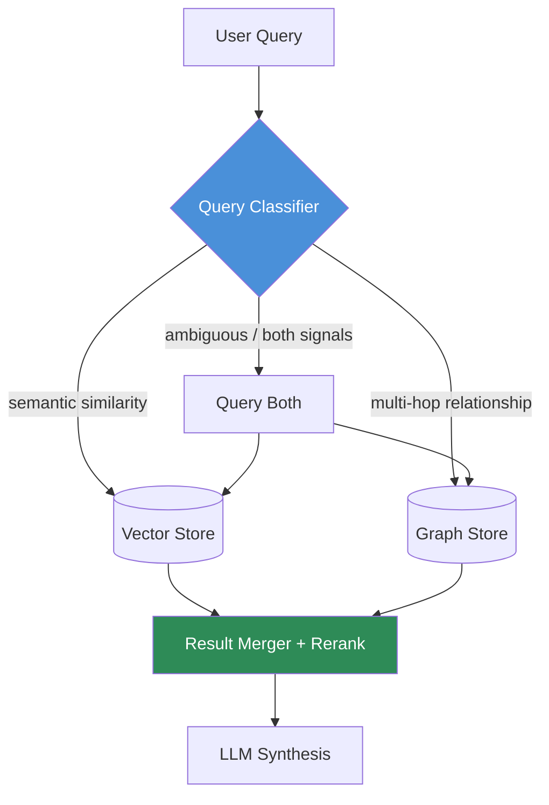

We've covered why flat vector retrieval fails on relationship questions and why full GraphRAG costs 300-400x more to index than plain embeddings. Both of those posts land on the same unstated conclusion: neither approach is right for all of your queries, all of the time. What changed through 2026 is that enterprise teams stopped treating "vector or graph" as an architecture decision made once at project kickoff, and started treating it as a per-query routing decision made at request time. That shift — hybrid retrieval as query-aware routing rather than a monolithic pipeline — is what actually earned the "2026 standard" label, and it's worth being precise about what it does and doesn't mean.



## Hybrid doesn't mean "always query both"

The naive version of hybrid retrieval — fire every query at the vector store and the graph store, merge whatever comes back, let the LLM sort it out — is the version most teams tried first in 2025, and it's the version that gave hybrid retrieval a reputation for being expensive and slow. Querying a graph store on every request when 80% of your traffic is simple semantic lookup ("find documents about deployment rollback procedures") wastes a Cypher traversal on a question the vector index would have answered in 40ms. The version that actually stuck routes each query to the retrieval mode suited to it, and reserves "query both" for the genuinely ambiguous middle.

The distinction that matters isn't topic, it's query shape:

- **Semantic similarity questions** — "find documents about X," "what's our policy on Y," "show me examples of Z" — these are asking for content that resembles the query. Vector search is the right tool: fast, cheap, no schema dependency.
- **Relationship and multi-hop questions** — "who reports to whom and what have they shipped together," "which vendors are connected to the systems flagged in the audit," "trace the approval chain for this budget line" — these require traversing structured relationships that don't live in any single chunk's embedding. Graph traversal is the right tool.

A query classifier sitting in front of both stores is the entire architecture. It doesn't need to be sophisticated — a well-prompted LLM call with a handful of examples gets you most of the way, and you can supplement it with cheap heuristics (does the query contain relationship language: "reports to," "connected to," "who worked with," "chain of").

## A working query classifier

```python
from dataclasses import dataclass
from anthropic import Anthropic

client = Anthropic()

RELATIONSHIP_SIGNAL_PHRASES = [
    "who reports to", "connected to", "worked with", "chain of",
    "related to", "depends on", "approved by", "escalated to",
]


@dataclass
class RoutingDecision:
    use_vector: bool
    use_graph: bool
    reasoning: str


def classify_query(query: str) -> RoutingDecision:
    # Cheap heuristic pass first — skip the LLM call when it's obvious
    lower = query.lower()
    if any(phrase in lower for phrase in RELATIONSHIP_SIGNAL_PHRASES):
        heuristic_graph_signal = True
    else:
        heuristic_graph_signal = False

    response = client.messages.create(
        model="claude-sonnet-5",
        max_tokens=200,
        tools=[{
            "name": "route_query",
            "description": "Decide which retrieval systems this query needs",
            "input_schema": {
                "type": "object",
                "properties": {
                    "use_vector": {"type": "boolean"},
                    "use_graph": {"type": "boolean"},
                    "reasoning": {"type": "string"},
                },
                "required": ["use_vector", "use_graph", "reasoning"],
            },
        }],
        tool_choice={"type": "tool", "name": "route_query"},
        messages=[{
            "role": "user",
            "content": f"""Classify this query for retrieval routing.

use_vector=true when the query asks for semantically similar content
(documents about a topic, policy lookups, "find examples of X").

use_graph=true when the query requires tracing relationships between
entities (org structure, approval chains, multi-hop connections,
"who worked with whom", dependency chains).

Set both true only when the query has both a content-lookup component
and a relationship component.

Heuristic signal from phrase matching: relationship language detected = {heuristic_graph_signal}

Query: {query}""",
        }],
    )
    tool_use = next(b for b in response.content if b.type == "tool_use")
    return RoutingDecision(**tool_use.input)


def retrieve(query: str, vector_store, graph_client) -> list[dict]:
    decision = classify_query(query)
    results = []

    if decision.use_vector:
        results.extend(vector_store.search(query, top_k=8))

    if decision.use_graph:
        results.extend(graph_client.traverse_for_query(query))

    return results
```

In production, cache the classifier's decisions per normalized query pattern — most enterprise search traffic is repetitive ("who owns X," "where's the doc on Y"), and re-running an LLM classification on identical query shapes is wasted latency. A simple LRU keyed on a normalized query hash cuts classifier calls substantially once traffic stabilizes.

## Merging results when both fire

When a query genuinely needs both — "what does the security policy say about vendors connected to the Q3 audit findings" has a content-lookup half and a relationship half — you're merging two result sets with different shapes. Vector results are ranked chunks with similarity scores; graph results are traversal paths with no natural comparability to a cosine score. Don't try to force them onto one ranking axis. Instead, pass both to the LLM as distinct, labeled context blocks and let synthesis handle the merge:

```python
def build_synthesis_prompt(query: str, vector_hits: list[dict], graph_paths: list[dict]) -> str:
    vector_block = "\n\n".join(f"[Doc: {h['source']}]\n{h['content']}" for h in vector_hits)
    graph_block = "\n".join(
        " -> ".join(step["entity"] for step in path["chain"]) + f"  ({path['relationship_summary']})"
        for path in graph_paths
    )
    return f"""Answer the question using both sources below. Cite which source
each part of your answer comes from.

RELEVANT DOCUMENTS:
{vector_block}

RELEVANT RELATIONSHIPS:
{graph_block}

QUESTION: {query}"""
```

Reranking across modalities is a solved-badly problem — resist the urge to build a unified scoring function before you've shipped the simpler version and watched where it actually falls short.

## The result that made this the standard, not just a nice idea

The case that got cited constantly through 2026 industry write-ups is LinkedIn's customer service retrieval system, which paired a knowledge graph with vector search specifically because pure retrieval kept failing on questions requiring cross-entity reasoning — "this ticket relates to an issue three support agents already resolved differently." Routing relationship-shaped questions to the graph and leaving content lookup to the vector index cut median per-issue resolution time by close to a third. The number that matters more than the specific percentage is the mechanism: the win came from *not* forcing every query through the expensive path, only the ones that needed it.

## Where teams still get this wrong

The failure mode isn't picking the wrong architecture — it's skipping the classifier and hardcoding routing by source system or content type instead ("HR queries always go to the graph"). That breaks the moment someone asks a semantic question about HR content, or a relationship question about a document type you assumed was vector-only. Route by query shape, not by domain, and revisit the classifier's misroutes as a standing part of the retrieval eval suite — the same discipline the RAGAS series argued for flat retrieval applies here, just measured per-route instead of globally.
