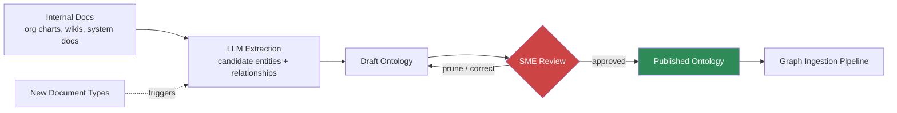

Before any graph gets built — GraphRAG, a hybrid retrieval backend, whatever you're routing relationship queries to — someone has to decide what the graph's schema actually is. That schema is the ontology: the set of entity types ("Employee," "Project," "System," "Vendor") and relationship types ("reports_to," "uses," "depends_on," "owns") the graph will be built from. Get the ontology wrong and every downstream extraction inherits the mistake — entities get misclassified, relationships get missed because there was no slot for them, and the graph that looked structured on day one turns out to encode a subtly wrong model of the organization. The traditional way to build one is a series of workshops with subject matter experts that runs for months. What changed in 2026 is using an LLM to draft the ontology from existing documentation first, and reserving the SME time for review instead of first-draft authoring.



## What an ontology actually is here

Don't overthink the word. In this context it's just a schema: a controlled list of node labels and edge types, with enough definition that an extraction pipeline knows what to look for and a graph query knows what it can ask. "Employee `reports_to` Employee." "Project `uses` Technology." "Vendor `supplies` Component." "Incident `caused_by` Change." Each entity type usually needs a small set of properties (an Employee has a name, a title, a team) and each relationship type needs directionality and cardinality rules (`reports_to` is one-directional, each Employee has at most one direct manager).

The traditional build process is a facilitator running workshops with department SMEs, whiteboarding entity types, arguing about naming ("is it 'Team' or 'Squad' or 'Pod'?"), and iterating across weeks per domain. It produces a good ontology — SME-authored schemas tend to be more precise about edge cases than anything drafted cold — but it's slow, and it doesn't scale past the first two or three domains before organizational patience runs out.

## The LLM-assisted draft

The faster path treats the ontology as something extracted from evidence rather than designed from a blank page. Feed the model your existing documentation — org charts, system architecture docs, project wikis, ticketing system schemas — and ask it to propose candidate entity types and relationships grounded in what actually appears in the text, not what an idealized taxonomy would look like.

```python
from anthropic import Anthropic
import json

client = Anthropic()

ONTOLOGY_SCHEMA = {
    "type": "object",
    "properties": {
        "entity_types": {
            "type": "array",
            "items": {
                "type": "object",
                "properties": {
                    "name": {"type": "string"},
                    "description": {"type": "string"},
                    "example_mentions": {"type": "array", "items": {"type": "string"}},
                    "suggested_properties": {"type": "array", "items": {"type": "string"}},
                },
                "required": ["name", "description", "example_mentions"],
            },
        },
        "relationship_types": {
            "type": "array",
            "items": {
                "type": "object",
                "properties": {
                    "name": {"type": "string"},
                    "source_entity": {"type": "string"},
                    "target_entity": {"type": "string"},
                    "directional": {"type": "boolean"},
                    "description": {"type": "string"},
                    "example_mentions": {"type": "array", "items": {"type": "string"}},
                },
                "required": ["name", "source_entity", "target_entity", "directional", "description"],
            },
        },
    },
    "required": ["entity_types", "relationship_types"],
}


def propose_ontology_from_corpus(document_texts: list[str]) -> dict:
    """Draft candidate entity/relationship types from a sample of internal docs.
    Run on a representative sample, not the full corpus — 30-50 documents
    spanning the domain is usually enough signal."""
    combined = "\n\n---\n\n".join(document_texts)
    response = client.messages.create(
        model="claude-sonnet-5",
        max_tokens=4096,
        tools=[{
            "name": "propose_ontology",
            "description": "Propose candidate entity and relationship types grounded in the source text",
            "input_schema": ONTOLOGY_SCHEMA,
        }],
        tool_choice={"type": "tool", "name": "propose_ontology"},
        messages=[{
            "role": "user",
            "content": f"""Read these internal documents and propose a candidate
ontology: entity types and relationship types that actually appear.

For every proposed type, include real example mentions from the text —
do not propose a type you cannot ground in a specific passage. Favor
fewer, well-grounded types over an exhaustive idealized taxonomy.

Documents:
{combined}""",
        }],
    )
    tool_use = next(b for b in response.content if b.type == "tool_use")
    return tool_use.input


def save_draft(ontology: dict, path: str) -> None:
    with open(path, "w") as f:
        json.dump(ontology, f, indent=2)
```

Two things make this useful rather than dangerous: grounding every proposed type in real example mentions from the source text (so a reviewer can check "is this actually what the documents say" rather than trusting an abstraction), and running it across a representative sample rather than the entire corpus, which keeps the draft cheap and fast to iterate on.

## Where this fails without a human

An ungrounded ontology is a specific, recognizable failure mode: it looks structured — clean entity names, tidy relationships, a diagram that presents well — while encoding relationships that are wrong or too coarse to be useful. The most common version I've seen: an LLM proposes "Employee `works_on` Project" as a single relationship type when the actual organization distinguishes "owns," "contributes to," and "was consulted on" — three meaningfully different roles that get flattened into one edge because the source documents used loose language and the model didn't push back. A graph built on that ontology will answer "who works on Project X" with a list that's technically not wrong but useless for anything requiring accountability — you can't tell the owner from someone who was cc'd on a design doc once.

This is why the review step isn't optional polish, it's the step that makes the difference between a usable ontology and a plausible-looking one. Reviewers should be pruning and correcting, not rubber-stamping: merge relationship types that are really the same thing under different names, split ones that are conflating distinct roles, and reject any entity type whose example mentions don't actually support it. Budget SME time for this — it's real work, just far less of it than authoring from scratch.

## Treat it as a living artifact, not a one-time deliverable

The workshop model produces a finished ontology and moves on. That doesn't survive contact with a growing document corpus — new document types (a new ticketing system, a newly acquired subsidiary's org structure, a vendor contract format you've never ingested before) will surface entities and relationships the original ontology didn't anticipate. Run the same extraction pipeline periodically against newly ingested document types, flag proposed additions that aren't already covered by the published ontology, and route those through the same lightweight expert review rather than silently expanding the schema. An ontology that only changes during scheduled reviews, on evidence gathered the same way it was built the first time, stays trustworthy. One that grows ad hoc as extraction pipelines quietly add whatever entity types they happen to encounter turns into the same mess the workshop process was trying to avoid, just arrived at faster.
