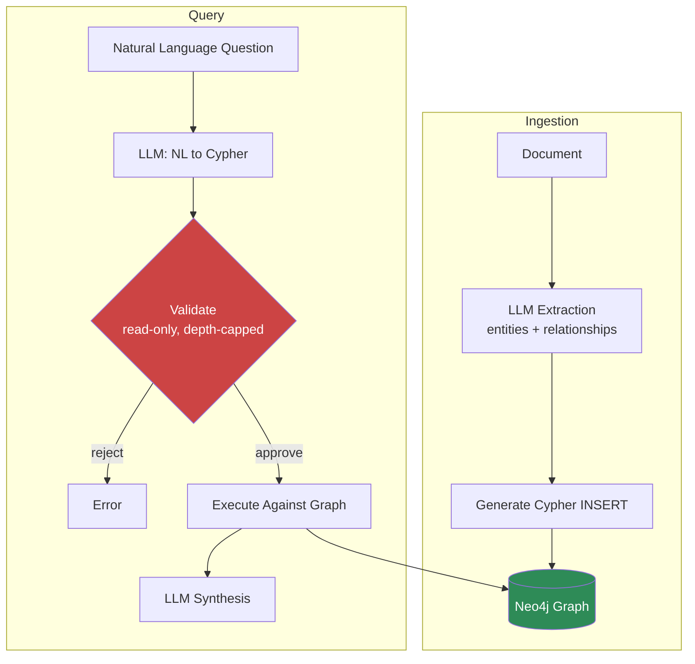

The GraphRAG-when-it's-worth-it post covered the cost tradeoffs and Microsoft's reference implementation. This one is narrower and more concrete: what it actually looks like to build a GraphRAG pipeline on Neo4j when you're not using the Microsoft package — because most enterprise teams end up here, wiring an LLM extraction step and an LLM query-generation step around a graph database they already run for other reasons. Two pipelines, sharing one graph: ingestion writes to it, query reads from it.



## Ingestion: extraction against your ontology, then Cypher

The extraction step should be constrained to the ontology you published in the prior step — don't let the model invent entity types mid-ingestion, or your graph schema drifts document by document. Pass the ontology's entity and relationship types as part of the extraction prompt and enforce them with structured output.

```python
from anthropic import Anthropic
from neo4j import GraphDatabase

client = Anthropic()
driver = GraphDatabase.driver("bolt://localhost:7687", auth=("neo4j", "password"))

ENTITY_TYPES = ["Employee", "Project", "Technology", "Vendor", "Incident"]
RELATIONSHIP_TYPES = ["REPORTS_TO", "WORKS_ON", "USES", "SUPPLIES", "CAUSED_BY"]

EXTRACTION_SCHEMA = {
    "type": "object",
    "properties": {
        "entities": {
            "type": "array",
            "items": {
                "type": "object",
                "properties": {
                    "id": {"type": "string"},
                    "type": {"type": "string", "enum": ENTITY_TYPES},
                    "name": {"type": "string"},
                },
                "required": ["id", "type", "name"],
            },
        },
        "relationships": {
            "type": "array",
            "items": {
                "type": "object",
                "properties": {
                    "source_id": {"type": "string"},
                    "target_id": {"type": "string"},
                    "type": {"type": "string", "enum": RELATIONSHIP_TYPES},
                },
                "required": ["source_id", "target_id", "type"],
            },
        },
    },
    "required": ["entities", "relationships"],
}


def extract_graph_elements(chunk_text: str, source_doc: str) -> dict:
    response = client.messages.create(
        model="claude-sonnet-5",
        max_tokens=2048,
        tools=[{
            "name": "extract",
            "description": "Extract entities and relationships strictly within the given types",
            "input_schema": EXTRACTION_SCHEMA,
        }],
        tool_choice={"type": "tool", "name": "extract"},
        messages=[{
            "role": "user",
            "content": f"""Extract entities and relationships from this text.
Only use entity types: {ENTITY_TYPES}
Only use relationship types: {RELATIONSHIP_TYPES}
Assign each entity a stable id derived from its name (lowercase, underscored).

Text:
{chunk_text}""",
        }],
    )
    tool_use = next(b for b in response.content if b.type == "tool_use")
    result = tool_use.input
    for e in result["entities"]:
        e["source_doc"] = source_doc
    return result


def write_to_graph(extracted: dict, session) -> None:
    for entity in extracted["entities"]:
        session.run(
            f"""
            MERGE (n:{entity['type']} {{id: $id}})
            SET n.name = $name, n.source_doc = $source_doc, n.ingested_at = datetime()
            """,
            id=entity["id"], name=entity["name"], source_doc=entity["source_doc"],
        )
    for rel in extracted["relationships"]:
        session.run(
            f"""
            MATCH (a {{id: $source_id}}), (b {{id: $target_id}})
            MERGE (a)-[r:{rel['type']}]->(b)
            SET r.ingested_at = datetime()
            """,
            source_id=rel["source_id"], target_id=rel["target_id"],
        )


def ingest_document(text_chunks: list[str], source_doc: str) -> None:
    with driver.session() as session:
        for chunk in text_chunks:
            extracted = extract_graph_elements(chunk, source_doc)
            write_to_graph(extracted, session)
```

Using `MERGE` instead of `CREATE` matters here — documents get re-ingested, entities get mentioned across multiple chunks, and you want the graph to converge on one node per real-world entity rather than accumulating duplicates every time the same person's name shows up in a new document.

## Query: natural language to Cypher, validated before execution

This is the step people underestimate. Generating Cypher from a question is the easy half; making sure the generated Cypher is safe to run against a real graph is the half that actually determines whether this is production-ready.

```python
GRAPH_SCHEMA_DESCRIPTION = f"""
Node labels: {ENTITY_TYPES}
Relationship types: {RELATIONSHIP_TYPES}
All nodes have properties: id, name, source_doc, ingested_at
"""

def generate_cypher(question: str) -> str:
    response = client.messages.create(
        model="claude-sonnet-5",
        max_tokens=500,
        messages=[{
            "role": "user",
            "content": f"""Given this graph schema, write a single read-only
Cypher query to answer the question. Return ONLY the Cypher, no explanation.
Limit traversal to at most 3 hops. Always include a LIMIT clause.

Schema:
{GRAPH_SCHEMA_DESCRIPTION}

Question: {question}""",
        }],
    )
    return response.content[0].text.strip().strip("```cypher").strip("```").strip()


FORBIDDEN_KEYWORDS = ["CREATE", "MERGE", "DELETE", "SET", "REMOVE", "DROP", "DETACH"]
MAX_HOP_COUNT = 3


def validate_cypher(query: str) -> tuple[bool, str]:
    upper = query.upper()

    for keyword in FORBIDDEN_KEYWORDS:
        if keyword in upper:
            return False, f"Write operation detected: {keyword}"

    if "LIMIT" not in upper:
        return False, "Query missing LIMIT clause"

    # Rough hop-count guard: count relationship traversal hops in the pattern
    hop_count = query.count("-[")
    if hop_count > MAX_HOP_COUNT:
        return False, f"Query exceeds max hop count ({hop_count} > {MAX_HOP_COUNT})"

    return True, ""


def query_graph(question: str, session) -> list[dict]:
    cypher = generate_cypher(question)
    is_safe, reason = validate_cypher(cypher)
    if not is_safe:
        raise ValueError(f"Rejected generated Cypher: {reason}\nQuery was: {cypher}")

    result = session.run(cypher)
    return [dict(record) for record in result]


def answer_question(question: str) -> str:
    with driver.session() as session:
        graph_results = query_graph(question, session)

    synthesis = client.messages.create(
        model="claude-sonnet-5",
        max_tokens=1024,
        messages=[{
            "role": "user",
            "content": f"""Answer the question using these graph query results.

Results: {graph_results}

Question: {question}""",
        }],
    )
    return synthesis.content[0].text
```

## The safety pattern is the same one from text-to-SQL, applied to Cypher

This should look familiar if you've built the text-to-SQL safety envelope from the enterprise data series: schema-scoped generation, a validation pass before execution, read-only enforcement, and a resource cap. The keyword-blocklist approach above is a reasonable starting point, but the same caveat applies here that applies to naive SQL keyword blocking — a sufficiently adversarial or malformed query can slip past string matching (`CREATE` embedded in a string literal the query is filtering on, for instance). For anything beyond an internal tool with a small, trusted user base, parse the Cypher into an AST with a proper Cypher parser and validate structurally, the same way `sqlglot` gets used for SQL AST validation, rather than trusting keyword search alone.

The hop-count guard deserves its own emphasis: Cypher traversal cost scales badly with depth on a densely connected graph. A 2-hop query on a moderately connected enterprise graph might touch thousands of nodes; a 4-hop query on the same graph can touch millions, and an LLM asked to "trace all connections" has no inherent sense of that cost — it will happily generate an unbounded variable-length pattern (`-[*]-`) if the question sounds like it wants one. Cap hop count in the prompt *and* enforce it in validation, because prompted constraints get ignored under model variance and validation is the backstop that actually holds.

## What this buys you over the Microsoft package

Rolling your own on Neo4j instead of using the `graphrag` package trades away the community-detection and global-search machinery (worth revisiting if your query patterns turn out to be corpus-wide synthesis rather than targeted lookups) for direct control over the ontology, the extraction schema, and the graph you're probably already operating for other systems. For most enterprise knowledge management use cases — "who owns this," "what depends on that," "trace the approval chain" — targeted local queries against a graph built on your own ontology cover the actual demand, and the operational simplicity of one graph database instead of a separate GraphRAG indexing pipeline is worth the tradeoff.
