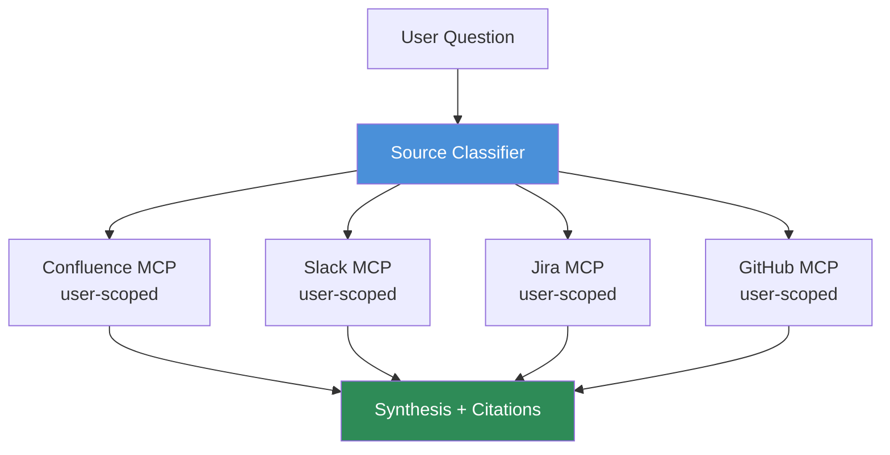

The graph and hybrid retrieval work in this series assumes you've already got a corpus to index. In most enterprises that assumption is the hard part. The answer to "how does the checkout retry logic work" might be in a Confluence design doc, a Slack thread from the engineer who wrote it, a Jira ticket documenting the last time it broke, or the code itself — and the search tool your team actually uses covers exactly one of those. Confluence search doesn't see Slack. Slack search doesn't see code. Nobody searches Jira comments unless they already know the ticket number. Unified search is the obvious answer, and MCP made it tractable to build without owning a bespoke integration for every source system.



## The architecture: one coordinator, several MCP servers

Each source system gets exposed as its own MCP server — a Confluence MCP server, a Slack MCP server, a Jira MCP server, a GitHub/code MCP server. A coordinating agent sits in front of them, decides which sources are worth querying for a given question, fans the question out, and synthesizes the results into one answer with citations pointing back to the original source. This isn't a new integration pattern — it's the standard agent-with-tools pattern — but MCP specifically is what makes it practical to stand up quickly, because you're not writing bespoke auth-and-query glue for four different systems, you're wiring four MCP clients into one coordinator.

```python
from anthropic import Anthropic
from dataclasses import dataclass

client = Anthropic()

@dataclass
class SourceResult:
    source: str
    content: str
    citation_url: str


def classify_sources(question: str) -> list[str]:
    """Decide which of the available MCP sources are worth querying.
    Keep this cheap and biased toward querying more sources rather than
    fewer when uncertain — the synthesis step filters irrelevant results."""
    response = client.messages.create(
        model="claude-sonnet-5",
        max_tokens=200,
        tools=[{
            "name": "select_sources",
            "description": "Select which knowledge sources to query for this question",
            "input_schema": {
                "type": "object",
                "properties": {
                    "sources": {
                        "type": "array",
                        "items": {"type": "string", "enum": ["confluence", "slack", "jira", "code"]},
                    },
                },
                "required": ["sources"],
            },
        }],
        tool_choice={"type": "tool", "name": "select_sources"},
        messages=[{"role": "user", "content": f"Question: {question}"}],
    )
    tool_use = next(b for b in response.content if b.type == "tool_use")
    return tool_use.input["sources"]


async def query_source(source: str, question: str, user_credentials: dict) -> list[SourceResult]:
    """Query one MCP server, scoped to the requesting user's own credentials —
    never a shared service account with broader access than the user has."""
    mcp_client = get_mcp_client(source, credentials=user_credentials[source])
    raw_results = await mcp_client.search(query=question)
    return [
        SourceResult(source=source, content=r["snippet"], citation_url=r["url"])
        for r in raw_results
    ]


async def unified_search(question: str, user_credentials: dict) -> str:
    sources = classify_sources(question)

    all_results: list[SourceResult] = []
    for source in sources:
        all_results.extend(await query_source(source, question, user_credentials))

    context = "\n\n".join(
        f"[{r.source} — {r.citation_url}]\n{r.content}" for r in all_results
    )
    synthesis = client.messages.create(
        model="claude-sonnet-5",
        max_tokens=1024,
        messages=[{
            "role": "user",
            "content": f"""Answer the question using the sources below. Cite the
source URL for every claim. If sources conflict, say so explicitly rather
than picking one silently.

Sources:
{context}

Question: {question}""",
        }],
    )
    return synthesis.content[0].text
```

## The permission problem is the whole risk surface

Notice `query_source` takes `user_credentials` and scopes the MCP client call to the requesting user's own credentials, per source, per query. This is the detail that makes or breaks whether this system is safe to deploy, and it's the detail that gets shortcut first under deadline pressure — usually by standing up one service account with broad read access across all four systems "to keep the integration simple." That shortcut turns a unified search agent into a permission bypass: a user who can't see a private Slack channel or a restricted Confluence space can now ask the agent a question and get an answer synthesized from content they were never supposed to access, because the agent's service account could see it even though the user couldn't.

The fix isn't complicated, just non-negotiable: every MCP call runs with the requesting user's actual scope, not a system-wide credential. Confluence's MCP integration should authenticate as the user (OAuth token exchange, not a shared API key) so its search API only returns spaces that user has permission to see. Same for Slack (user token, not a bot token with workspace-wide read), same for Jira, same for the code search. If a source system's MCP server doesn't support per-user scoped authentication, that source doesn't go into the unified search pool until it does — there's no acceptable version of this that trades permission fidelity for integration speed.

## Start with two or three sources, not all of them

The temptation with unified search is to wire up everything on day one — it looks impressive in a demo to answer a question by pulling from six systems at once. In practice this is the wrong sequencing. Each additional source multiplies the permission-scoping work, the query-classification training data you need, and the synthesis complexity when sources disagree. Start with the two or three sources that cover the highest-value question volume — for most engineering orgs that's Confluence (design docs, runbooks) and the codebase itself, with Slack or Jira added once those two are working reliably and the permission model is proven out. Adding a fourth source to a system that already works cleanly is a much smaller lift than debugging permission scoping across four systems simultaneously while also trying to get classification accuracy right.

## What "working" looks like

A unified search agent earns its place when it changes what people do instead of search — someone asks it a question rather than pinging three Slack channels and searching Confluence and Jira separately, hoping one of them has the answer. That's a real time saving, but it's also exactly why the permission and citation discipline above isn't optional: a system people default to instead of manual search is also a system whose mistakes — a wrong answer stated confidently, or worse, a permission leak — propagate further and faster than the fragmented status quo ever did.
