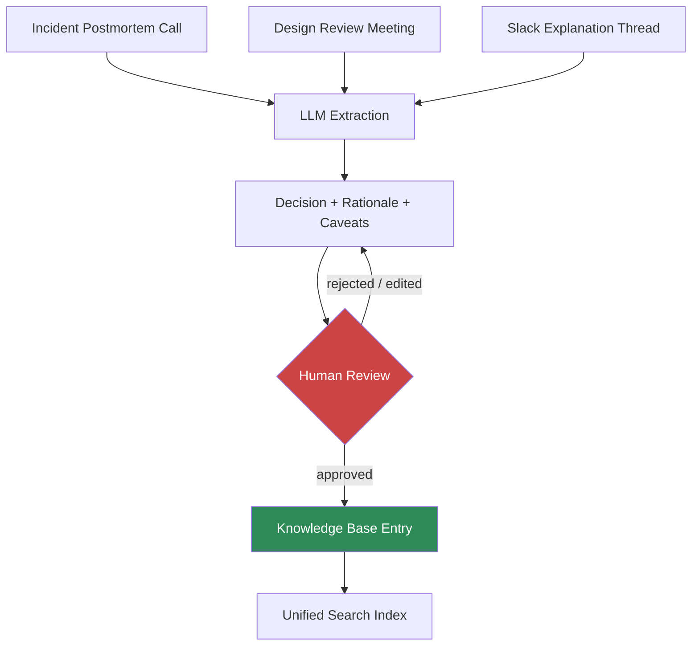

Every knowledge management system built so far in this series — hybrid retrieval, the ontology, the graph, unified search — assumes the knowledge exists somewhere as text. It usually doesn't, not the good parts. The reason a senior engineer gets paged for the tricky production issue isn't that they read something the rest of the team missed. It's that they remember trying the obvious fix eighteen months ago, watching it make things worse, and understanding why. That reasoning almost never gets written down. It lives in one person's head until they explain it out loud in an incident call or a design review, and then it either gets captured or it evaporates the moment the meeting ends. This is the tacit knowledge problem, and it's a different problem from the retrieval and indexing work — it's about creating the searchable content in the first place, not searching content that already exists.



## Transcription is not extraction

The easy version of this — recording meetings and running them through a transcript search — has existed for years and solves almost none of the actual problem. A raw transcript of an hour-long incident call is a wall of text: cross-talk, false starts, someone reading logs out loud, three people talking over each other about an unrelated topic for four minutes before getting back on track. Searching that later is barely better than not having it, because the signal — the actual decision that got made and why — is buried in noise a keyword search can't distinguish from everything around it.

What's actually useful is extraction: identifying the specific moments in a transcript where a decision got made, a reason got given, or a caveat got attached, and pulling just those out as structured, durable content. That's a fundamentally different task from transcription, and it's the one LLMs are actually good at — reading a meandering conversation and finding the load-bearing sentences.

## Capture sources worth targeting

Not every meeting is worth this treatment, and treating all of them the same way is how this becomes noise generation instead of knowledge capture. The sources that reliably contain tacit knowledge worth extracting:

- **Incident postmortems** — the "we tried X, it made things worse because Y" reasoning is exactly the kind of scar tissue that never makes it into a runbook otherwise.
- **Design review meetings** — the rejected alternatives and why they were rejected are frequently more valuable than the design that got approved, because they're what stops the next person from re-litigating the same dead end.
- **Slack threads where someone explains a tricky system** — these are already text, already have an audience who found them valuable enough to ask the question, and are the cheapest source to extract from because there's no transcription step at all.

## Extraction: decision, rationale, caveat

The structure that's proven durable across the teams I've seen do this is three fields per extracted entry: what was decided, why, and what to watch out for. It's simple enough that a reviewer can validate an entry in under a minute, and specific enough that it's actually searchable later — "why didn't we use approach X" is a caveat-field query, "what did we decide about Y" is a decision-field query.

```python
from anthropic import Anthropic
import json

client = Anthropic()

EXTRACTION_SCHEMA = {
    "type": "object",
    "properties": {
        "entries": {
            "type": "array",
            "items": {
                "type": "object",
                "properties": {
                    "decision": {"type": "string"},
                    "rationale": {"type": "string"},
                    "caveats": {"type": "array", "items": {"type": "string"}},
                    "speaker_role": {"type": "string"},
                    "confidence": {"type": "string", "enum": ["high", "medium", "low"]},
                    "source_excerpt": {"type": "string"},
                },
                "required": ["decision", "rationale", "confidence", "source_excerpt"],
            },
        },
    },
    "required": ["entries"],
}


def extract_tacit_knowledge(transcript: str, meeting_type: str) -> list[dict]:
    """Extract decision/rationale/caveat entries from a raw transcript.
    Every entry must be grounded in a direct source excerpt so a reviewer
    can verify it against what was actually said."""
    response = client.messages.create(
        model="claude-sonnet-5",
        max_tokens=4096,
        tools=[{
            "name": "extract_entries",
            "description": "Extract durable decision/rationale/caveat knowledge entries",
            "input_schema": EXTRACTION_SCHEMA,
        }],
        tool_choice={"type": "tool", "name": "extract_entries"},
        messages=[{
            "role": "user",
            "content": f"""This is a transcript of a {meeting_type}. Extract entries
ONLY where a genuine decision, technical rationale, or caveat/warning was
stated — skip small talk, status updates, and anything without durable
future value. Include the exact source excerpt for each entry so it can
be verified. Mark confidence 'low' if the reasoning is implied rather
than stated directly.

Transcript:
{transcript}""",
        }],
    )
    tool_use = next(b for b in response.content if b.type == "tool_use")
    return tool_use.input["entries"]


def queue_for_review(entries: list[dict], source_meeting: str, review_queue) -> None:
    for entry in entries:
        review_queue.add({
            **entry,
            "source_meeting": source_meeting,
            "status": "pending_review",
        })
```

## Human review is not optional here, for two reasons

The obvious reason is accuracy — an LLM reading a noisy transcript will occasionally attribute a caveat to the wrong system, or extract a "decision" that was actually someone thinking out loud and getting overruled thirty seconds later. Publishing that as authoritative knowledge is worse than not capturing it, because it's wrong in a way that reads as confident and sourced.

The less obvious reason is sensitivity. Incident calls and design reviews say things out loud that nobody intended to publish to a searchable knowledge base — a candid assessment of another team's code quality, a comment about why a vendor relationship is strained, something said in the heat of an outage that wouldn't survive a second read. Passive capture without a review gate risks turning every honest conversation into a liability, and it will chill the honesty of those conversations the moment people realize anything they say might get published. The review step isn't just quality control, it's what keeps people willing to talk candidly in the first place.

## The adoption problem is a friction problem

None of this works if the capture step adds friction people route around. If extraction requires someone to remember to hit record, manually flag which meetings are worth processing, and then separately go review a queue, it gets skipped within a month — same failure mode as any documentation initiative that depends on people remembering to do the extra thing. The versions that actually stick automate everything up to the review gate: transcripts get pulled automatically from whatever call platform the org already uses, extraction runs on a schedule without anyone triggering it, and the only human action required is a quick approve/reject/edit pass on entries that are already drafted. Review should feel like editing, not writing.

## The honest limit

This augments deliberate documentation. It doesn't replace it. Extraction surfaces what already got said out loud — it can't capture knowledge that never got articulated in the first place, and it's not a substitute for the discipline of writing a real runbook or design doc when the stakes justify it. What it's good for is the long tail: the hundreds of smaller pieces of reasoning that are individually too small to justify a dedicated doc but collectively are most of what makes an experienced engineer faster than a new one. Wired into the unified search index from the earlier post, that long tail becomes something a new hire can actually query instead of something they have to wait a year to absorb by osmosis.
