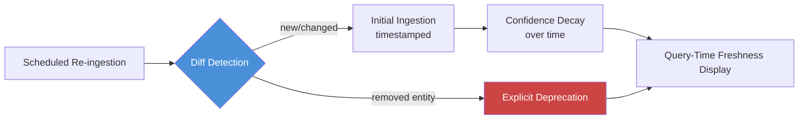

Every graph built with the ontology and ingestion pipeline from earlier in this series is accurate on the day it's built and decaying from that moment forward. Org structures change. Projects wrap up. Vendors get replaced. Systems get deprecated and their replacements never get ingested because nobody remembered to re-run the pipeline. None of that updates itself — a knowledge graph built from a point-in-time ingestion is a snapshot, and snapshots age. The part that surprises teams isn't that this happens, it's how fast trust in the whole system collapses the first time someone gets burned by a stale answer that was presented with the same confidence as a fresh one.



## Why this erodes trust faster than it erodes accuracy

There's an asymmetry worth naming explicitly: users don't experience "the graph is 15% stale" as a statistic, they experience it as a single bad answer at a moment that mattered — they asked who owns a system, acted on the answer, and found out the person left the team eight months ago. That one experience doesn't just discount the stale 15%. It discounts the whole system, including the 85% that's still accurate, because the user has no way to tell which answer they're getting without checking it manually — and if they have to check every answer manually, the system isn't saving them anything. A knowledge graph that's honestly labeled — "this fact was last confirmed 90 days ago" — and 60% fresh survives that moment better than one that's 80% fresh with no labeling at all, because the labeled system fails gracefully and the unlabeled one fails silently and gets abandoned.

## Four maintenance strategies, in order of how much they cost to build

**1. Source freshness tracking.** Every node and edge carries the document it was extracted from and the ingestion timestamp — this should already be happening if you followed the ingestion pattern from the Neo4j post, where every write sets `source_doc` and `ingested_at`. The cost here is near zero; the value is that everything downstream (decay scoring, deprecation, the freshness display at query time) depends on this being present from day one. Retrofitting it onto an existing graph that didn't track it is a real migration, not a small addition — get this right at ingestion time even before you build the rest.

**2. Scheduled re-ingestion with diffing.** Periodically re-run extraction against the same source systems and diff the result against the current graph state: entities that no longer appear in fresh source material, relationships that have changed (a different manager, a different system owner), and genuinely new entities. This is more expensive than the initial ingestion because you're running extraction again, but it's the mechanism that actually catches drift rather than just labeling it.

**3. Confidence decay.** Between re-ingestion cycles, facts age. A relationship extracted from a document ingested yesterday deserves higher confidence than the same relationship type extracted from a document ingested fourteen months ago and never re-confirmed since. Decay isn't about deleting anything — it's a score computed at query time that lets the system (and the user) distinguish "recently confirmed" from "was true as of a while ago, unconfirmed since."

**4. Explicit deprecation.** When re-ingestion diffing finds an entity that's dropped out of fresh source material — a project that wrapped, a system that got decommissioned — the correct action is marking it deprecated with a reason and a timestamp, not silently deleting it. Silent deletion destroys the audit trail (why did this disappear? was it an extraction error or a real organizational change?) and breaks any historical query that legitimately wants to know what used to be true.

## A freshness-scoring function applied at query time

```python
from datetime import datetime, timedelta
from dataclasses import dataclass

@dataclass
class GraphFact:
    content: str
    ingested_at: datetime
    last_reconfirmed_at: datetime | None
    entity_type: str


# Half-life per entity type — how fast confidence decays without reconfirmation.
# Org structure changes fast; vendor relationships change slowly.
DECAY_HALF_LIFE_DAYS = {
    "Employee": 90,       # org changes happen often
    "Project": 180,
    "Technology": 365,
    "Vendor": 270,
    "default": 180,
}


def freshness_score(fact: GraphFact, now: datetime | None = None) -> float:
    """Returns a confidence score in [0, 1] based on how long since the
    fact was last confirmed by fresh source material."""
    now = now or datetime.utcnow()
    last_confirmed = fact.last_reconfirmed_at or fact.ingested_at
    age_days = (now - last_confirmed).days
    half_life = DECAY_HALF_LIFE_DAYS.get(fact.entity_type, DECAY_HALF_LIFE_DAYS["default"])
    return 0.5 ** (age_days / half_life)


def annotate_and_filter(facts: list[GraphFact], min_confidence: float = 0.3) -> list[dict]:
    """Attach freshness scores and filter or flag stale results at query time."""
    annotated = []
    for fact in facts:
        score = freshness_score(fact)
        annotated.append({
            "content": fact.content,
            "confidence": round(score, 2),
            "last_confirmed": (fact.last_reconfirmed_at or fact.ingested_at).isoformat(),
            "stale": score < min_confidence,
        })
    return annotated


def format_for_user(annotated_facts: list[dict]) -> str:
    lines = []
    for f in annotated_facts:
        marker = "⚠ stale — " if f["stale"] else ""
        lines.append(f"{marker}{f['content']} (confirmed {f['last_confirmed'][:10]}, confidence {f['confidence']})")
    return "\n".join(lines)
```

The half-life values matter more than the decay formula's exact shape — an Employee-typed relationship (who reports to whom) should decay much faster than a Technology-typed one (what language a service is written in), because org structure genuinely changes on a different timescale than a codebase's tech stack. Tune these per entity type against how often that entity type actually changes in your organization, not against a single global default.

## Someone has to own this

None of the above runs itself. Scheduled re-ingestion needs a schedule and someone who notices when the job silently stops running. Deprecation needs a human decision in ambiguous cases — an entity that disappeared from fresh source material might mean the project ended, or might just mean nobody updated the wiki page that used to mention it, and those two cases need different handling. Decay half-lives need periodic tuning as the organization's actual rate of change becomes clearer. Treating a knowledge graph as a build-once artifact is the single most common reason these projects degrade from useful to actively distrusted within a year — budget an ongoing owner for graph quality the same way you'd budget one for a production data pipeline, because that's what it actually is.
