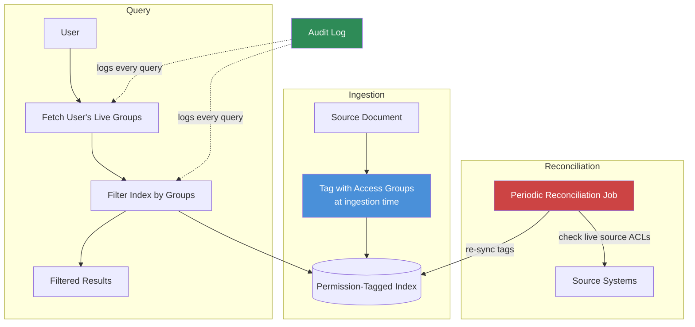

The unified search post covered the basic rule: every MCP call scoped to the requesting user's own credentials, never a shared service account. That rule is necessary but not sufficient once you're indexing content instead of querying it live — which most unified search systems end up doing for latency reasons, because re-querying four live source systems on every question is slow, and because a graph-backed system like the ones earlier in this series needs its own copy of the entity and relationship data. The moment you build an index, you've built a second copy of permission-sensitive content that has to stay in sync with permissions in the source systems that keep changing after you indexed it. That's a harder problem than access control in any single system, because you're now representing the union of several different permission models correctly, at query time, on data that's aging.



## Two architectures, and why neither one alone is enough

**Query-time filtering** re-checks the user's live permissions against each source system at the moment of the query, before including any result. It's accurate — if a user just lost access to a Confluence space five minutes ago, a query-time check catches that immediately — but it's slow (an API call per source system per query) and expensive at scale, and it defeats the purpose of building an index in the first place if you still have to hit every live system on every question.

**Permission-tagged indexing** tags every indexed chunk, at ingestion time, with the access groups that could see it then. Query time becomes a fast local filter: fetch the user's current group memberships, filter the index to chunks tagged with a matching group. This is fast and cheap, but it has the same staleness problem as everything else in this index — the tags reflect permissions as of ingestion, and permissions in the source system keep changing. A user removed from a group after ingestion still matches the old tag until something re-syncs it.

The answer in practice is both, in specific roles: permission-tagged indexing for the speed of everyday queries, with a periodic reconciliation job that re-checks tags against live source permissions and catches drift before it becomes a real exposure window.

```python
from dataclasses import dataclass
from datetime import datetime, timedelta

@dataclass
class IndexedChunk:
    content: str
    source_system: str
    source_doc_id: str
    access_groups: list[str]   # tagged at ingestion time
    tagged_at: datetime


def tag_chunk_at_ingestion(content: str, source_system: str, doc_id: str, source_client) -> IndexedChunk:
    """Fetch the current ACL from the source system and tag the chunk with it.
    This is the only place access_groups gets set from a live source check —
    everywhere else reads the tag."""
    live_groups = source_client.get_document_acl(doc_id)
    return IndexedChunk(
        content=content,
        source_system=source_system,
        source_doc_id=doc_id,
        access_groups=live_groups,
        tagged_at=datetime.utcnow(),
    )


def filter_by_user_groups(chunks: list[IndexedChunk], user_groups: set[str]) -> list[IndexedChunk]:
    """Fast local filter — no external API calls. This is the query-time path."""
    return [c for c in chunks if set(c.access_groups) & user_groups]


RECONCILIATION_STALENESS_THRESHOLD = timedelta(days=1)


def reconcile_tags(chunks: list[IndexedChunk], source_clients: dict, log) -> int:
    """Periodic job: for every chunk tagged longer ago than the staleness
    threshold, re-check the live ACL and update the tag if it changed."""
    updated = 0
    now = datetime.utcnow()
    for chunk in chunks:
        if now - chunk.tagged_at < RECONCILIATION_STALENESS_THRESHOLD:
            continue
        client = source_clients[chunk.source_system]
        live_groups = client.get_document_acl(chunk.source_doc_id)
        if set(live_groups) != set(chunk.access_groups):
            log.info(f"ACL drift detected: {chunk.source_doc_id} "
                      f"{chunk.access_groups} -> {live_groups}")
            chunk.access_groups = live_groups
            chunk.tagged_at = now
            updated += 1
    return updated
```

Set the reconciliation cadence against how sensitive the content is, not a single global default — a system holding HR or legal documents needs same-day reconciliation; a system holding public-facing engineering wikis can tolerate a weekly pass. Whatever the cadence, publish it, so a security review can state the actual maximum exposure window rather than assuming real-time accuracy the architecture doesn't provide.

## Test access control like it's the product, because it is

The failure mode that actually gets enterprises in trouble isn't a subtle permission edge case — it's a permission check nobody wrote a test for, discovered by an actual user rather than a test suite. A required test suite here isn't optional polish, it's the thing that has to exist before this ships:

```python
import pytest

def test_user_cannot_see_content_outside_their_groups(search_client, fixture_index):
    """User in group 'engineering' should never see chunks tagged 'legal-only'."""
    results = search_client.query("contract terms", user_groups={"engineering"})
    for r in results:
        assert "legal-only" not in r.access_groups, (
            f"Leak: engineering user retrieved legal-only content: {r.source_doc_id}"
        )


def test_revoked_access_excluded_after_reconciliation(search_client, fixture_index, reconciler):
    """A user removed from a group must not see previously-tagged content
    after reconciliation has run."""
    doc = fixture_index.get_chunk("doc_123")
    doc.access_groups = ["finance"]  # simulate original tag

    # Source system ACL changed — user's group removed from the document
    fixture_index.source_client.set_acl("doc_123", [])
    reconciler.reconcile_tags([doc], {"confluence": fixture_index.source_client}, log=NullLogger())

    results = search_client.query("Q3 budget", user_groups={"finance"})
    assert "doc_123" not in [r.source_doc_id for r in results]


def test_no_service_account_shortcut_in_query_path(search_client):
    """Every retrieval call in the query path must be traceable to a specific
    user's credential — fail loudly if any code path queries with a shared
    service account instead."""
    with search_client.trace_credential_usage() as trace:
        search_client.query("test", user_groups={"engineering"})
    assert all(call.credential_type == "user_scoped" for call in trace.calls)
```

Run these against real permission scenarios pulled from your actual org structure, not synthetic happy-path fixtures — the scenario that breaks in production is usually a group hierarchy edge case (nested groups, a user in two conflicting groups, a group that was renamed) that a simple fixture doesn't reproduce.

## Audit everything, because "we don't know what happened" is the worst possible answer

Every query needs a log entry recording who asked, what sources were checked, what permission groups were evaluated, and what got returned — not for performance monitoring, for the security review that happens after an incident. When someone asks "did this system ever expose document X to a user who shouldn't have seen it," the honest answer needs to come from a log, not from re-deriving the answer after the fact from a permission model that's since changed. Build the audit log as a first-class part of the query path, not an afterthought bolted on when compliance asks for it — retrofitting audit logging onto a system that's already handled months of queries means you have months of blind spot you can't answer for.

One leaked document is the entire risk this architecture exists to prevent, and it only takes one to break the premise the whole unified search project was built on — that people can trust what it shows them without checking it manually first.
