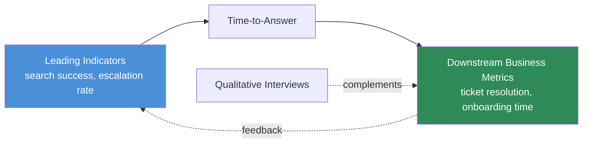

Everything built across this series — hybrid retrieval, the ontology, the graph, unified search, tacit knowledge capture, the maintenance discipline and the access control layer around all of it — is a real engineering investment, and at some point someone with budget authority is going to ask what it bought. This is the question knowledge management projects have always struggled to answer, long before LLMs were involved: the value shows up as time that didn't get spent searching, not as a line item anyone can point to. "We saved money" is hard to say credibly when the savings are distributed across a thousand small moments nobody tracked individually. Here's the measurement approach that actually holds up when someone pushes back on it.



## Why direct ROI measurement fails

The instinct is to try to measure the thing directly — "how many engineer-hours did the knowledge system save this quarter" — and it fails because there's no clean counterfactual. You can't A/B test whether an engineer would have spent forty minutes searching Confluence and Slack manually versus ninety seconds asking the unified search agent, because you only observe one of those two outcomes for any given question. Self-reported time savings ("this probably saved me half an hour") are directionally useful but not the kind of number that survives a skeptical budget review. The fix isn't a better direct measurement, it's a chain of leading indicators that are individually measurable and collectively make the case.

## Leading indicators you can actually instrument

**Search success rate.** Did the user get an answer without escalating to a human? This is measurable directly from system logs if you instrument the right signal: did the user's session end after the search result (success, or at least acceptance), or did they immediately post the same question in a Slack channel or ping a colleague (failure, the system didn't actually answer it).

**Escalation rate.** The inverse of search success, and arguably the stronger proxy of the two, because it's observable behavior rather than a self-reported satisfaction score. If a meaningful share of queries against the unified search system are followed within the same session by the user asking a human the same or a closely related question, the system isn't working regardless of what a satisfaction survey says.

**Time-to-answer.** For the queries that do succeed, how long from question asked to answer received. This is the metric that connects most directly to the hybrid retrieval work — a query correctly routed to vector search should answer in under a second; one correctly routed to graph traversal will be slower but should still land well under what manual multi-system search would have taken.

```python
from dataclasses import dataclass, field
from datetime import datetime, timedelta

@dataclass
class SearchEvent:
    query_id: str
    user_id: str
    query_text: str
    answered_at: datetime
    result_returned: bool
    follow_up_human_escalation: bool = False   # set by a downstream job, see below
    user_marked_helpful: bool | None = None


def compute_search_success_rate(events: list[SearchEvent]) -> float:
    answered = [e for e in events if e.result_returned]
    if not answered:
        return 0.0
    succeeded = [e for e in answered if not e.follow_up_human_escalation]
    return len(succeeded) / len(answered)


def compute_escalation_rate(events: list[SearchEvent]) -> float:
    return 1.0 - compute_search_success_rate(events)


def detect_escalation(search_event: SearchEvent, slack_messages: list[dict],
                       window: timedelta = timedelta(minutes=20)) -> bool:
    """Downstream job: check if the same user asked a related question in
    Slack shortly after a search query — a strong proxy for 'the search
    result didn't actually solve it'."""
    window_end = search_event.answered_at + window
    for msg in slack_messages:
        if msg["user_id"] != search_event.user_id:
            continue
        if not (search_event.answered_at <= msg["timestamp"] <= window_end):
            continue
        if is_related_question(msg["text"], search_event.query_text):
            return True
    return False


def is_related_question(candidate: str, original_query: str) -> bool:
    """Cheap similarity check — an embedding cosine-similarity threshold
    works fine here; doesn't need to be exact."""
    return embedding_similarity(candidate, original_query) > 0.75
```

## Downstream business metrics the leading indicators feed

Once search success and escalation rate are trending in the right direction, they should show up one level up in metrics the business already tracks: ticket resolution time for support and ops teams (the metric behind the LinkedIn hybrid-retrieval case cited earlier in this series — a real, meaningfully-sized drop in median resolution time, not a marginal one), and time-to-first-contribution for new engineers, which is one of the clearest places tacit knowledge capture and unified search compound — a new hire who can query the system instead of waiting to absorb institutional knowledge by osmosis ships their first real change measurably faster.

The honest caveat: these downstream metrics have other causes too. Ticket resolution time moves with headcount changes, seasonal ticket volume, and a dozen other things unrelated to search quality. Don't present the downstream number alone as proof — present it alongside the leading indicators that plausibly explain the mechanism, so the causal story is at least coherent even where it can't be perfectly isolated.

## The qualitative complement

Metrics miss things that matter. Periodic interviews with a rotating sample of users catch value the numbers don't capture cleanly — reduced context-switching (not having to hold three tabs open and cross-reference them), increased confidence in a decision because the source citation was right there instead of half-remembered from a meeting six months ago, or a new failure mode nobody instrumented for yet because it hadn't occurred to anyone to measure it. Run these on a cadence, not as a one-time launch survey — the qualitative picture shifts as usage patterns mature and as the system covers more sources.

## Framing it for stakeholders: time recovered, not adoption

The most common mistake in presenting this upward is leading with adoption ("80% of engineers used the search system this month") as if usage alone were the goal. Adoption without impact isn't the goal — a system people open reflexively and then still escalate to a human half the time isn't succeeding just because the usage number looks good. Frame the story as time recovered: search success rate up, escalation rate down, time-to-answer down, and the downstream metrics moving in a direction consistent with that mechanism. That's a case that survives a skeptical question, where "people are using it" on its own doesn't.

## A minimal dashboard schema

```python
DASHBOARD_METRICS = {
    "search_success_rate": {
        "cadence": "weekly",
        "source": "search_event_log",
        "target_trend": "increasing",
    },
    "escalation_rate": {
        "cadence": "weekly",
        "source": "search_event_log + slack_correlation_job",
        "target_trend": "decreasing",
    },
    "median_time_to_answer_seconds": {
        "cadence": "weekly",
        "source": "search_event_log",
        "target_trend": "decreasing",
        "segment_by": ["vector_routed", "graph_routed", "unified_multi_source"],
    },
    "ticket_resolution_time_median": {
        "cadence": "monthly",
        "source": "support_ticketing_system",
        "target_trend": "decreasing",
        "caveat": "confounded by headcount and volume — track alongside leading indicators",
    },
    "new_hire_time_to_first_contribution": {
        "cadence": "quarterly",
        "source": "engineering_onboarding_tracker",
        "target_trend": "decreasing",
    },
}
```

Segmenting time-to-answer by retrieval route (vector vs. graph vs. multi-source) is worth the extra instrumentation effort specifically because it closes the loop back to the hybrid routing decision from earlier in this series — if graph-routed queries are consistently slow enough that users are escalating instead of waiting, that's a signal to revisit the hop-count caps or the classifier's routing threshold, not a signal that the whole system isn't working. The measurement framework isn't just for justifying the investment after the fact — instrumented well, it's the same feedback loop that tells you which part of the architecture to improve next.
