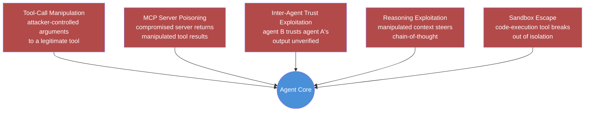

Last September this blog covered prompt injection, the OWASP LLM Top 10, and red-teaming AI systems before launch. That was chat-model security: the threat model was a manipulated string in, a manipulated string out. It's not wrong, it's just no longer the whole picture. An agent doesn't just answer questions — it calls tools with real side effects, pulls in results from MCP servers it has to trust by configuration rather than verification, and in multi-agent systems, treats another agent's output as though it were checked input. Every one of those is a new place an attacker can land, and none of them show up if you're only filtering what goes into the context window.

## Why the chat-model threat model doesn't transfer

A chat model's worst-case failure is a bad string: it says something wrong, offensive, or leaked. An agent's worst-case failure is a bad *action*: it deletes the wrong file, emails the wrong recipient, exfiltrates data through a tool call, or runs code that escapes the sandbox it was supposed to be confined to. The blast radius changed the moment we gave the model hands. Prompt-injection mitigations — input filtering, instruction hierarchies, output moderation — still matter, but they're defending the wrong boundary if the actual damage happens three tool calls downstream of a perfectly innocuous-looking prompt.

This matters more than it did a year ago because the industry noticed. At Black Hat USA 2026, 35 of the 121 briefings were specifically about agentic AI security — not "AI security" broadly, but the agent-specific surface: tool abuse, MCP trust, sandbox escapes, multi-agent manipulation. That's not a niche research track anymore. That's close to a third of the conference. When security researchers stop treating something as a hypothetical and start building CTF challenges and disclosure pipelines around it, it's time for engineering teams to have an actual threat model, not vibes.

## The five categories this series maps

I'm not going to try to cover agent security in one post — the surface is too broad and the mitigations are too different by category to compress usefully. Instead, this is the map for the week, and each subsequent post takes one category deep enough to leave you with something you can actually implement.

**1. Tool-call manipulation.** The agent calls a legitimate, sanctioned tool — but an attacker-controlled input changes the arguments it passes. A file-read tool gets a path-traversal string. A database-query tool gets an injected filter. The tool itself was never the problem; the arguments were. This is subtler than it sounds because most teams' tool allow-listing stops at "is this tool approved," never "are these arguments approved," which leaves the actual attack surface completely unguarded.

**2. MCP server poisoning.** MCP made it trivially easy to plug a new tool server into an agent, and just as easy to trust it implicitly once it's plugged in. A compromised or intentionally malicious MCP server can return manipulated data through a normal-looking tool result, or ship a tool description that quietly instructs the agent to misuse it. The agent reasons over that result as fact. If the server is lying, the agent's reasoning is now built on a lie it has no way to detect on its own.

**3. Inter-agent trust exploitation.** Multi-agent systems hand context from one agent to the next as if it were internal state, not external input. If agent A was manipulated — by any of the other four categories, or just by bad luck — agent B inherits the corruption with no verification step in between. This is the one that compounds fastest in production, because most multi-agent architectures were built for reliability, not adversarial robustness, and the failure modes look identical until you go looking for the cause.

**4. Reasoning exploitation.** The subtlest category, and the one classic prompt-injection filters are least equipped for. Instead of an explicit instruction ("ignore previous instructions"), the attack plants misleading facts or biased framing in content the agent processes — a document it's asked to summarize, a search result it's asked to synthesize — and steers the agent's conclusion without ever using language a pattern filter would flag.

**5. Sandbox escape.** Code-execution tools are the most powerful thing you can hand an agent, and sandbox escapes against major agent platforms have already been publicly demonstrated. The honest engineering position here isn't "our sandbox can't be escaped" — it's "assume it eventually will be, and design so that when it happens, the blast radius is small enough to be a bad afternoon, not a bad quarter."

## What this series will and won't do

Each post from here forward takes one category and gets specific: the attack pattern, why the obvious defense doesn't fully work, and code you can actually adapt — validation wrappers, sandboxing configs, schema-checked handoffs. None of it is a silver bullet, and I'll say so plainly where the mitigations reduce risk rather than eliminate it, because that's the honest state of this field in early 2027. The last post ties the individual mitigations into an operating model, because a pile of good practices with no owner isn't a security program, it's a to-do list nobody's accountable for.

If you're running agents with real tool access in production right now and your security review checklist still reads like it was written for a chatbot, this is the gap. The rest of the week fills it in.
