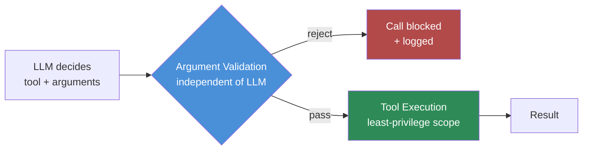

Most teams' tool security stops at allow-listing: which tools is the agent permitted to call. That's necessary and it's nowhere near sufficient, because the tool being approved says nothing about the arguments being safe. A file-read tool that's perfectly fine to expose can still be handed a path-traversal string. A query tool that only ever runs parameterized selects can still be handed a filter that widens the scope of what it reads. The tool passed review. The specific call didn't — and nothing checked.



## Where the manipulated argument comes from

The attacker rarely talks to the agent directly. More often the manipulated input rides in through content the agent is processing on someone else's behalf: a document it's summarizing, a support ticket it's triaging, a web page it fetched as part of a task. Embedded in that content is text crafted to influence the arguments the agent generates for its next tool call — not a request the agent consciously reasons about as "should I do this," just a string that happens to shape the parameters it fills in.

A few concrete shapes this takes:

- **Path traversal in a file tool.** A document being processed contains a filename-looking string like `../../../etc/passwd` or `../../config/secrets.yaml`, and the agent, trying to be helpful and literal, passes it straight through to a file-read tool that assumes it's operating on relative paths within a project directory.
- **Filter injection in a query tool.** The agent is building a database query based on user-described criteria, and the criteria include text that gets concatenated into a filter clause rather than bound as a parameter, widening or redirecting what the query actually returns.
- **Recipient substitution in a communication tool.** The agent is asked to "reply to the sender" or "forward this to the relevant team," and manipulated context steers it toward including an unintended additional recipient in what looks like a normal instruction.

None of these require the agent to call a tool it isn't supposed to call. They all work through a tool that's completely legitimate, doing exactly the thing it was built to do — just with arguments nobody meant to authorize.

## Why allow-listing tools misses this

Tool allow-listing answers "can the agent use this capability at all." Argument-level attacks live entirely inside "yes it can" — the capability was already granted, and the exploit is in how it gets invoked on a specific call. If your review process stops at the tool boundary, you've built a very solid wall around the wrong perimeter. The actual perimeter that needs defending is every individual call, not just the roster of tools available.

## Defenses

**1. Validate arguments at the tool boundary, independent of the LLM's reasoning.** This is the core fix, and it has to happen in code that runs regardless of what the model "intended." Schema validation catches type and shape errors. Path canonicalization plus an allow-listed directory root catches traversal. Parameterized queries — never string-built SQL assembled from anything the model produced — catch filter injection. The model's output is a proposal; the validation layer is the decision.

**2. Scope tools to least privilege.** A file-read tool shouldn't have filesystem-wide access just because it's convenient to build that way. Scope it to the one directory it needs. A query tool shouldn't have write access if its job is reads. The narrower the tool's inherent capability, the less an argument manipulation can accomplish even when it succeeds.

**3. Require explicit confirmation when arguments look unusual for tools with side effects.** Not every call needs a human in the loop — that doesn't scale — but a statistical or rule-based check for "this argument pattern is out of family for this tool" (a path outside the normal directory tree, a recipient outside the normal domain, a filter unusually broad) is cheap insurance for the calls that actually have consequences.

## A hardened file-read tool wrapper

```python
import os
from pathlib import Path

ALLOWED_ROOT = Path("/data/agent-workspace").resolve()


class PathTraversalError(Exception):
    pass


def validate_path(requested_path: str) -> Path:
    """Canonicalize and confirm the path stays inside the allowed root.

    This runs independent of the LLM's reasoning — it doesn't matter why
    the model asked for this path, only whether the resolved path is safe.
    """
    candidate = (ALLOWED_ROOT / requested_path).resolve()

    # resolve() collapses ../ sequences — comparing against the real root
    # after resolution is what actually blocks traversal, not string matching
    # on ".." in the input, which is trivially bypassed with encoding tricks.
    try:
        candidate.relative_to(ALLOWED_ROOT)
    except ValueError:
        raise PathTraversalError(
            f"Requested path resolves outside the allowed root: {requested_path}"
        )

    if not candidate.exists():
        raise FileNotFoundError(str(candidate))

    return candidate


def read_file_tool(requested_path: str) -> str:
    """The only file-read capability the agent has. No raw filesystem access
    is ever exposed beyond this function."""
    safe_path = validate_path(requested_path)

    # Least-privilege: refuse anything that isn't a plain file this tool
    # is meant to serve, even inside the allowed root.
    if not safe_path.is_file():
        raise ValueError(f"Not a regular file: {safe_path}")

    max_bytes = 1_000_000
    size = safe_path.stat().st_size
    if size > max_bytes:
        raise ValueError(f"File exceeds size limit: {size} bytes")

    return safe_path.read_text(errors="replace")


# Example: a traversal attempt embedded in agent-generated arguments
# gets rejected before it ever touches the filesystem.
try:
    read_file_tool("../../../etc/passwd")
except PathTraversalError as e:
    print(f"Blocked: {e}")
```

The same principle applies to a query tool — bind parameters, never interpolate model-generated text into a query string — and to any tool that sends something externally, where the validation layer should check the destination against an explicit allow-list rather than trusting whatever the model filled in.

## The connection to output validation you already do

If your team validates structured LLM output against a schema before using it downstream — most teams doing serious agent work already do this for the *response* — apply the identical rigor to tool call arguments before they hit execution. It's the same discipline, just applied one layer earlier: the model's proposed action is untrusted output until something outside the model has checked it.
