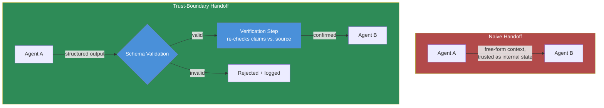

Most multi-agent architectures I've seen in production implement handoffs the same way: agent A finishes its part, its output gets dropped into agent B's context, and agent B proceeds as if that output were established fact. It's the same pattern you'd use to pass a variable between two functions in your own codebase — because that's mentally how most teams built it, one agent calling into the next like a subroutine. The problem is that agent A's output isn't a variable your own code produced. It's the result of an LLM's reasoning over inputs that might include attacker-controlled content, and agent B is about to treat it as ground truth with zero verification in between.



## Why this is different from the reliability problem

The September multi-agent posts on this blog covered how errors propagate through agent handoffs — a wrong classification in step one becomes a wrong routing decision in step two, and by step four the system has confidently built on a mistake nobody caught. That's a reliability problem, and it exists even with zero adversaries in the picture; agents are wrong sometimes and nothing verifies that.

Inter-agent trust exploitation is the adversarial cousin of that same architectural gap. It's not "agent A happened to be wrong" — it's "an attacker crafted input specifically designed to manipulate agent A's output in a way that produces a *specific, intended* downstream effect in agent B." The mechanism is identical (unverified handoff), but the failure isn't random anymore. Someone chose it. That changes what "good enough" reliability engineering looks like, because a system tuned to catch honest mistakes at a 2% base rate isn't necessarily tuned to catch a crafted input built to look exactly like a normal, high-confidence handoff.

A concrete shape: agent A is a document-triage agent that reads incoming content and produces a summary with a routing recommendation. An attacker who can influence that incoming content — a submitted form, an uploaded file, an email the system ingests — crafts it so agent A's summary looks completely ordinary but steers agent B (which acts on the routing recommendation, maybe approving a request or escalating a ticket) toward a specific unsafe action. Nothing about agent A's output looks suspicious in isolation. The manipulation is in what it omits and how it frames, not in anything a content filter would catch.

## Trust boundary patterns

**1. Treat inter-agent messages as untrusted input, not internal state.** This is the mental model shift, same as the previous post's stance on MCP tool results. The moment output crosses from one agent's reasoning into another's, it has left a trust boundary — even though both agents live in the same codebase, same deployment, same team's system. Internal doesn't mean trusted when the content passing through was shaped by external, potentially adversarial input upstream.

**2. Structured, schema-validated handoffs instead of free-form context.** Free-form text handoffs are the easiest thing to build and the easiest thing to smuggle instructions through — a field that's supposed to be a one-line confidence note can carry arbitrary prose, and arbitrary prose can carry an instruction agent B's model will read and act on. A schema-validated handoff constrains what can be said: a confidence score is a float in a defined range, a routing decision is one of an enumerated set of values, a summary field has a length cap and no embedded-instruction pathway because it's rendered as inert data, not interpreted as agent-directed text.

**3. A verification step for consequential downstream actions.** Not every handoff needs this — plenty of agent-to-agent steps are low-stakes and re-verifying everything kills the point of automating in the first place. But before agent B takes an action with real consequences based on agent A's claims, a cheap check that re-derives the key fact from source data rather than trusting the summary catches both honest errors and crafted manipulation with the same mechanism.

## A schema-validated handoff with verification

```python
from dataclasses import dataclass
from enum import Enum
from typing import Optional


class RoutingDecision(str, Enum):
    AUTO_APPROVE = "auto_approve"
    ESCALATE = "escalate"
    REJECT = "reject"


@dataclass(frozen=True)
class TriageHandoff:
    """The only shape agent A is allowed to hand to agent B.
    No free-form field can carry an instruction — every field is
    constrained enough to be rendered as data, not read as directive text."""
    document_id: str
    routing: RoutingDecision
    confidence: float          # bounded 0.0-1.0, enforced below
    claimed_amount: Optional[float]  # the specific fact B will act on
    summary: str                # length-capped, treated as inert display text

    def __post_init__(self):
        if not (0.0 <= self.confidence <= 1.0):
            raise ValueError("confidence out of range")
        if len(self.summary) > 500:
            raise ValueError("summary exceeds length cap")


def verify_claimed_amount(handoff: TriageHandoff, source_store) -> bool:
    """Re-derive the consequential fact from source data instead of
    trusting agent A's summary of it. This is the check that catches
    both an honest extraction error and a crafted manipulation."""
    source_record = source_store.get(handoff.document_id)
    if source_record is None:
        return False
    actual_amount = source_record.extracted_amount
    if handoff.claimed_amount is None or actual_amount is None:
        return handoff.claimed_amount == actual_amount
    return abs(handoff.claimed_amount - actual_amount) < 0.01


def agent_b_process(handoff: TriageHandoff, source_store, action_executor) -> str:
    if not verify_claimed_amount(handoff, source_store):
        return (
            f"Handoff for {handoff.document_id} failed verification — "
            f"claimed amount does not match source. Routed to human review."
        )

    if handoff.routing == RoutingDecision.AUTO_APPROVE and handoff.confidence >= 0.9:
        return action_executor.approve(handoff.document_id)
    elif handoff.routing == RoutingDecision.REJECT:
        return action_executor.reject(handoff.document_id)
    else:
        return action_executor.escalate_to_human(handoff.document_id)
```

Agent A can no longer smuggle an instruction through a "notes" field, because there is no unconstrained field to smuggle it through. And agent B doesn't act on agent A's claim about the amount — it acts on the amount as re-checked against the source record, which is the one piece of the handoff that actually matters for a consequential action.

## The design principle

Draw a trust boundary at every agent hop, not just at the system's external edge. It's tempting to treat "internal" agent-to-agent traffic as a lower-scrutiny zone because it never touches an external API or a user-facing input field — but the content flowing through it was shaped by external input at some point upstream, and by the time it reaches agent B, that provenance is invisible unless your architecture preserved it. Schema-constrained handoffs plus targeted verification on consequential actions is a small amount of engineering overhead for closing a gap that otherwise sits wide open in almost every multi-agent system I've reviewed.
