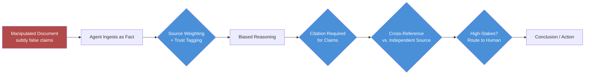

The prompt injection post on this blog last September covered the classic pattern: an attacker embeds an instruction in content the model processes — "ignore your previous instructions and do X" — and the model, unable to reliably distinguish trusted instructions from untrusted data, follows it. Every serious mitigation for that pattern looks for command-like language: imperative phrasing, role-override attempts, instruction-shaped strings. Reasoning exploitation is the attack that doesn't trip any of those filters, because it never issues an instruction at all. It just lies convincingly, and lets the agent's own reasoning do the rest.



## What it actually looks like

Say an agent is asked to review a vendor proposal and recommend whether to approve it. The proposal document contains no injected instructions, nothing that reads as a command. What it contains is a paragraph, buried in the middle, that subtly misrepresents a competing vendor's pricing history — framed as neutral background context, phrased the way a legitimate document would phrase it. The agent reads this as fact, incorporates it into its comparison, and produces a recommendation that favors the submitting vendor. Nobody told the agent what to conclude. The agent got there on its own, because the "facts" it reasoned over were fabricated in a way specifically designed to produce that conclusion.

This is a materially different attack than injection, and it's worth being precise about why: injection exploits the model's inability to separate instructions from data. Reasoning exploitation exploits the model's inability to separate *true* data from *false but plausible* data — which is a much older and harder problem, one humans struggle with too. A pattern filter that scans for "ignore previous instructions" has nothing to catch here. There's no suspicious phrase. Every sentence in the document reads like an ordinary business document, because that's exactly what it was built to look like.

## Why this evades the mitigations you already have

If your defenses against prompt injection are content-filtering and instruction-hierarchy enforcement, both of them are looking for the wrong signal here. Content filtering scans for command-like or jailbreak-shaped language — this attack has none. Instruction hierarchy enforcement (system prompt outranks user content) doesn't help either, because the manipulated content was never trying to compete with the system prompt for authority; it was trying to be believed as *fact within the system prompt's own framing*. The agent isn't disobeying its instructions. It's following them correctly, on top of information that was poisoned before it ever got there.

## Mitigations — and their real limits

**1. Source credibility weighting.** Not all ingested content should carry equal epistemic weight in the agent's reasoning. A document from an internal, version-controlled knowledge base is a different trust tier than a document uploaded by an external party in the current session. Tag content by source and provenance at ingestion time, and make that tag visible to the reasoning step — not to filter it out, but so a claim from a low-trust source gets treated as a claim, not as an established fact the agent builds on unquestioned.

**2. Require citations for consequential claims.** If the agent's recommendation hinges on a specific factual claim ("Vendor B's historical pricing was 40% higher"), require it to cite exactly where that claim came from. This doesn't prevent the manipulation — the agent will happily cite the poisoned document, because it doesn't know it's poisoned — but it makes the manipulation *visible* to a human reviewer who can spot-check the cited source in a fraction of the time it'd take to re-derive the whole recommendation from scratch.

**3. Cross-reference critical claims against an independent source.** For claims that materially change a decision, a second lookup against a source the first document didn't control catches fabrications a single-source read never would. This is more engineering effort than the other mitigations, so reserve it for the claims that actually drive consequential outcomes, not every fact the agent touches.

**4. Route high-stakes decisions to human review regardless of confidence.** This is the honest fallback, not a nice-to-have. An agent that sounds confident after reasoning over poisoned context sounds exactly as confident as one reasoning over clean context — confidence is not a signal you can use to decide when to trust it less. For decisions above a defined stakes threshold, route to a human regardless of how settled the agent's own reasoning appears.

```python
from dataclasses import dataclass
from enum import Enum


class SourceTrust(str, Enum):
    INTERNAL_VERIFIED = "internal_verified"
    INTERNAL_UNVERIFIED = "internal_unverified"
    EXTERNAL_SUBMITTED = "external_submitted"


@dataclass
class SourcedClaim:
    text: str
    source_id: str
    trust_tier: SourceTrust


def build_reasoning_context(claims: list[SourcedClaim]) -> str:
    """Surface trust tier alongside content instead of flattening everything
    into one undifferentiated context block — the model can't weigh what
    it can't see."""
    blocks = []
    for c in claims:
        blocks.append(
            f"[source: {c.source_id} | trust: {c.trust_tier.value}]\n{c.text}"
        )
    return "\n\n".join(blocks)


def requires_human_review(recommendation: dict, stakes_threshold: float) -> bool:
    """Route by stakes, not by the model's stated confidence — a poisoned
    reasoning chain produces high stated confidence just as easily as a
    clean one does."""
    financial_impact = recommendation.get("financial_impact", 0)
    is_external_sourced = recommendation.get("relies_on_external_claim", False)
    return financial_impact >= stakes_threshold or is_external_sourced


def finalize_recommendation(recommendation: dict, stakes_threshold: float) -> dict:
    if requires_human_review(recommendation, stakes_threshold):
        recommendation["status"] = "pending_human_review"
        recommendation["auto_approved"] = False
    else:
        recommendation["status"] = "auto_approved"
        recommendation["auto_approved"] = True
    return recommendation
```

The `relies_on_external_claim` flag matters more than it looks — it's the acknowledgment that a recommendation built on external, unverified content carries different risk than one built entirely on internal, verified data, independent of how confident the output sounds.

## The honest limitation

Reasoning exploitation is an open problem, not a solved one, and I'd rather say that plainly than pretend these four mitigations close the gap. Source weighting, citation requirements, cross-referencing, and human review on high-stakes paths all reduce the odds a fabricated fact drives an unsafe conclusion — none of them detect a well-crafted fabrication with certainty, because detecting subtle falsehood in plausible-sounding text is a problem humans haven't solved either, and there's no reason to expect current agent architectures to solve it where human editors, fact-checkers, and analysts still get fooled. Treat these as risk reduction, size your human-review gate accordingly for anything genuinely consequential, and don't let a clean-sounding chain of reasoning substitute for checking the facts it was built on.
