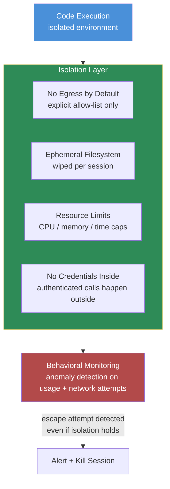

Code-execution tools are the most powerful thing you can hand an agent, and they're also the most heavily scrutinized attack surface in this whole series — for good reason. Sandbox escapes have been publicly demonstrated against multiple major agent platforms' code-execution environments, which means the question worth asking isn't "is our sandbox escape-proof." It's "if ours gets escaped tomorrow, what actually happens." Most teams have a good answer to the first question and no answer at all to the second, which is backwards, because the first answer is never going to be a permanent yes.



## Treat "the sandbox might be escaped" as a design assumption

This is the mindset shift that actually changes architecture. If you design assuming isolation is perfect, every other control becomes optional — why limit network egress if the sandbox can't be broken out of anyway. If you design assuming isolation will eventually fail, every other control becomes load-bearing, because it's the thing standing between "an exploited process ran inside a container" and "an exploited process reached something that mattered." The demonstrated escapes across agent platforms in the last year weren't edge cases in obscure implementations — they hit widely used, well-funded platforms. Assume yours is next in line, not exempt.

## Blast-radius-limiting design

**1. Network isolation — no egress by default.** A code-execution sandbox that can reach the open internet is a sandbox that can exfiltrate data, download additional payloads, or call out to an attacker-controlled endpoint the moment it's compromised. Default to zero outbound network access, and require an explicit allow-list for any external calls the agent's actual task genuinely needs — and keep that list as short as the task allows, not as long as would be convenient.

**2. Filesystem isolation — ephemeral, wiped per session.** The sandbox's filesystem should not persist between sessions, should not have access to the host filesystem, and should not have any visibility into other sessions' data. If an escape happens inside a session, the most it can touch is that session's own ephemeral state, and that state disappears when the session ends.

**3. Resource limits — CPU, memory, time caps.** Beyond security, this is basic multi-tenant hygiene: a runaway or exploited process shouldn't be able to consume enough shared infrastructure to degrade other sessions. Hard caps on CPU time, memory, and wall-clock execution time bound the damage a single compromised sandbox can do to the platform around it, independent of what the process inside is actually trying to do.

**4. No credentials inside the execution environment.** This is the single highest-leverage control on this list. If the agent's task requires an authenticated API call, that call should happen *outside* the sandbox — the sandboxed code produces request parameters, and a separate, trusted component outside the isolation boundary makes the actual authenticated call. An escaped sandbox with no credentials in it can do local damage within its own resource limits. An escaped sandbox with an API key in an environment variable can do damage to everything that key can reach.

## A sandbox configuration example

Here's a gVisor-based container configuration reflecting these constraints — the specifics vary by runtime (Firecracker microVMs and gVisor's runsc are both common choices for this), but the shape of the policy is what matters:

```yaml
# sandbox-policy.yaml — code execution sandbox for agent tool calls
apiVersion: v1
kind: Pod
metadata:
  name: agent-code-exec
spec:
  runtimeClassName: gvisor  # syscall-intercepting isolation layer,
                            # not just a namespace-isolated container

  containers:
    - name: exec-sandbox
      image: agent-sandbox-runtime:pinned-sha256
      resources:
        limits:
          cpu: "1"
          memory: "512Mi"
          ephemeral-storage: "256Mi"
        requests:
          cpu: "250m"
          memory: "128Mi"

      securityContext:
        runAsNonRoot: true
        readOnlyRootFilesystem: true
        allowPrivilegeEscalation: false
        capabilities:
          drop: ["ALL"]

      env: []  # deliberately empty — no credentials, no secrets, no API
                # keys are ever mounted into this environment

      volumeMounts:
        - name: ephemeral-workspace
          mountPath: /workspace
          # tmpfs-backed, wiped when the pod terminates — no persistence
          # across sessions, no access to host or sibling session data

  volumes:
    - name: ephemeral-workspace
      emptyDir:
        medium: Memory
        sizeLimit: 256Mi

  # Network policy applied separately: default-deny egress, with an
  # explicit allow-list only for endpoints the specific task requires.
---
apiVersion: networking.k8s.io/v1
kind: NetworkPolicy
metadata:
  name: agent-sandbox-default-deny
spec:
  podSelector:
    matchLabels:
      app: agent-code-exec
  policyTypes: ["Egress"]
  egress: []  # empty egress rules = no outbound traffic permitted at all
              # by default; specific tasks get scoped exceptions, not a
              # blanket allow
```

The wall-clock timeout on top of this (not shown — usually enforced at the orchestration layer that spins the sandbox up and tears it down) matters as much as the resource limits inside the container spec. A sandbox with no time cap is a sandbox where "runaway" and "still running three hours later, quietly doing something" look identical from the outside.

## Behavioral monitoring as the second layer

Isolation limits damage if it's breached. Monitoring is what tells you it *was* breached, and neither one substitutes for the other. Anomaly detection on sandbox behavior — unexpected outbound connection attempts even against a default-deny policy (an attempt is itself a signal worth alerting on, independent of whether it succeeded), resource usage patterns that don't match the declared task, filesystem access patterns outside the expected workspace — catches escape attempts that isolation alone would only silently block or, worse, silently fail to block. A blocked egress attempt that nobody logs and nobody alerts on is a near-miss you'll never learn from.

A minimal version of this doesn't need a dedicated security tool — it needs the orchestration layer to emit structured events for the things that matter, and something downstream watching for the patterns that shouldn't happen under a default-deny policy:

```python
from dataclasses import dataclass, field
from datetime import datetime, timezone


@dataclass
class SandboxEvent:
    session_id: str
    event_type: str          # "egress_attempt", "resource_limit_hit", "fs_access"
    detail: str
    timestamp: datetime = field(default_factory=lambda: datetime.now(timezone.utc))


ALWAYS_ALERT_EVENTS = {"egress_attempt", "privilege_escalation_attempt"}


def evaluate_sandbox_event(event: SandboxEvent, alert_sink) -> None:
    """Egress attempts and privilege-escalation attempts are always
    worth an alert under a default-deny policy — there's no legitimate
    reason for either to occur, so any occurrence is signal, not noise."""
    if event.event_type in ALWAYS_ALERT_EVENTS:
        alert_sink.emit(
            severity="high",
            session_id=event.session_id,
            message=f"Unexpected {event.event_type}: {event.detail}",
        )
        # Kill the session immediately rather than letting it run out
        # its timeout — an escape attempt in progress doesn't get the
        # benefit of the doubt.
        alert_sink.terminate_session(event.session_id)
```

The point isn't the code — it's that this only works if the orchestration layer is already instrumented to emit these events in the first place. Bolting monitoring onto a sandbox that was never built to report its own behavior is a much bigger project than adding a few event emissions while you're already writing the isolation policy.

## The layered principle

Neither isolation nor monitoring is sufficient alone. Isolation without monitoring means an escape that partially succeeds goes unnoticed until the damage is already done. Monitoring without isolation means you get a very fast, very useless notification that something bad already happened with nothing standing in its way. The point of this design isn't to claim your sandbox can't be escaped — publicly demonstrated escapes against major platforms should make anyone skeptical of that claim regardless of who's making it. The point is that when it does happen, the blast radius is a session with no credentials, no persistent storage, no network reach, and capped resources — which turns a potential incident into a contained one, and turns "we got escaped" from a crisis into a Tuesday.
