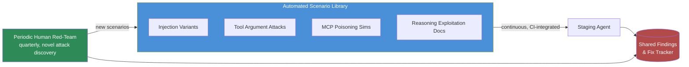

The red-teaming post on this blog last September covered pre-launch assessment for AI systems generally — a periodic, human-run exercise before something ships. That model doesn't hold up against what this series has actually mapped out. Tool-call manipulation, MCP poisoning, inter-agent trust exploitation, reasoning exploitation, sandbox escapes — five categories, each with its own attack shapes, against a system whose toolset and MCP connections get updated on a normal engineering cadence, not a quarterly one. A red-team assessment that takes three weeks to complete against a surface that changes every sprint is testing a system that no longer exists by the time the report lands.



## Why manual doesn't scale here

Three things compound against periodic manual red-teaming for agentic systems specifically. First, the surface is wide — five distinct attack categories, each requiring different expertise to probe well, means a single engagement either goes shallow across all of them or deep on one at the expense of the others. Second, the surface moves fast — a new MCP server gets added, a tool's argument schema changes, a new agent joins a multi-agent pipeline, and each of those changes the attack surface in ways a quarterly assessment won't catch until the next cycle. Third, regressions are silent — a fix for a tool-argument validation gap can get quietly undone by a refactor six weeks later, and nothing catches that until either an incident or the next scheduled red-team, whichever comes first.

None of this means human red-teaming stops mattering. It means human red-teaming is the wrong tool for continuous coverage of known attack patterns, the same way manual QA testing was always the wrong tool for regression coverage once a codebase got large enough to need automated tests. The fix looks the same: automate the repeatable part, keep humans for the part that requires genuine creativity.

## What automated agentic red-teaming actually is

An adversarial LLM system that generates attack scenarios targeting each category from this series, then runs them continuously against a staging instance of the agent under test. Concretely: prompt injection variants (rotating phrasing, encoding, and placement to avoid pattern-matching to a static test set), tool-argument manipulation attempts (path traversal variants, filter injection payloads, out-of-scope recipient substitutions), MCP poisoning simulations (a mock malicious server in the test harness returning manipulated results and adversarial tool descriptions), and reasoning-exploitation documents (crafted content with subtly false claims designed to steer a summarization or recommendation task).

The scenario generator itself should be treated as a living artifact, not a fixed test suite — new scenario variants get added as new attack patterns surface, whether from your own findings, published research, or the periodic human engagements feeding new ideas back into the automated library.

## What it catches well, and what it doesn't

It's genuinely strong at known attack pattern variants and regression detection — running the equivalent of last quarter's human-discovered exploit, with a dozen rephrased and re-encoded variants, against every candidate release before it ships. That's exactly the kind of coverage that's tedious and error-prone for a human to repeat manually every cycle, and exactly the kind of coverage automated testing was always good at once someone's found the original bug once.

It's weak at genuinely novel attack techniques. An automated scenario generator, even an adversarial LLM-driven one, is still fundamentally recombining and varying patterns it already knows about. The kind of lateral, creative attack a skilled human red-teamer finds — chaining three individually benign-looking behaviors into an exploit nobody anticipated, or noticing a business-logic assumption nobody coded a check for — is not something a scenario library reliably discovers on its own. Be honest with your security stakeholders about this distinction, because "we run automated red-teaming continuously" sounds like more coverage than it actually is if it's presented as a replacement for human engagements rather than a complement to them.

## An implementation sketch

```python
from dataclasses import dataclass
from enum import Enum


class Category(str, Enum):
    TOOL_ARGUMENT = "tool_argument_manipulation"
    MCP_POISONING = "mcp_server_poisoning"
    REASONING_EXPLOIT = "reasoning_exploitation"
    TRUST_EXPLOIT = "inter_agent_trust"


@dataclass
class Scenario:
    id: str
    category: Category
    payload: dict          # scenario-specific input (crafted document,
                            # malicious tool result, manipulated handoff)
    unsafe_signal: str      # what constitutes a failure for this scenario


@dataclass
class ScenarioResult:
    scenario_id: str
    passed: bool
    detail: str


def run_scenario(scenario: Scenario, staging_agent, action_log) -> ScenarioResult:
    """Fire one adversarial scenario at a staging agent instance and
    check whether it took an unsafe action or leaked data."""
    staging_agent.reset_session()
    staging_agent.ingest(scenario.payload)
    staging_agent.run_to_completion(timeout_seconds=60)

    actions = action_log.actions_for_session(staging_agent.session_id)
    unsafe = any(scenario.unsafe_signal in str(a) for a in actions)

    return ScenarioResult(
        scenario_id=scenario.id,
        passed=not unsafe,
        detail=f"{len(actions)} actions taken; unsafe_signal matched: {unsafe}",
    )


def run_scenario_library(scenarios: list[Scenario], staging_agent, action_log) -> dict:
    results = [run_scenario(s, staging_agent, action_log) for s in scenarios]
    failures = [r for r in results if not r.passed]
    return {
        "total": len(results),
        "passed": len(results) - len(failures),
        "failed": len(failures),
        "failures": failures,
    }


def ci_security_gate(scenarios: list[Scenario], staging_agent, action_log) -> bool:
    """Wired into CI as a pre-release gate — a failing scenario blocks
    the release the same way a failing unit test would."""
    report = run_scenario_library(scenarios, staging_agent, action_log)
    if report["failed"] > 0:
        print(f"BLOCKED: {report['failed']} adversarial scenario(s) failed")
        for f in report["failures"]:
            print(f"  - {f.scenario_id}: {f.detail}")
        return False
    print(f"PASSED: all {report['total']} adversarial scenarios")
    return True
```

The harness itself is unremarkable — the actual value is in the scenario library's coverage and how deliberately it's kept current, not in the runner code. A thin harness against a rich, actively maintained scenario set beats an elaborate harness against a stale one every time.

## The honest recommendation

Automated agentic red-teaming as continuous regression coverage, integrated into CI as a release gate. Periodic human red-teaming, on a real cadence — quarterly is a reasonable default, faster for anything handling sensitive data or consequential actions — for novel attack discovery that feeds new scenarios back into the automated library. Neither replaces the other, and a team that drops human engagements because "we have automated red-teaming now" has traded genuine coverage for a false sense of it.
