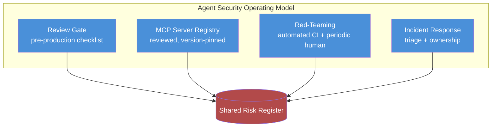

Everything covered this week — argument validation, MCP allow-listing, schema-checked handoffs, sandbox blast-radius design, automated red-teaming — is a mitigation, not a program. A pile of good mitigations with no owner, no review gate, and no process for what happens when one fails isn't security, it's a collection of things somebody once did carefully to one agent, once. The gap between "we know these practices" and "these practices are actually applied to every agent we ship" is exactly where most enterprise agent deployments sit right now, and closing that gap is an operating-model problem, not a technical one.



## The four pillars

**1. An agent security review gate before production.** Every new agent — or every material change to an existing one's tool access — goes through a checklist before it ships, not after an incident makes it mandatory in hindsight. The checklist draws directly from this week: is every tool's argument surface validated independently of the LLM (post 3), is every MCP server on the approved registry (post 2), is the sandbox configured for contained blast radius with no embedded credentials (post 6), does every inter-agent handoff use a schema rather than free-form context (post 4), and for any high-stakes decision path, is there a human review gate that isn't bypassed by the agent sounding confident (post 5). This gate is a peer review step, not a rubber stamp — someone outside the team that built the agent should actually look at the checklist answers, the same way you wouldn't let a team self-certify its own production readiness review for a service handling payments.

**2. An MCP server registry with review and version pinning.** Covered in the MCP poisoning post — no engineer adds an arbitrary MCP server to a production agent's toolset unilaterally. The registry is the enforcement mechanism for that rule: a maintained list of approved servers, what each one is scoped to touch, who reviewed it, and what version is pinned. New servers go through review before they're added to the registry, not after they're already in use somewhere.

**3. Continuous automated red-teaming plus periodic human engagement.** The CI-integrated scenario library from post 7, catching known-pattern variants and regressions on every release, paired with a real quarterly (or faster, for higher-risk agents) human red-team engagement that hunts for the novel attacks the automated library structurally can't find on its own. Findings from both feed the same tracker — a novel technique a human red-teamer discovers becomes a new scenario in the automated library, closing the loop instead of living in a report nobody revisits.

**4. An incident response process specific to agent security.** This is the pillar most teams don't have at all, because "agent security incident" isn't yet a defined category most incident response runbooks recognize. It needs to be. Concretely, that category covers: an unauthorized tool call actually executed (not just attempted and blocked), data exfiltrated through a manipulated agent interaction, a sandbox escape detected by monitoring, or a multi-agent handoff that propagated a manipulated or false claim into a consequential action. Each of those needs a defined owner for triage — and "the on-call engineer for the underlying service" is usually the wrong answer, because diagnosing whether an agent was manipulated requires reasoning about prompt content, tool call sequences, and reasoning chains that a standard service on-call runbook doesn't cover.

## Where this sits organizationally

This work belongs with the AI platform team — the same team referenced in this blog's earlier posts on building internal AI platforms and agent registries — working alongside traditional AppSec, not replacing it. AppSec already owns the org's incident response process, vulnerability management, and security review culture; agent security extends that scope with domain-specific expertise (how tool calls get manipulated, how MCP trust works, how reasoning gets exploited) that most AppSec teams don't have yet and that most AI platform teams don't have enough security process discipline to run alone. Neither team should own this in isolation. The review gate above works best staffed jointly — AppSec brings the review rigor and incident process maturity, the AI platform team brings the technical fluency in how these systems actually fail.

## A sample review checklist

```markdown
# Agent Security Review Checklist

## Tool & Argument Security
- [ ] Every tool has argument validation independent of LLM output
      (schema validation, path canonicalization, parameterized queries)
- [ ] Every tool is scoped to least privilege (not broader access
      than the specific task requires)
- [ ] Side-effecting tools with unusual arguments trigger explicit
      confirmation or additional review

## MCP Server Trust
- [ ] Every MCP server the agent connects to is on the approved registry
- [ ] Registry entries are version-pinned, not tracking latest
- [ ] Tool results from MCP servers are treated as untrusted input
      (same filtering as external user input)

## Inter-Agent Trust Boundaries
- [ ] Multi-agent handoffs use schema-validated structures, not
      free-form context
- [ ] Consequential downstream actions re-verify key claims against
      source data before acting

## Reasoning & Content
- [ ] Ingested content is tagged with source trust tier
- [ ] Consequential recommendations require citations to source content
- [ ] High-stakes decisions route to human review regardless of the
      agent's stated confidence

## Sandbox & Execution
- [ ] Code-execution sandboxes default to no network egress
- [ ] Filesystem is ephemeral, wiped per session, no host access
- [ ] No credentials or secrets present inside the sandboxed
      execution environment
- [ ] Resource limits (CPU / memory / time) are enforced
- [ ] Behavioral monitoring is active on sandbox network and
      resource usage

## Testing & Response
- [ ] Automated adversarial scenario suite covers this agent's
      toolset and is wired into the release pipeline
- [ ] A human red-team engagement has assessed this agent (or the
      pattern it's built on) within the last review cycle
- [ ] Incident response ownership for this agent is documented and
      the on-call path is defined

Reviewed by: ______________   Date: __________
```

Treat this as a starting point, not a finished artifact — the specific line items should evolve with your own findings, the same way the automated scenario library evolves with each red-team engagement.

## The maturity model, honestly

Most enterprise agent deployments in early 2027 are still at what I'd call ad hoc mitigation: individual engineers applying some subset of this week's practices to some subset of their agents, inconsistently, usually in response to something that already went wrong rather than ahead of it. That's the honest state of the industry right now, not a criticism of any one team — this whole space moved fast enough that process maturity lagged behind deployment velocity almost everywhere.

The closing message of this series isn't that you need a fully staffed program with dedicated headcount before you can call your agents secure. It's that a deliberate program — even a lightweight one, even a single owned checklist and a shared risk register with two people accountable for it — meaningfully reduces risk compared to the current default of nothing. Start with the review gate. It's the cheapest pillar to stand up, it forces the other three into existence because you can't fill out the checklist honestly without them, and it's the one control that turns everything else in this series from "things we know about" into "things we actually do."
