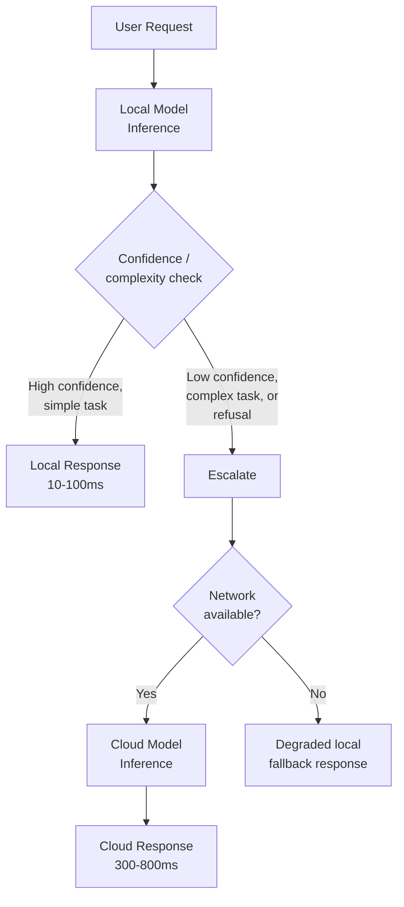

I spent most of last year watching teams argue about this the wrong way. "Should this feature run on-device or in the cloud?" is a false binary, and by the time a mobile AI feature ships to production, almost nobody is answering it with a single answer anymore. The architecture that won isn't on-device-only or cloud-only — it's hybrid, with a local model handling the common case and a cloud model catching what the local model can't do. This week I'm going deep on the mobile and IoT implementations of that pattern: this post is the architecture, the next six are the platform-specific mechanics.



## Why neither extreme works alone

On-device models on a 2026 flagship phone top out around 3-7B parameters at INT4 quantization — that's the practical ceiling given 6-8GB of usable RAM after the OS and running apps take their share. That's genuinely useful for intent classification, short-form generation, simple Q&A against a small context. It is not sufficient for multi-step reasoning, long-document synthesis, or anything where a wrong answer is expensive. I covered the hardware ceiling in detail in December's edge inference post — the constraint hasn't changed, and it's the reason on-device-only is a non-starter for most product surfaces beyond narrow, well-scoped tasks.

Cloud-only has the opposite problem. A round trip to a US-East endpoint from a mobile device on decent LTE is 80-200ms before the model does any work — add model latency and you're regularly at 500ms-1.5s for anything non-trivial. For a keyboard suggestion, a voice command, or an in-app search-as-you-type feature, that's the difference between "feels instant" and "feels broken." And cloud-only means the feature is dead the moment the user loses signal, which on mobile is not an edge case — it's Tuesday, on a subway.

The hybrid pattern accepts both constraints instead of pretending one of them doesn't exist. Local handles what local can handle well, fast, and offline. Cloud handles what needs real capability, with the latency cost that implies.

## Designing the escalation trigger

The engineering problem that actually matters here isn't "run a local model" or "call a cloud API" — both of those are solved problems. It's deciding, per request, which one to use. Three approaches, roughly in order of how often I reach for them:

**Task complexity classification.** Before you even run the local model, classify the request type. A short intent ("set a timer for 10 minutes") goes local. A request that references prior multi-turn context, asks for synthesis across multiple sources, or matches patterns you've seen the local model fail on goes straight to cloud — skip the wasted local inference entirely.

**Local model confidence score.** Run the local model first, and use its own output — a logprob-derived confidence score, or a structured "confidence" field you've prompted it to emit — as the escalation signal. This is the more general mechanism because it doesn't require you to anticipate every hard case in advance; it catches cases you didn't think to classify.

**Explicit refusal or failure.** The local model says "I don't have enough information" or returns malformed output for a structured task. Treat that as an automatic escalation trigger, not a dead end shown to the user.

In practice, use classification as a cheap pre-filter and confidence scoring as the fallback for everything that gets past it. Here's the shape, cloud-side handler included:

```python
# escalation_handler.py — cloud-side service that mobile clients call
# when the local model escalates a request

from dataclasses import dataclass
from enum import Enum
import time

class EscalationReason(Enum):
    LOW_CONFIDENCE = "low_confidence"
    COMPLEX_TASK = "complex_task"
    LOCAL_REFUSAL = "local_refusal"
    EXPLICIT_OVERRIDE = "explicit_override"  # user tapped "ask more"

@dataclass
class EscalationRequest:
    prompt: str
    local_attempt: str | None      # what the local model produced, if anything
    local_confidence: float | None
    reason: EscalationReason
    session_context: list[dict]    # conversation history, already on-device

def handle_escalation(req: EscalationRequest, cloud_client) -> dict:
    start = time.monotonic()

    # Pass the local attempt as context when useful — it can save the
    # cloud model a round of re-deriving intent, and helps you measure
    # how often local was "close but not confident enough" vs "wrong".
    system_note = ""
    if req.local_attempt and req.reason == EscalationReason.LOW_CONFIDENCE:
        system_note = f"A smaller local model produced this candidate response with low confidence: {req.local_attempt!r}. Verify or improve it."

    response = cloud_client.messages.create(
        model="claude-sonnet-4-5",
        max_tokens=512,
        system=system_note or "Respond directly to the user's request.",
        messages=req.session_context + [{"role": "user", "content": req.prompt}],
    )

    latency_ms = (time.monotonic() - start) * 1000
    return {
        "text": response.content[0].text,
        "escalation_reason": req.reason.value,
        "latency_ms": latency_ms,
        "source": "cloud",
    }
```

On the client side, the local-first check is the part worth getting right — this is pseudocode, but the shape carries across Swift and Kotlin:

```
function handleRequest(prompt, sessionContext):
    localResult = localModel.infer(prompt, sessionContext)

    if localResult.confidence >= CONFIDENCE_THRESHOLD
       and not isComplexTask(prompt)
       and localResult.status != REFUSED:
        return { text: localResult.text, source: "local", latencyMs: localResult.latencyMs }

    if not networkAvailable():
        return degradedLocalFallback(localResult)

    return callCloudEscalation(prompt, localResult, sessionContext)
```

The `CONFIDENCE_THRESHOLD` is the knob you'll spend the most time tuning in production. Set it too low and cheap-but-wrong local answers ship to users. Set it too high and you escalate everything, defeating the point of running a local model at all — I've seen teams ship a "hybrid" architecture that escalates 95% of traffic, which is cloud-only with extra battery drain. Tune it against a labeled eval set of real user requests, not synthetic ones, and revisit it every time you update the local model.

## Privacy design — what never escalates

The hybrid pattern is not "escalate everything that's hard." Some categories of input should never leave the device regardless of local model confidence — health data entered into a wellness app, anything the user has explicitly marked private, biometric-adjacent inputs. This has to be a policy check that runs *before* the confidence check, not a confidence threshold you hope stays high enough. Bake it into the request router as a hard gate:

```python
NEVER_ESCALATE_CATEGORIES = {"health_data", "biometric", "user_marked_private"}

def should_escalate(request_category: str, confidence: float, threshold: float) -> bool:
    if request_category in NEVER_ESCALATE_CATEGORIES:
        return False  # no exceptions, regardless of confidence
    return confidence < threshold
```

Document this gate explicitly in your privacy policy and your App Store / Play Store privacy declarations — "some AI features may send data to our servers to improve accuracy" is the honest disclosure, and users should be able to see which categories are local-only if you're building anything health- or finance-adjacent.

## UX has to differ by path

The failure mode I see most often isn't architectural — it's that teams build the escalation logic correctly and then render every response identically, so a 40ms local answer and a 700ms cloud round trip both show up as "AI is thinking..." with no distinction. That's a wasted opportunity. Show local responses as near-instant with no loading state at all — that's the whole point of paying for the local inference. Show a lightweight, honest loading indicator for cloud escalations, and if you're escalating frequently for a given feature, that's a signal your local model or your threshold needs work, not something to paper over with a spinner.

The rest of this week goes into the platform mechanics: Apple's Foundation Models framework and Core ML tomorrow and Wednesday, Android AI Core and TinyML after that, then cross-framework tradeoffs and OTA model updates to close it out. The architecture in this post is the frame all of them sit inside.
