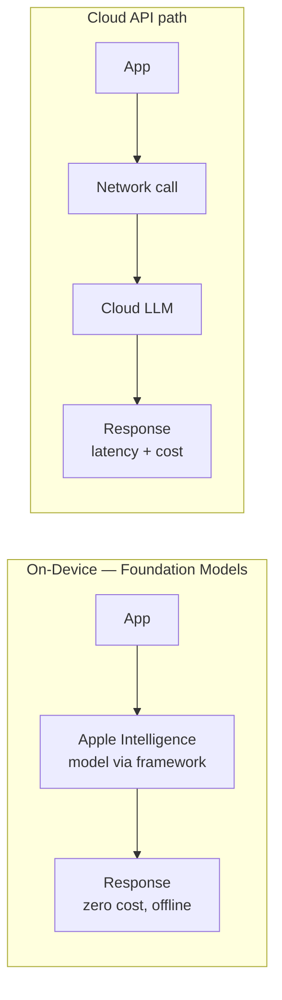

The pitch for Apple's Foundation Models framework is simple: the on-device model already running on the user's iPhone for Apple Intelligence — Siri suggestions, notification summaries, writing tools — is also available to your app, directly, through a Swift API. No API key, no network call, no per-token bill. I've now shipped two features against it, and the honest take is that it's exactly as good as "a well-behaved small local model" sounds, which means it's a great fit for a narrower set of tasks than the marketing suggests.



## What the framework actually gives you

`FoundationModels` exposes a `LanguageModelSession` you create directly in Swift, prompt like any chat API, and optionally constrain to typed output or hand tool definitions to. It's built for summarization, short-form generation, classification, and tool-calling flows where the model's job is to decide *which* function to call and *with what arguments*, not to do the heavy reasoning itself.

```swift
import FoundationModels

// Basic session — no configuration needed, the framework
// manages model loading against the system model
let session = LanguageModelSession()

let response = try await session.respond(
    to: "Summarize this in two sentences: \(articleText)"
)
print(response.content)
```

That's the whole integration for the simple case. No model file to bundle, no memory management, no thermal throttling logic — the OS owns all of that, same as it owns loading the Siri model.

## Tool calling

The more interesting use case is tool calling, where the on-device model decides when to invoke app-defined functions and extracts arguments from natural language. This is genuinely useful for command-style features — "add milk to my shopping list," "set a reminder for tomorrow at 9" — without you writing intent-classification code by hand.

```swift
import FoundationModels

struct AddReminderTool: Tool {
    let name = "add_reminder"
    let description = "Adds a reminder with a title and due date"

    @Generable
    struct Arguments {
        @Guide(description: "The reminder title")
        var title: String
        @Guide(description: "ISO 8601 due date and time")
        var dueDate: String
    }

    func call(arguments: Arguments) async throws -> ToolOutput {
        let reminder = try await RemindersStore.shared.create(
            title: arguments.title,
            due: arguments.dueDate
        )
        return ToolOutput("Created reminder: \(reminder.title)")
    }
}

let session = LanguageModelSession(tools: [AddReminderTool()])
let response = try await session.respond(
    to: "remind me to call the dentist tomorrow at 2pm"
)
// The framework routes to AddReminderTool, extracts title + dueDate,
// executes it, and folds the tool result back into the response.
```

## Guided generation for structured output

For anything that needs to feed back into app logic rather than be displayed as prose, use `@Generable` types directly as the response shape instead of parsing JSON out of free text — this is the framework's biggest practical win over hand-rolling structured output against a cloud API.

```swift
@Generable
struct MeetingSummary {
    @Guide(description: "One-sentence summary of the meeting")
    var summary: String
    @Guide(description: "Action items extracted from the transcript, max 5")
    var actionItems: [String]
    @Guide(description: "Overall sentiment: positive, neutral, or negative")
    var sentiment: String
}

let session = LanguageModelSession()
let result = try await session.respond(
    to: "Extract a structured summary from this transcript: \(transcript)",
    generating: MeetingSummary.self
)

print(result.content.summary)
for item in result.content.actionItems {
    print("- \(item)")
}
```

The model is constrained to emit valid `MeetingSummary` instances during generation — you're not post-hoc parsing and hoping. That's a meaningfully better developer experience than the JSON-mode conventions most cloud APIs still rely on.

## The real constraints

Three things worth knowing before you commit product surface to this:

**Model capability.** This is not a frontier model. It's sized for on-device execution, which puts it in the same rough capability band as the local models discussed across this series — good at classification, extraction, short summarization, tool routing; noticeably weaker on multi-step reasoning, long-document synthesis, or anything requiring broad world knowledge. I tested it against a 12-page contract summarization task and the output missed nuance a cloud model caught reliably — fine for a "quick summary" feature, not fine as the only summarization path in a legal-adjacent product.

**Context window.** The usable context is meaningfully smaller than what you get from server-side frontier models. Long documents need chunking or a cloud escalation path — you can't just hand it a 50-page PDF and expect a coherent summary the way you might with a cloud model's larger window.

**Hardware and OS fragmentation.** Foundation Models requires a device that supports Apple Intelligence, on a supported OS version, with Apple Intelligence actually enabled by the user (it's opt-in, not on by default in every region). That means your feature availability check isn't just an OS version gate — it's a runtime capability check, and you need a real fallback for users who don't qualify:

```swift
import FoundationModels

func checkAvailability() -> SystemLanguageModel.Availability {
    SystemLanguageModel.default.availability
}

switch checkAvailability() {
case .available:
    // proceed with on-device session
    break
case .unavailable(.deviceNotEligible):
    // fall back to cloud API — older/smaller device
case .unavailable(.appleIntelligenceNotEnabled):
    // prompt user to enable in Settings, or fall back to cloud
case .unavailable(.modelNotReady):
    // model still downloading after OS update — fall back to cloud
case .unavailable(let other):
    // fall back to cloud API
}
```

That switch statement is not optional boilerplate — treat it as load-bearing. I'd estimate, across a mixed install base a year or two into Apple Intelligence's rollout, a meaningful double-digit percentage of active devices still won't qualify, either on hardware or by user choice. Ship without the fallback path and you've shipped a feature that silently doesn't work for a real chunk of your users.

## When to use this vs. a cloud API

This is the hybrid pattern from the previous post, applied directly. Route through Foundation Models first for tasks in its wheelhouse — command parsing, short summarization, structured extraction from short text, tool-calling flows. Escalate to your cloud API when the availability check fails, when the task is long-document or multi-step, or when the guided-generation output comes back looking degenerate (empty fields, repeated text — small models do this under load or on out-of-distribution input).

What I wouldn't do is build a feature that only works via Foundation Models with no cloud fallback, unless the feature is genuinely fine to be unavailable on a chunk of devices. And I wouldn't route everything through Foundation Models just because it's "free" — the marginal API cost saved is real, but a feature that quietly underperforms because you defaulted to the free path instead of the right one will cost you more in churn than the API bill ever would have.
