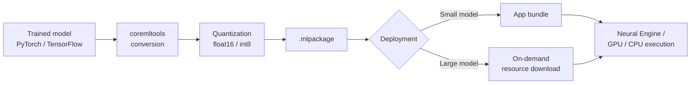

Foundation Models, covered yesterday, is the right call when the system model is capable enough and general-purpose enough for your task. It stops being the right call the moment you need a model you actually trained — a fine-tuned classifier on your own labeled data, a vision model, an audio model, or any architecture the system model wasn't built for. That's where Core ML comes in: you bring the model, Apple's toolchain gets it running on the Neural Engine, and you own the full conversion and optimization pipeline yourself.



## The conversion pipeline

`coremltools` is the bridge from PyTorch or TensorFlow to Apple's `.mlpackage` format. The typical path: trace or script the model, convert with `ct.convert`, apply quantization, save.

```python
import torch
import coremltools as ct
from transformers import AutoModelForSequenceClassification, AutoTokenizer

model_name = "distilbert-base-uncased-finetuned-sst-2-english"
model = AutoModelForSequenceClassification.from_pretrained(model_name)
tokenizer = AutoTokenizer.from_pretrained(model_name)
model.eval()

# Trace with representative input shapes
example_input = tokenizer("Example input text", return_tensors="pt")
traced_model = torch.jit.trace(
    model,
    (example_input["input_ids"], example_input["attention_mask"]),
    strict=False,
)

mlmodel = ct.convert(
    traced_model,
    inputs=[
        ct.TensorType(name="input_ids", shape=(1, ct.RangeDim(1, 128)), dtype=int),
        ct.TensorType(name="attention_mask", shape=(1, ct.RangeDim(1, 128)), dtype=int),
    ],
    outputs=[ct.TensorType(name="logits")],
    minimum_deployment_target=ct.target.iOS17,
    compute_units=ct.ComputeUnit.ALL,  # let Core ML pick NE/GPU/CPU per op
)

mlmodel.save("SentimentClassifier.mlpackage")
```

`compute_units=ct.ComputeUnit.ALL` is the setting to default to — it lets Core ML place each operation on whichever unit (Neural Engine, GPU, CPU) supports it fastest, falling back automatically for ops the Neural Engine doesn't implement. Don't force `.cpuAndNeuralEngine` or similar unless you've profiled and found a specific reason to — the automatic placement is usually right.

## Neural Engine vs. GPU vs. CPU — you don't fully control this

This is the part people new to Core ML get wrong: you don't pick the execution unit per operation, Core ML does, based on which units implement the op and what it estimates will be fastest given the current model and input shapes. A model with a lot of unusual custom ops — non-standard attention variants, certain control-flow patterns — can end up mostly on CPU despite `compute_units=ALL`, because the Neural Engine's operator support is narrower than the GPU's, which is narrower than the CPU's fallback-does-everything path. This is worth checking, not assuming:

```python
# Inspect what actually ran where, using Core ML's compute plan API (Xcode 16+)
# In practice this is easiest via Xcode's Core ML performance report (Product >
# Performance Report, or xctrace), which shows a per-layer breakdown of which
# compute unit executed each op. Do this before you assume ANE placement.
```

If a chunk of your model lands on CPU, the fix is usually architectural — swap an uncommon op for a Neural-Engine-friendly equivalent, or split the model so the ANE-friendly backbone runs separately from a small CPU-bound head.

## Quantization tradeoffs

Full float32 weights waste app bundle size and Neural Engine bandwidth for no accuracy benefit in most cases — start at float16 and go further if size or latency demands it.

```python
import coremltools as ct
import coremltools.optimize.coreml as cto

mlmodel = ct.models.MLModel("SentimentClassifier.mlpackage")

# float16: near-zero accuracy loss, roughly halves weight size vs float32.
# Good default for most models.
op_config_fp16 = cto.OpLinearQuantizerConfig(mode="linear_symmetric", dtype="float16")

# int8: bigger size/latency win, real accuracy risk — validate on a held-out
# set before shipping. Weight-only quantization (as below) is more conservative
# than full activation quantization.
op_config_int8 = cto.OpLinearQuantizerConfig(
    mode="linear_symmetric",
    dtype="int8",
    weight_threshold=512,  # only quantize weight tensors above this size
)

config = cto.OptimizationConfig(global_config=op_config_int8)
compressed_model = cto.linear_quantize_weights(mlmodel, config=config)
compressed_model.save("SentimentClassifier-int8.mlpackage")
```

The honest tradeoff table, from models I've actually shipped:

| Precision | Size vs. float32 | Typical accuracy delta | When to use |
|---|---|---|---|
| float32 | 1x | baseline | debugging only, never ship |
| float16 | ~0.5x | negligible (<0.1% on most classification tasks) | default for shipping |
| int8 (weight-only) | ~0.25x | small (0.5-2% depending on task) | when bundle size or latency matters and you've validated the drop |
| int8 (full activation) | ~0.25x, faster | larger, task-dependent | only after benchmarking accuracy against your eval set — this is not safe to assume |

Always validate quantized accuracy against a held-out set before shipping — don't trust the "negligible" claims in tooling docs for your specific task and data distribution. I've seen int8 quantization be free on a text classifier and cost three points of F1 on a fine-grained image classifier from the same conversion pipeline.

## Bundle size and on-demand resources

App Store guidelines and practical download-size expectations both push against bundling large models directly in your app binary. Apple's On-Demand Resources (ODR) system lets you tag a `.mlpackage` as a downloadable resource fetched after install rather than bundled in the initial download:

```swift
// Request the model as an on-demand resource, download if needed
let request = NSBundleResourceRequest(tags: ["sentiment-model"])

request.beginAccessingResources { error in
    if let error = error {
        // fall back to a smaller bundled model, or cloud API
        return
    }
    guard let modelURL = Bundle.main.url(
        forResource: "SentimentClassifier",
        withExtension: "mlmodelc"
    ) else { return }

    do {
        let model = try MLModel(contentsOf: modelURL)
        // proceed with inference
    } catch {
        // handle load failure — corrupt download, incompatible OS, etc.
    }
}
```

Rule of thumb: anything under roughly 25-50MB, bundle it directly — the download-size friction is minor and you avoid a runtime dependency on ODR availability. Anything larger, or any model you expect to update independently of app releases, use ODR or your own download-and-cache path (the OTA model update pattern I'll cover at the end of this series applies directly here).

## Benchmarking on real devices

Simulator numbers are close to meaningless for Neural Engine workloads — the simulator doesn't have one, so everything falls back to CPU. Benchmark on physical devices, ideally spanning at least two hardware generations, since Neural Engine throughput varies significantly across chip generations:

```swift
import CoreML

func benchmark(model: MLModel, input: MLFeatureProvider, iterations: Int = 50) -> (p50: Double, p95: Double) {
    var latencies: [Double] = []
    for _ in 0..<iterations {
        let start = CFAbsoluteTimeGetCurrent()
        _ = try? model.prediction(from: input)
        latencies.append((CFAbsoluteTimeGetCurrent() - start) * 1000)
    }
    latencies.sort()
    let p50 = latencies[latencies.count / 2]
    let p95 = latencies[Int(Double(latencies.count) * 0.95)]
    return (p50, p95)
}
```

Run this warmed up (discard the first few iterations — first-call model load and ANE compilation skew the numbers badly) and on-battery as well as on-charger, since thermal throttling under sustained load is a real effect on Neural Engine performance during extended usage sessions.

## The practical limitation

Core ML's operator coverage lags the pace of new model architectures. If you're converting something recent and unusual — a novel attention mechanism, a new normalization scheme — expect `ct.convert` to fail on an unsupported op, and expect to either write a custom Core ML op implementation (documented but genuinely fiddly) or simplify the architecture to stick to well-supported operations before you invest further in the conversion. I've had conversions that worked cleanly on a first try and conversions that ate two full days chasing down a single unsupported op in a custom decoder block. Budget for the second case, not the first, when you're converting something off the beaten path.
