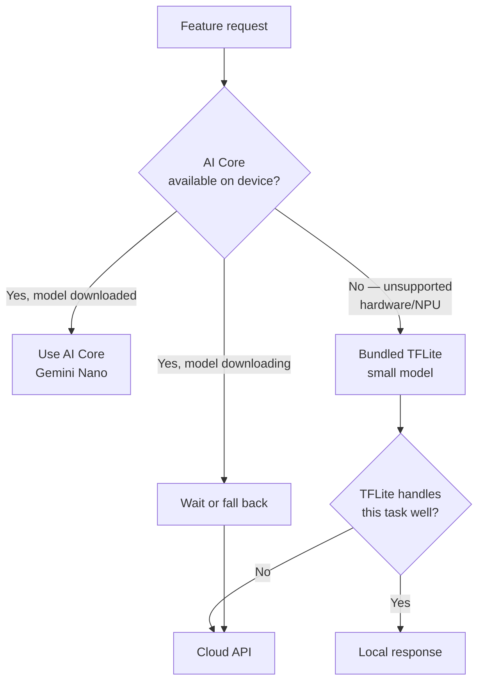

Android AI Core is Google's answer to the same problem Apple's Foundation Models framework solves — give apps access to a system-managed on-device model (Gemini Nano) without every app bundling its own multi-gigabyte model file. The API surface is comparable in spirit. What's genuinely different, and what ends up driving most of the engineering effort, is that Android doesn't have Apple's tight hardware/software integration. "Does this device support on-device AI" is not a yes/no answered by an OS version check — it's a real fragmentation problem, and you design around it from day one or you ship a feature that silently fails on a large chunk of your install base.



## The API surface

AI Core is accessed primarily through the ML Kit GenAI APIs, which wrap Gemini Nano for common tasks — summarization, proofreading, image description, and a rewriting/rephrasing API — plus lower-level access for custom prompting and structured output when the packaged task APIs don't fit.

```kotlin
import com.google.mlkit.genai.summarization.Summarization
import com.google.mlkit.genai.summarization.SummarizationRequest
import com.google.mlkit.genai.summarization.SummarizerOptions

suspend fun summarizeText(context: Context, text: String): String? {
    val options = SummarizerOptions.builder(context)
        .setInputType(SummarizerOptions.InputType.ARTICLE)
        .setOutputType(SummarizerOptions.OutputType.THREE_BULLETS)
        .setLanguage(SummarizerOptions.Language.ENGLISH)
        .build()

    val summarizer = Summarization.getClient(options)

    // Feature availability is a real runtime state, not a static capability —
    // check it before every use, not just once at app launch
    val availability = summarizer.checkFeatureStatus().await()
    if (availability != FeatureStatus.AVAILABLE) {
        summarizer.close()
        return null  // caller falls back to TFLite or cloud
    }

    val request = SummarizationRequest.builder(text).build()
    val result = summarizer.runInference(request).await()
    summarizer.close()
    return result.summary
}
```

For structured output or custom prompting beyond the packaged task APIs, the lower-level GenAI API takes a prompt and a schema, similar in spirit to Apple's guided generation, though the tooling here is younger and less complete as of this writing.

## The fragmentation reality

This is the part that makes Android on-device AI a different engineering problem than iOS. Apple ships a small number of chip variants per year, all with a Neural Engine, all supporting Apple Intelligence identically within a device-age cutoff. Android ships from dozens of OEMs across a wide spread of SoCs — Tensor, Snapdragon 8-series, Snapdragon mid-range, Dimensity, and older or budget chips with weak or absent NPUs. AI Core availability tracks that: Gemini Nano requires a minimum NPU capability and enough free storage to download the model, and a meaningful share of active Android devices — think mid-range and older-flagship territory, not just budget phones — simply don't qualify, full stop, not "qualify with degraded performance."

That means the availability check on Android isn't a one-time branch, it's a state machine: unsupported hardware, supported-but-model-not-downloaded, downloading, available, and download-failed are all states you'll see in production telemetry, and each needs a defined behavior.

```kotlin
enum class AiCoreState {
    UNSUPPORTED_HARDWARE,
    MODEL_NOT_DOWNLOADED,
    DOWNLOADING,
    AVAILABLE,
    DOWNLOAD_FAILED,
}

suspend fun resolveAiCoreState(summarizer: Summarizer): AiCoreState {
    return when (summarizer.checkFeatureStatus().await()) {
        FeatureStatus.AVAILABLE -> AiCoreState.AVAILABLE
        FeatureStatus.DOWNLOADABLE -> {
            // trigger download, don't block the current request on it
            summarizer.downloadFeature(object : DownloadCallback {
                override fun onDownloadFailed(e: GenAiException) { /* log + fallback path */ }
            })
            AiCoreState.MODEL_NOT_DOWNLOADED
        }
        FeatureStatus.DOWNLOADING -> AiCoreState.DOWNLOADING
        FeatureStatus.UNAVAILABLE -> AiCoreState.UNSUPPORTED_HARDWARE
        else -> AiCoreState.UNSUPPORTED_HARDWARE
    }
}
```

## The three-tier fallback

Because "unsupported hardware" is a large and permanent segment of the Android install base — not a transient state like "still downloading" — Android AI features almost always need a real three-tier fallback: AI Core when available, a bundled TFLite model as the guaranteed-available middle tier, and cloud as the capability backstop. iOS features often get away with two tiers (Foundation Models or cloud) because the "unsupported" segment is smaller and shrinking faster as older devices age out. On Android, the middle tier is not optional polish — it's usually necessary just to give every user a working feature at all.

```kotlin
suspend fun getSummary(context: Context, text: String, tfliteModel: TfliteSummarizer, cloudClient: CloudApiClient): SummaryResult {
    val aiCoreResult = tryAiCoreSummary(context, text)
    if (aiCoreResult != null) {
        return SummaryResult(aiCoreResult, source = "ai_core")
    }

    // Middle tier: bundled TFLite model, works on every device regardless
    // of NPU capability, at lower quality than Gemini Nano
    val tfliteResult = runCatching { tfliteModel.summarize(text) }.getOrNull()
    if (tfliteResult != null && tfliteResult.confidence > MIN_CONFIDENCE) {
        return SummaryResult(tfliteResult.text, source = "tflite_local")
    }

    // Backstop: cloud, for devices without AI Core and where the TFLite
    // model's output confidence is too low to trust
    val cloudResult = cloudClient.summarize(text)
    return SummaryResult(cloudResult, source = "cloud")
}
```

## AI Core vs. bundling your own TFLite model

These aren't competing choices for the same job — they trade off differently and most apps end up using both, per the fallback chain above.

**AI Core** gets you Gemini Nano's capability — meaningfully better than what you'd realistically train and ship yourself for general summarization or rewriting tasks — with zero model distribution cost, since the OS manages the download and update. The cost is availability: it's out of your control, gated by hardware and Google's rollout, and you cannot guarantee it works for a given user.

**Your own TFLite model** gives you guaranteed availability (it's bundled, it runs on any device your `minSdkVersion` supports, no download gate) and full control over behavior, size, and update cadence. The cost is that you own training, evaluation, and the size/quality tradeoff entirely, and a general-purpose task like open-ended summarization is genuinely hard to match Gemini Nano's quality with a model small enough to bundle.

The practical split I use: AI Core for general-purpose language tasks where quality matters and a cloud/TFLite fallback is acceptable for the unsupported segment. Your own TFLite model for narrow, well-defined tasks — a specific classifier, a domain-specific extractor — where you can realistically match or beat Gemini Nano's quality on that narrow task with a model a fraction of the size, and where you need every user, not just the AI-Core-eligible ones, to have the feature.

## The honest fragmentation number

I don't have a clean industry-wide percentage to hand you, and anyone who claims a precise one is guessing — it moves with every OEM release cycle and Google's own rollout pace. What I can say from checking `checkFeatureStatus()` across a production install base: budget for AI Core covering a majority of *newer flagship and upper-mid-range* devices and materially less of your total install base once you include older and budget-tier hardware, and validate against your own analytics rather than any number in a blog post — this one included. Whatever the number is on the day you ship, it moves, so build the fallback chain as a permanent part of the architecture, not a launch-day workaround you plan to remove later.
