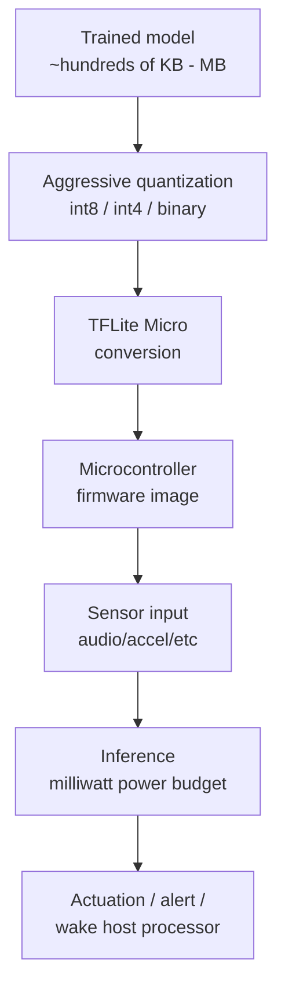

Everything so far this week — Foundation Models, Core ML, AI Core — assumes a phone-class device: gigabytes of RAM, an NPU doing tens of trillions of operations per second, a battery you charge nightly. TinyML throws all of that out. We're talking ARM Cortex-M class microcontrollers with 256KB-1MB of RAM total, no NPU, and a power budget measured in milliwatts because the device runs on a coin-cell battery for a year, not overnight charging. If you come into TinyML expecting "edge AI but smaller," you'll be disappointed by the ceiling and surprised by how much value there is under it once you accept what it's actually for.



## What this actually is

TinyML is not "IoT edge AI" as a broad category — it's a specific, narrow discipline: keyword spotting ("Hey device"), simple anomaly detection on sensor streams (vibration, current draw, temperature), basic sensor classification (is this sound a dog bark or glass breaking, is this accelerometer pattern a fall or normal movement). These are all tasks with small input dimensionality, a handful of output classes, and — critically — models that were always going to be small even before you started optimizing, because the underlying task doesn't need much capacity.

If someone asks you to run anything resembling a language model on a Cortex-M microcontroller, the answer is no — not "no with heroic quantization," just no. The RAM and compute aren't there and no amount of TinyML technique changes that. The value of this discipline is in matching the right narrow task to the right narrow hardware, not in stretching a big-model use case down to fit.

## The pipeline

**Train small.** Don't start with a large model and hope to quantize your way down — start with an architecture sized for the target from the beginning. Depthwise-separable convolutions for audio/vibration classification, small dense networks for simple sensor fusion. A model that starts at 500KB in float32 has a much better shot at a usable TFLite Micro conversion than one that starts at 50MB.

**Quantize aggressively.** int8 is the standard target for TFLite Micro — it roughly quarters model size versus float32 and, more importantly, lets you skip floating-point math entirely on hardware that often lacks an FPU. Some deployments push further to int4 or binary/ternary weights for the most constrained targets, at a real accuracy cost that has to be validated against your specific task, not assumed acceptable.

```python
import tensorflow as tf

def representative_dataset():
    # Real samples from your sensor pipeline — quantization calibration
    # quality depends entirely on how representative this set is
    for sample in calibration_samples:
        yield [sample.astype("float32")]

converter = tf.lite.TFLiteConverter.from_saved_model("keyword_spotter_saved_model")
converter.optimizations = [tf.lite.Optimize.DEFAULT]
converter.representative_dataset = representative_dataset
# Force full int8 — including input/output tensors, not just weights.
# This is what actually gets you off floating-point math on the MCU.
converter.target_spec.supported_ops = [tf.lite.OpsSet.TFLITE_BUILTINS_INT8]
converter.inference_input_type = tf.int8
converter.inference_output_type = tf.int8

tflite_model = converter.convert()
with open("keyword_spotter_int8.tflite", "wb") as f:
    f.write(tflite_model)

print(f"Model size: {len(tflite_model) / 1024:.1f} KB")
```

A well-scoped keyword-spotting model in this pipeline typically lands in the 15-50KB range post-quantization — well within reach of a microcontroller with a few hundred KB of flash and RAM to spare for everything else the firmware needs to do.

## Deploying to the microcontroller

TFLite Micro is the standard runtime — a C++ interpreter designed with no dynamic memory allocation, no OS dependency, and a footprint small enough to coexist with your model and the rest of your firmware in the same address space. The deployment path: convert the `.tflite` file to a C byte array, link it into your firmware, and run inference against a fixed memory arena.

```bash
# Convert the .tflite flatbuffer into a C source array for firmware linking
xxd -i keyword_spotter_int8.tflite > keyword_spotter_model.cc
```

```cpp
// firmware inference loop — ARM Cortex-M, TFLite Micro
#include "tensorflow/lite/micro/micro_interpreter.h"
#include "tensorflow/lite/micro/micro_mutable_op_resolver.h"
#include "keyword_spotter_model.cc"  // generated array: keyword_spotter_int8_tflite[]

constexpr int kTensorArenaSize = 20 * 1024;  // tune to your model — start
                                              // generous, shrink once it works
uint8_t tensor_arena[kTensorArenaSize];

const tflite::Model* model = tflite::GetModel(keyword_spotter_int8_tflite);

// Only register the ops your model actually uses — every registered op
// costs flash space, and flash is scarce here
static tflite::MicroMutableOpResolver<4> resolver;
resolver.AddDepthwiseConv2D();
resolver.AddFullyConnected();
resolver.AddSoftmax();
resolver.AddReshape();

tflite::MicroInterpreter interpreter(model, resolver, tensor_arena, kTensorArenaSize);
interpreter.AllocateTensors();

void run_inference(int8_t* audio_features) {
    TfLiteTensor* input = interpreter.input(0);
    memcpy(input->data.int8, audio_features, input->bytes);

    if (interpreter.Invoke() != kTfLiteOk) {
        // handle failure — don't let a bad inference hang the device
        return;
    }

    TfLiteTensor* output = interpreter.output(0);
    int8_t top_class = 0;
    int8_t top_score = output->data.int8[0];
    for (int i = 1; i < output->dims->data[1]; i++) {
        if (output->data.int8[i] > top_score) {
            top_score = output->data.int8[i];
            top_class = i;
        }
    }
    handle_detected_class(top_class, top_score);
}
```

Note what's absent compared to mobile inference code: no async, no thread pool, no dynamic allocation at inference time. `tensor_arena` is a fixed-size buffer allocated once at compile time — TFLite Micro plans memory usage statically and refuses to allocate beyond it at runtime. Getting `kTensorArenaSize` right — big enough to fit the model's actual working memory, small enough not to waste scarce RAM — is genuinely one of the more fiddly parts of a first TinyML deployment; TFLite Micro will tell you at `AllocateTensors()` time if you undersized it.

## The power budget drives everything

A battery-powered sensor node that needs to run for a year on a coin cell has a power budget in the single-digit milliwatt range, averaged over time. Inference itself might draw tens of milliwatts for tens of milliseconds — fine in isolation — but if you're running that inference continuously, average power blows the budget immediately. The actual pattern in production TinyML deployments is duty-cycled: the MCU spends the vast majority of its time in a deep-sleep state drawing microamps, wakes periodically or on an interrupt (a low-power always-on wake circuit, or a simple energy-threshold trigger on the raw sensor signal), runs one inference pass, and goes back to sleep.

```
Typical duty cycle for a battery-powered keyword spotter:
  - Deep sleep: ~10-50 µA, >99% of time
  - Wake on low-power always-on audio trigger (separate, simpler circuit)
  - Run full model inference: ~10-30 mW for ~5-20 ms
  - Return to deep sleep

Average power stays in the tens-of-µA range despite an inference
that individually draws three orders of magnitude more power,
because the inference is such a small fraction of total time.
```

This is why TinyML model design optimizes as much for inference *frequency and duration* as for raw accuracy — a model that's 2% more accurate but takes 3x longer to run per inference can blow a battery-life target even though it "performs better" on a held-out test set. Latency and energy per inference are first-class metrics here, not afterthoughts, in a way they usually aren't for mobile edge AI where the phone's battery is a shared resource across a hundred other things anyway.

## The honest scope

TinyML is not a general answer to "how do I put AI in my IoT device." It's a well-understood, narrow niche: simple classification and detection tasks, small fixed input shapes, a handful of output classes, extreme resource constraints, and — this is the part worth internalizing — tasks where a false positive or missed detection is an acceptable, bounded cost, because you're not going to get cloud-model-grade accuracy out of a 30KB int8 model no matter how carefully you train it. Match the task to the discipline. If your IoT device has a network connection anyway and the task genuinely needs more capability than a microcontroller can give, that's not a TinyML problem — that's the hybrid architecture from Monday's post, with the microcontroller doing a cheap local pre-filter and escalating to a gateway or cloud for anything the local model isn't confident about.
