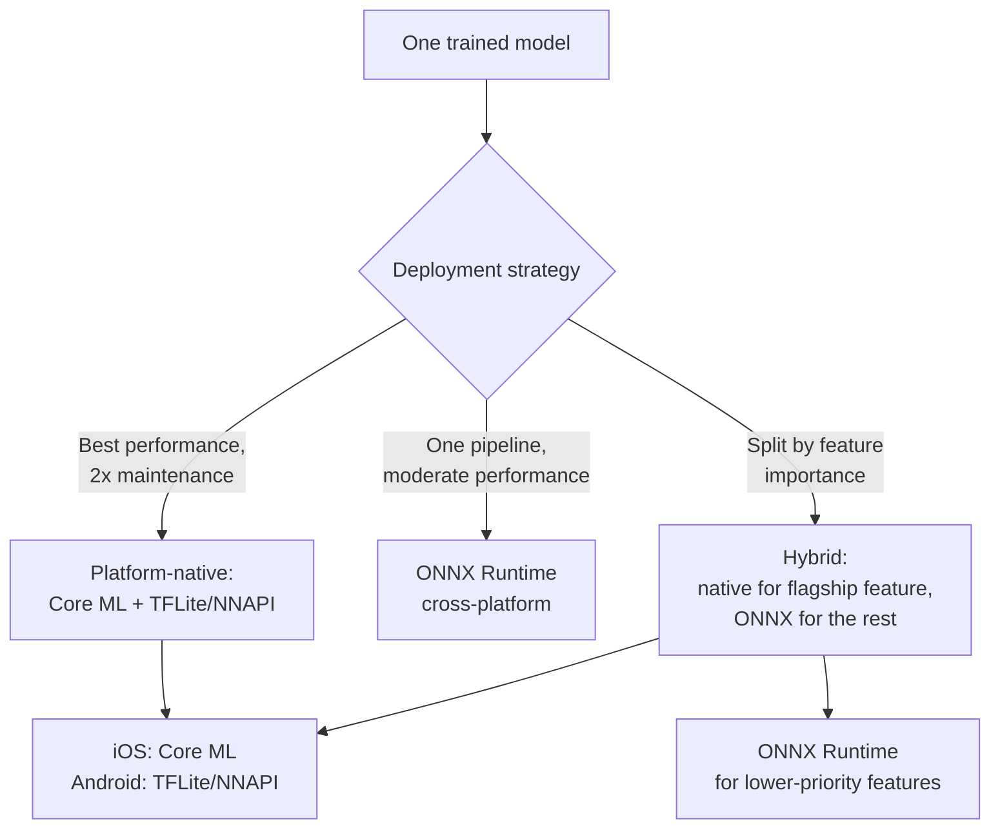

Every team I've worked with that ships the same AI feature on both iOS and Android eventually hits this decision, usually around the second or third model update: do you maintain two platform-native conversion pipelines, or standardize on one cross-platform runtime and accept the performance you get? I've done both, and the honest answer is that the "right" choice depends on whether the feature you're shipping is the thing your product is differentiated on, or a supporting feature that just needs to work acceptably everywhere.



## The three approaches

**Platform-native conversions** — Core ML on iOS, TFLite (with NNAPI or GPU delegate) on Android — gets you the best latency and power efficiency each platform's toolchain can deliver, because each conversion is targeting hardware-specific compilers and hardware-specific operator implementations. The cost is that you now maintain two conversion pipelines, two sets of quantization decisions, two benchmarking suites, and two sets of platform-specific bugs. Every model update means re-running both pipelines and re-validating both outputs before shipping.

**ONNX Runtime as a single cross-platform runtime** collapses that to one conversion path — export to ONNX once, run the same runtime on iOS, Android, and embedded Linux via its execution provider abstraction (Core ML EP on iOS, NNAPI or XNNPACK EP on Android). One pipeline, one model artifact, one set of tests. The tradeoff is real performance headroom left on the table — in my experience, typically 10-20% slower inference than a platform-native conversion of the same model, because ONNX Runtime's execution providers are a more general abstraction than a toolchain built specifically for one chip family's compiler.

**A hybrid split by feature** is what most mature products I've seen actually land on: platform-native conversion for the one AI feature that's core to the product and needs every millisecond of latency headroom, ONNX Runtime for everything else where "works well, ships fast, one pipeline" beats "the absolute best possible number."

## Benchmarking it on your own model — not someone else's numbers

The 10-20% figure above is a starting expectation, not something to cite in a design doc without verifying it against your actual model. Operator mix, input shape, and quantization scheme all move that number meaningfully — I've seen a small classification model come out essentially tied between Core ML and ONNX Runtime, and I've seen a larger model with heavier convolution layers show a 30%+ gap. Measure your model, on real target hardware, before committing to an architecture.

```python
# benchmark_export.py — export the same model to all three formats
# and get a same-methodology comparison

import time
import numpy as np
import torch
import coremltools as ct
import onnx
import onnxruntime as ort
import tensorflow as tf

MODEL_NAME = "mobile_classifier"
example_input = torch.randn(1, 3, 224, 224)

# --- PyTorch source model ---
model = torch.jit.load(f"{MODEL_NAME}_traced.pt")
model.eval()

# --- Export to ONNX ---
torch.onnx.export(
    model, example_input, f"{MODEL_NAME}.onnx",
    input_names=["input"], output_names=["output"],
    opset_version=17,
)

# --- Export to Core ML ---
mlmodel = ct.convert(
    model,
    inputs=[ct.TensorType(name="input", shape=example_input.shape)],
    minimum_deployment_target=ct.target.iOS17,
    compute_units=ct.ComputeUnit.ALL,
)
mlmodel.save(f"{MODEL_NAME}.mlpackage")

# --- Export to TFLite (via a TF SavedModel intermediate) ---
converter = tf.lite.TFLiteConverter.from_saved_model(f"{MODEL_NAME}_saved_model")
converter.optimizations = [tf.lite.Optimize.DEFAULT]
tflite_model = converter.convert()
with open(f"{MODEL_NAME}.tflite", "wb") as f:
    f.write(tflite_model)


def benchmark_onnx(path: str, input_np: np.ndarray, runs: int = 100) -> dict:
    session = ort.InferenceSession(path, providers=["CPUExecutionProvider"])
    input_name = session.get_inputs()[0].name
    # warm up
    for _ in range(5):
        session.run(None, {input_name: input_np})
    latencies = []
    for _ in range(runs):
        start = time.perf_counter()
        session.run(None, {input_name: input_np})
        latencies.append((time.perf_counter() - start) * 1000)
    return {"p50_ms": np.percentile(latencies, 50), "p95_ms": np.percentile(latencies, 95)}


input_np = example_input.numpy()
onnx_results = benchmark_onnx(f"{MODEL_NAME}.onnx", input_np)
print(f"ONNX Runtime (CPU EP) — p50: {onnx_results['p50_ms']:.2f}ms, p95: {onnx_results['p95_ms']:.2f}ms")
```

Core ML and TFLite benchmarking has to happen on-device — there's no meaningful desktop proxy for Neural Engine or NNAPI-delegate performance, so the equivalent measurement for those two runs in an Xcode Instruments session and an Android `adb`-driven benchmark harness respectively, not in this Python script. Run all three, on real target hardware, before writing the comparison number into any planning document.

## A representative comparison

These are illustrative numbers from a small mobile vision classifier (a MobileNetV3-class architecture, ~5M parameters, int8 quantized where applicable) — treat the pattern as informative and the exact numbers as something to reproduce on your own model, not to quote:

| Format | Platform | Model size | p50 latency | Notes |
|---|---|---|---|---|
| Core ML (ANE) | iOS, native | ~5.2MB | ~4ms | Best case — full Neural Engine placement |
| TFLite (NNAPI) | Android, native | ~5.4MB | ~6ms | Varies significantly by device NPU |
| ONNX Runtime (Core ML EP) | iOS, cross-platform | ~5.5MB | ~5ms | Close to native — EP delegates well for simple architectures |
| ONNX Runtime (NNAPI EP) | Android, cross-platform | ~5.6MB | ~8ms | Gap widens more on Android than iOS in my testing |
| ONNX Runtime (CPU only) | Either, no NPU delegate | ~5.5MB | ~22ms | Fallback path — this is the number you hit on unsupported/older hardware |

Two things worth noting in a table like this: the cross-platform gap is often smaller on iOS than Android, because ONNX Runtime's Core ML execution provider delegates cleanly to the same underlying Core ML stack a native conversion would use — you're paying more for the abstraction layer than for a fundamentally different execution path. And the CPU-only fallback row is the one that actually matters most for your worst-case UX — every architecture eventually has some device where the NPU delegate isn't available, and that's the number your loading-state design needs to be built around, not the best-case ANE number.

## The maintenance cost benchmarks don't show

The performance table gets all the attention in planning discussions, but the cost that actually eats engineering time month over month is the CI and testing burden of the platform-native path. Every model update means: re-run the Core ML conversion, re-run the TFLite conversion, re-validate accuracy on both against your eval set (quantization behaves differently across toolchains, so "passed on Core ML" doesn't guarantee "passes on TFLite"), re-run the device benchmark suite on a representative hardware matrix for both platforms, and coordinate two release trains if the model ships inside app binaries rather than via OTA update. That's easily 2-3x the CI time of a single ONNX export path, and it compounds every time you retrain.

I've seen teams underestimate this because the first model ship feels manageable — it's the fifth and tenth ship, months into a product's life, where the platform-native maintenance tax becomes the thing slowing down iteration speed on the model itself. If your model updates frequently (active fine-tuning, frequent retraining against new data), that tax is a real argument for ONNX Runtime or the hybrid split even when the pure latency numbers favor going fully native — the fastest model you can't afford to iterate on loses to a slightly slower model you can update weekly.

## Deciding

Go platform-native when the feature is genuinely latency-critical and central to the product experience — the thing users would notice a 10-20% latency regression on — and you have the team capacity to maintain two pipelines indefinitely. Go ONNX Runtime as the default for everything else, especially anything you expect to iterate on frequently. Reserve the hybrid split for products with exactly one flagship AI feature worth the platform-native investment and several supporting ones that don't need it — that's the shape I see most often in practice, and it's usually the right one.
