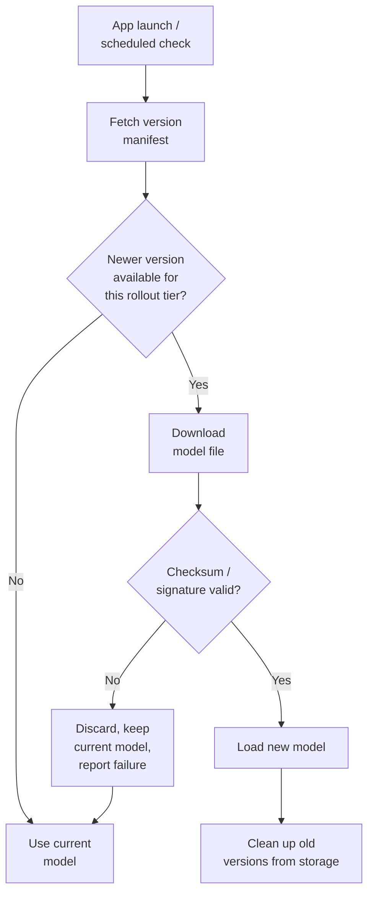

Closing this series where most teams eventually end up regretting a shortcut: bundling the model file directly in your app binary. It's the simplest thing that works, right up until you retrain the model and discover the update path is "ship a new app version, wait for App Store/Play Store review, and hope users update." That's days to weeks of latency on a model fix, and a meaningful chunk of your install base never updates the app at all, which means they're stuck on stale weights indefinitely. The fix is the same one server-side ML teams have used for years: decouple the model from the app release, and deliver it over the air.



## The manifest

Everything starts with a small, cheap-to-fetch manifest that describes what model version each rollout tier should be running. Keep this separate from the model file itself — you want the availability check to be a fast JSON fetch, not a multi-megabyte download every time you check for updates.

```json
{
  "model_id": "on_device_intent_classifier",
  "latest_version": "2027.02.07-3",
  "rollout": {
    "2027.02.07-3": 25,
    "2027.02.01-2": 75
  },
  "artifact": {
    "url": "https://models.example.com/intent_classifier/2027.02.07-3.mlpackage.zip",
    "sha256": "e3b0c44298fc1c149afbf4c8996fb92427ae41e4649b934ca495991b7852b85",
    "size_bytes": 18874368,
    "min_app_version": "4.2.0"
  }
}
```

The `rollout` percentages are the staged-rollout mechanism — this is the same canary discipline that should already govern any AI feature rollout on this blog, applied to model weights specifically. A bad model update degrades quality for every single user who receives it before you notice and react, and unlike a backend bug you can roll back in minutes, a model already downloaded to a device stays there until the app checks for an update again. Start small.

```python
# server-side: deterministic bucket assignment so a given device stays
# in the same rollout tier across repeated checks, rather than flapping
import hashlib

def assigned_version(device_id: str, manifest: dict) -> str:
    bucket = int(hashlib.sha256(device_id.encode()).hexdigest(), 16) % 100
    cumulative = 0
    # sort by rollout percentage descending so the newest version's
    # bucket range is evaluated first
    for version, pct in sorted(manifest["rollout"].items(), key=lambda kv: -kv[1]):
        cumulative += pct
        if bucket < cumulative:
            return version
    return manifest["latest_version"]
```

Hashing the device ID rather than rolling a fresh random number on every check is what keeps a device from bouncing between versions across repeated update checks — determinism here matters more than it looks like it does, because a flapping device is much harder to debug when something goes wrong.

## Download, verify, load, fall back

The client-side logic is a straightforward pipeline, but every step needs a defined failure behavior that falls back to the last known-good model rather than leaving the app in a broken state.

```swift
import CryptoKit

struct ModelManifest: Decodable {
    let modelId: String
    let latestVersion: String
    let artifact: ArtifactInfo
}
struct ArtifactInfo: Decodable {
    let url: String
    let sha256: String
    let sizeBytes: Int
    let minAppVersion: String
}

enum ModelUpdateResult {
    case upToDate
    case updated(version: String)
    case failed(reason: String)
}

func checkAndUpdateModel(currentVersion: String?) async -> ModelUpdateResult {
    guard let manifest = try? await fetchManifest() else {
        return .failed(reason: "manifest_fetch_failed")  // keep current model, try again later
    }

    guard manifest.artifact.minAppVersion.isCompatible(with: currentAppVersion) else {
        return .failed(reason: "app_version_too_old")  // don't even attempt the download
    }

    guard manifest.latestVersion != currentVersion else {
        return .upToDate
    }

    guard let downloadedURL = try? await downloadFile(from: manifest.artifact.url) else {
        return .failed(reason: "download_failed")
    }

    guard verifyChecksum(fileURL: downloadedURL, expectedSHA256: manifest.artifact.sha256) else {
        try? FileManager.default.removeItem(at: downloadedURL)
        return .failed(reason: "checksum_mismatch")  // never load an unverified model
    }

    guard let loadedModel = try? MLModel(contentsOf: downloadedURL) else {
        try? FileManager.default.removeItem(at: downloadedURL)
        return .failed(reason: "model_load_failed")  // corrupt or incompatible file
    }

    activateModel(loadedModel, version: manifest.latestVersion)
    cleanUpOldVersions(keeping: manifest.latestVersion)
    return .updated(version: manifest.latestVersion)
}

func verifyChecksum(fileURL: URL, expectedSHA256: String) -> Bool {
    guard let data = try? Data(contentsOf: fileURL) else { return false }
    let computed = SHA256.hash(data: data).map { String(format: "%02x", $0) }.joined()
    return computed == expectedSHA256
}
```

Every failure branch does the same thing: discard whatever's broken, keep the app on the last verified working model, and report the failure reason to your backend so you have visibility into rollout health without ever logging model inputs or outputs.

## Integrity verification is not optional

A checksum catches corruption — a truncated or bit-flipped download. It does not catch a malicious substitution if your download channel or CDN is compromised, because an attacker who can replace the file can also replace the published checksum. If you're distributing model weights that get loaded and executed on-device — and a `.mlpackage` or `.tflite` file is, in effect, code your app will execute — treat the download channel with the same seriousness as a code-signing problem: serve over TLS with certificate pinning if your threat model warrants it, and prefer signature verification (a keypair you control, signature shipped alongside or embedded in the manifest) over a bare checksum wherever the model represents meaningful product logic or handles sensitive input categories. Checksum-only is a reasonable minimum for low-stakes models; it is not a reasonable stopping point for anything security- or trust-sensitive.

## Storage cleanup

Downloaded model versions accumulate if you don't actively clean them up, and on a storage-constrained device that's a real complaint vector, not a theoretical one.

```swift
func cleanUpOldVersions(keeping activeVersion: String) {
    let modelDir = FileManager.default.urls(for: .applicationSupportDirectory, in: .userDomainMask)[0]
        .appendingPathComponent("models")

    guard let contents = try? FileManager.default.contentsOfDirectory(at: modelDir, includingPropertiesForKeys: nil) else {
        return
    }

    for fileURL in contents {
        let versionName = fileURL.deletingPathExtension().lastPathComponent
        // keep the active version and the immediately prior one — a one-version
        // rollback buffer is worth the storage cost if something goes wrong
        // shortly after an update
        if versionName != activeVersion && versionName != previouslyActiveVersion {
            try? FileManager.default.removeItem(at: fileURL)
        }
    }
}
```

Keeping exactly one prior version as a rollback buffer, rather than only the active one, has saved me real incident-response time — if a new model version turns out to have a quality regression that only surfaces after broader rollout, being able to revert a device to its last known-good model locally, without waiting on a fresh download, is worth the modest storage cost.

## Bringing the series together

This closes the loop on everything covered this week. The hybrid architecture from Monday decides when to use a local model at all; Foundation Models, Core ML, AI Core, and TinyML are the platform-specific ways to run one; the cross-framework post is how you decide what to build once if you're targeting more than one platform; and this post is how you keep whatever you built current without re-litigating an app store review every time the model improves. None of these pieces is optional once an on-device AI feature is more than a demo — the update path in particular is the one teams most often build last and regret not building first, because the day you actually need to ship a model fix fast is never a day you want to be building the OTA pipeline from scratch under pressure.
